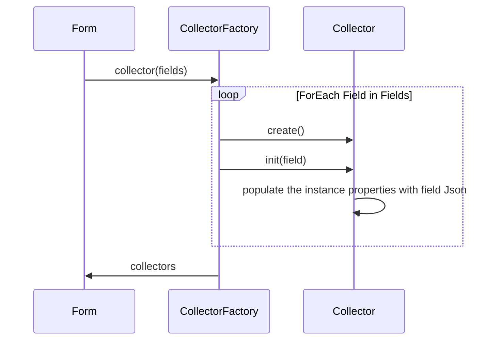
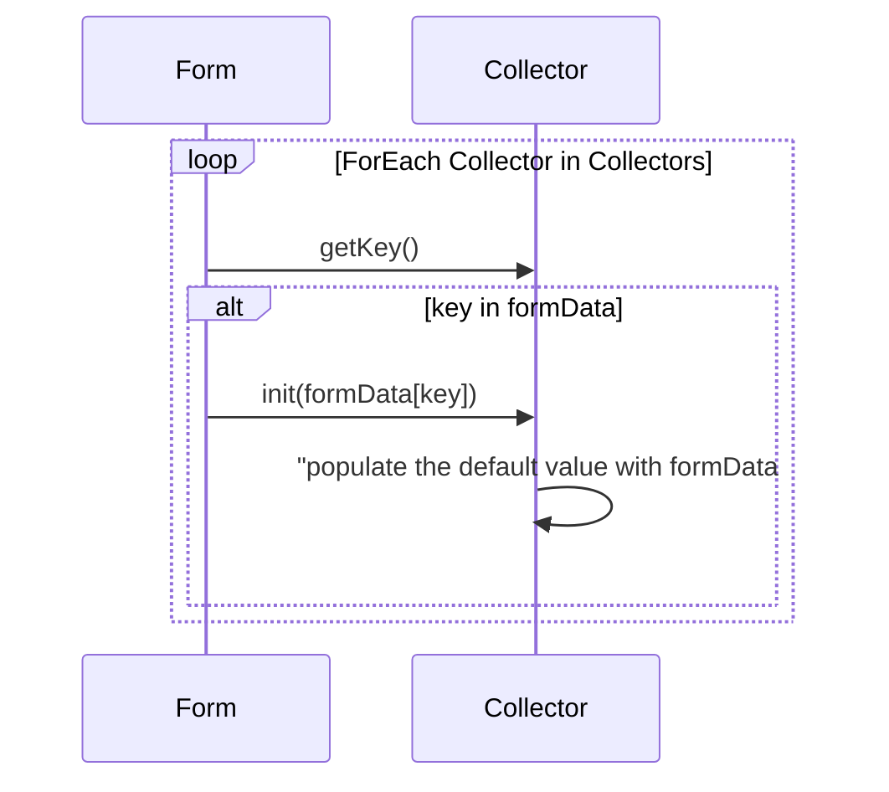
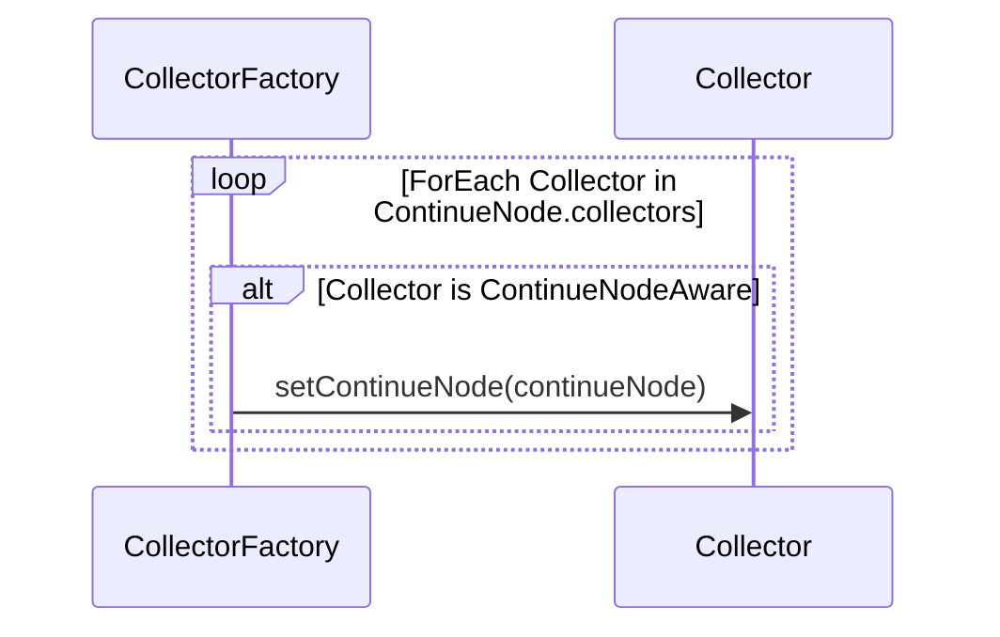

<p align="center">
  <a href="https://github.com/ForgeRock/ping-android-sdk">
    
  </a>
  <hr/>
</p>

# Design Concept

## Mapping Field Types to Collectors

DaVinci employs a factory-based approach to dynamically create and initialize collectors for different field types in a
form. This allows us to handle various field types such as text fields, password fields, and buttons, each with its own
specific behavior, validation, and data collection logic.

The `CollectorFactory` is a factory class that maps field types to their corresponding collectors. To register a new
collector, you provide the field type and the constructor reference of the collector. Using the constructor reference,
the `CollectorFactory` can dynamically create collectors when parsing the DaVinci Response JSON.

```
CollectorFactory.register(<Field Type>, <Contruction Reference>)
```

For example:

```kotlin
// Map Password Type to PasswordCollector
CollectorFactory.register("PASSWORD", ::PasswordCollector)

CollectorFactory.register("SUBMIT_BUTTON", ::SubmitCollector)

// Allow to map multiple Field Type to the same Collector
CollectorFactory.register("FLOW_BUTTON", ::FlowCollector)
CollectorFactory.register("FLOW_LINK", ::FlowCollector)
```

## How Collectors Are Created and Initialized

DaVinci Response JSON:

```json
{
  "form": {
    "components": {
      "fields": [
        {
          "type": "TEXT",
          "key": "user.username",
          "label": "Username",
          "required": true,
          "validation": {
            "regex": "^[^@]+@[^@]+\\.[^@]+$",
            "errorMessage": "Must be alphanumeric"
          }
        },
        {
          "type": "PASSWORD",
          "key": "password",
          "label": "Password",
          "required": true
        },
        ...
      ]
    }
  }
}
```



## How Collectors Populate Default Values

The Collector populates the default value from the `formData` JSON:

```json
{
  "formData": {
    "value": {
      "user.username": "",
      "password": "",
      "dropdown-field": "",
      "combobox-field": [],
      "radio-field": "",
      "checkbox-field": []
    }
  }
}
```



## How Collectors Access the ConnectorNode

By default, the `Collector` is self-contained and does not have direct access to the `ConnectorNode`. It is responsible for
handling data collection and validation specific to the field it represents. However, in certain cases, a collector may
need to access the `ConnectorNode` - for example, to retrieve global data such as the `passwordPolicy` from the root JSON to
validate a password.

To enable this access, a collector can implement the `ConnectorNodeAware` interface. This interface includes the
`connectorNode` property, allowing the collector to retrieve the `ConnectorNode` when needed. Once a collector is created,
the `ConnectorNode` is injected into it, granting access to global data for tasks like validation or other cross-field
operations.

```kotlin
class PasswordCollector : ContinueNodeAware {
    override lateinit var continueNode: ContinueNode
}
```
