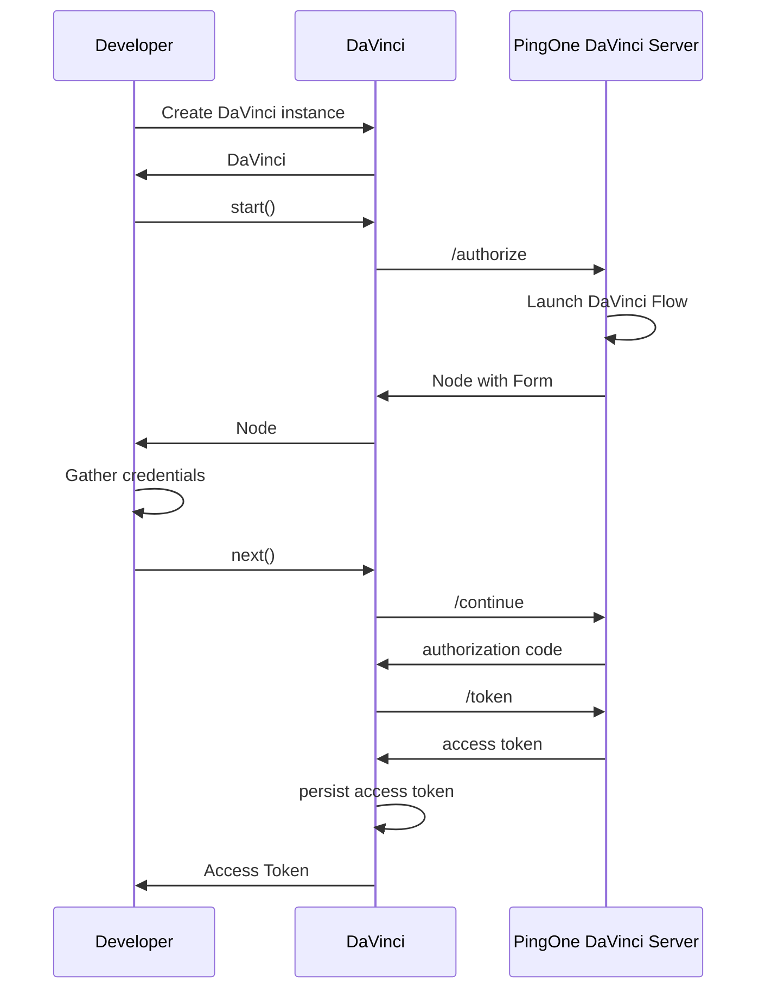

<p align="center">
  <a href="https://github.com/ForgeRock/ping-android-sdk">
    
  </a>
  <hr/>
</p>

# DaVinci

## Overview

DaVinci is a powerful and flexible library for Authentication and Authorization. It is designed to be easy to use and
extensible. It provides a simple API for navigating the authentication flow and handling the various states that can
occur during the authentication process.




## Add dependency to your project

```kotlin
dependencies {
    implementation("com.pingidentity.sdks:davinci:<version>")
}
```

## Usage

To use the `DaVinci` class, you need to create an instance of it and pass a configuration block to the constructor. The
configuration block allows you to customize various aspects of the `DaVinci` instance, such as the timeout and logging.

Here's an example of how to create a `DaVinci` instance:

```kotlin
val daVinci = DaVinci {
    // Oidc as module
    module(Oidc) {
        clientId = "test"
        discoveryEndpoint = "https://auth.pingone.ca/" +
                "02fb4743-189a-4bc7-9d6c-a919edfe6447/as/.well-known/openid-configuration"
        redirectUri = "org.forgerock.demo://oauth2redirect"
        scopes = mutableSetOf("openid", "email", "address", "profile", "phone")
    }
}
var node = daVinci.start()
node = node.next()
```

The `DaVinci` depends on `oidc` module. It discovers the OIDC endpoints with `discoveryEndpoint` attribute.

The `start` method returns a `Node` instance. The `Node` class represents the current state of the application. You can
use the `next` method to transition to the next state.

### More DaVinci Configuration

```kotlin
val daVinci = DaVinci {
    timeout = 30 // Default 30s, Seconds for network timeout
    logger = Logger.STANDARD // Use the standard logger which logs to the Logcat
    module(Oidc) {
        //...
        storage = MemoryStorage<Token>() // Default DataStoreStorage, you can override the storage to store the tokens
    }
}
```

### Navigate the authentication Flow

```kotlin
val node = daVinci.start() // Start the flow

//Determine the Node Type
when (node) {
    is ContinueNode -> {}
    is ErrorNode -> {}
    is FailureNode -> {}
    is SuccessNode -> {}
}
```

| Node Type    | Description                                                                                               |
|--------------|:----------------------------------------------------------------------------------------------------------|
| ContinueNode | In the middle of the flow, call ```node.next``` to move to next Node in the flow                          |
| ErrorNode    | Bad Request from the server, e.g Invalid Password, OTP, username ```node.message``` for the error message |
| FailureNode  | Unexpected Error, e.g Network, parsing ```node.cause``` to retrieve the cause of the error                |
| SuccessNode  | Authentication successful ```node.session``` to retrieve the session                                      |

### Provide Input

For `ContinueNode` Node, you can access list of Collector with `node.collectors()` and provide input to
the `Collector`.
Currently, there are, `TextCollector`, `PasswordCollector`, `SubmitCollector`, `FlowCollector`, `LabelCollector`
, `MultiSelectCollector`, `SingleSelectCollector`, but more will be added in the future, such as `Fido`,
`SocialLoginCollector`, etc...

To access the collectors, you can use the following code:

```kotlin
    node.collectors.forEach {
    when (it) {
        is TextCollector -> it.value = "My First Name"
        is PasswordCollector -> it.value = "My Password"
        is SubmitCollector -> it.value = "click me"
        is FlowCollector -> it.value = "Forgot Password"
            ...
    }
}

// Move to next Node, and repeat the flow until it reaches `SuccessNode` or `ErrorNode`
val next = node.next()
```

Each `Collector` has its own function.

#### TextCollector (TEXT)

```kotlin
textCollector.label //To access the label
textCollector.key //To access the key attribute
textCollector.type //To access the type attribute
textCollector.required //To access the required attribute
textCollector.valiation //To access the validation attribute

textCollector.validate() //To validate the field input value with Required and Regex
textCollector.value = "My First Name" //To set the value
```

#### PasswordCollector (PASSWORD, PASSWORD_VERIFY)

PasswordCollector has the same attributes as TextCollector, plus the following functions

```kotlin
passwordCollector.passwordPolicy() //Retrieve the password policy
passwordCollector.validate() //To validate the field input value against the password policy

//To check the type 
passwordCollector.type == "PASSWORD_VERIFY" // Develper may want to display it as a link instead of a button.
```

#### SubmitCollector (SUBMIT_BUTTON)

```kotlin
submitCollector.label //To access the label
submitCollector.key //To access the key attribute
submitCollector.type //To access the type attribute
submitCollector.value = "submit" //To set the value
```

#### FlowCollector (FLOW_BUTTON, FLOW_LINK)

FlowCollector has the same attributes as SubmitCollector

```kotlin
//To check the type 
flowCollector.type == "FLOW_LINK" // Develper may want to display it as a link instead of a button.
```

#### LabelCollector (LABEL)

```kotlin
labelCollector.content //To access the Content
```

#### MultiSelectCollector (COMBOBOX, CHECKBOX)

```kotlin
multiSelectCollector.label //To access the label
multiSelectCollector.key //To access the key attribute
multiSelectCollector.type //To access the type attribute
multiSelectCollector.required //To access the required attribute
multiSelectCollector.options //To access the options attribute

multiSelectCollector.value.add("option1") //To set the value
```

#### SingleSelectCollector (DROPDOWN, RADIO)

```kotlin
singleSelectCollector.label //To access the label
singleSelectCollector.key //To access the key attribute
singleSelectCollector.type //To access the type attribute
singleSelectCollector.required //To access the required attribute
singleSelectCollector.options //To access the options attribute

singleSelectCollector.value = "option1" //To set the value
```

### Collector Validation

Collectors have a `validate()` function to validate the input value. The `validate()` function will return `Success`
or `List<ValidationError>`

For example, to validate the `TextCollector` input value, you can use the following code:

```kotlin
val result: List<ValidationError> = textCollector.validate()
```

| ValidationError | Description                                                                                                                                                                                                      |
|-----------------|:-----------------------------------------------------------------------------------------------------------------------------------------------------------------------------------------------------------------|
| InvalidLength   | Check Password Length,  If the password length is outside this range, it adds an InvalidLength error specifying the required minimum and maximum lengths.                                                        |
| UniqueCharacter | Check for Unique Characters, If the number of unique characters is less than the required minUniqueCharacters from the policy, it adds a UniqueCharacter error with the required minimum unique character count. |
| MaxRepeat       | Check for Repeated Characters, If this maximum exceeds the allowed maxRepeatedCharacters from the policy, it adds a MaxRepeat error with the allowed maximum repetitions.                                        |
| MinCharacters   | Check for Character exists.                                                                                                                                                                                      |
| Required        | Check for required value.                                                                                                                                                                                        |
| Regex           | Check for valid regex.                                                                                                                                                                                           |

### Error Handling

For `FailureNode`, you can retrieve the cause of the error by using `node.cause()`. The `cause` is a `Throwable` object,
when receiving an error, you cannot continue the Flow, you may want to display a generic message to user, and report
the issue to the Support team.
The Error may include Network issue, parsing issue, API Error (Server response other that 2xx and 400) and other
unexpected issues.

For `ErrorNode`, you can retrieve the error message by using `node.message()`, and the raw json response
with `node.input`.
The `message` is a `String` object, when receiving a failure, you can continue the Flow with previous `ContinueNode`
Node, but you may want to display the error message to the user.
e.g "Username/Password is incorrect", "OTP is invalid", etc...

```kotlin
val node = daVinci.start() // Start the flow

//Determine the Node Type
when (node) {
    is ContinueNode -> {}
    is ErrorNode -> {
        node.message() // Retrieve the cause of the error
        node.details().forEach {  // Retrieve the details of the error
            it.rawResponse.let { rawResponse ->
                rawResponse.details?.forEach { detail ->
                    val msg = detail.message
                    detail.innerError?.errors?.forEach { (key, value) ->
                        val innerError = "$key: $value"
                    }
                }
            }
        }
    }
    is FailureNode -> {
        node.cause() // Retrieve the error message
    }
    is SuccessNode -> {}
}
```

### Node Identifier

You can use the `node.id()` to identify the current state of the flow. The `id` is a unique identifier for each node.

For example, you can use the `id` to determine if the current state is `Forgot Passowrd`, `Registration`, etc....

```kotlin

when (node.id()) {
    "cq77vwelou" -> "Sign On"
    "qwnvng32z3" -> "Password Reset"
    "4dth5sn269" -> "Create Your Profile"
    "qojn9nsdxh" -> "Verification Code"
    "fkekf3oi8e" -> "Enter New Password"
    else -> {
        ""
    }
}
```

Other than `id`, you can also use `node.name` to retrieve the name of the Node, `node.description` to retrieve the
description of the Node.

### Work with Jetpack Composable

ViewModel

```kotlin
// Define State that listen by the View
var state = MutableStateFlow<Node>(Empty)

//Start the DaVinci flow
val next = daVinci.start()

// Update the state
state.update {
    next
}

fun next(node: ContinueNode) {
    viewModelScope.launch {
        val next = node.next()
        state.update {
            next
        }
    }
}
```

View

```kotlin
when (val node = state.node) {
    is ContinueNode -> {}
    is ErrorNode -> {}
    is FailureNode -> {}
    is SuccessNode -> {}
}
```

### Post Authentication

After authenticate with DaVinci, the user session will be stored in the storage.
To retrieve the existing session, you can use the following code:

```kotlin
// Retrieve the existing user, if ST cookie exists in the storage, ```user``` will be not null.
// However, even with the user object, you may not be able to retrieve a valid token, as the token and refresh may be expired.

val user: User? = daVinci.user()

user?.let {
    it.accessToken()
    it.revoke()
    it.userinfo()
    it.logout()
}
```
