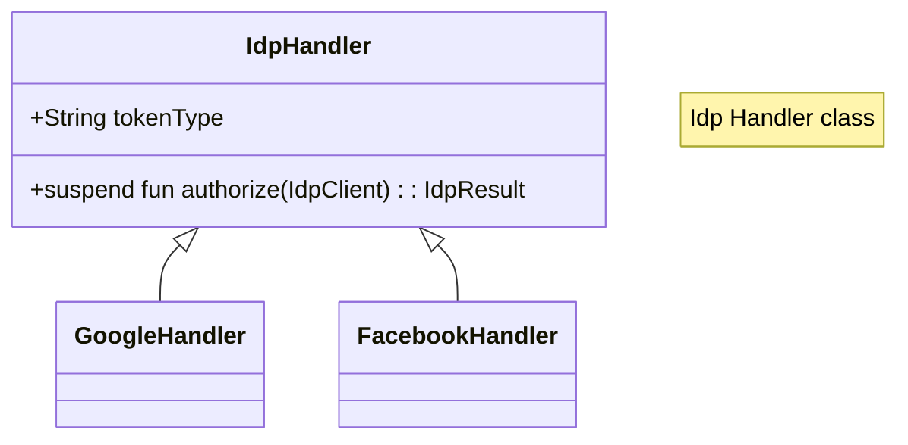
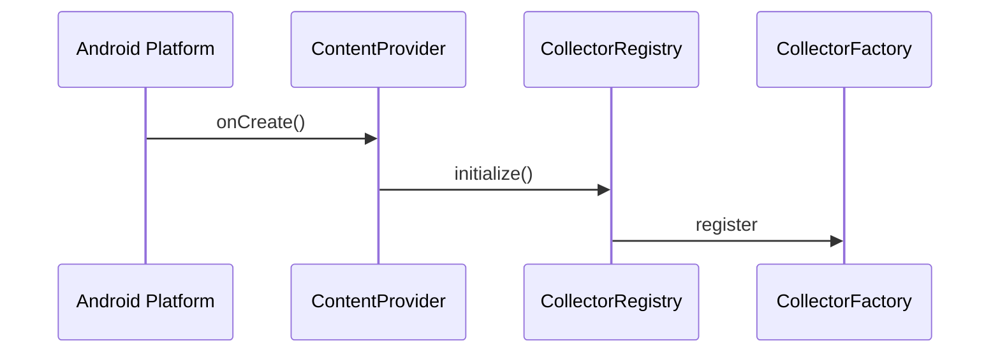
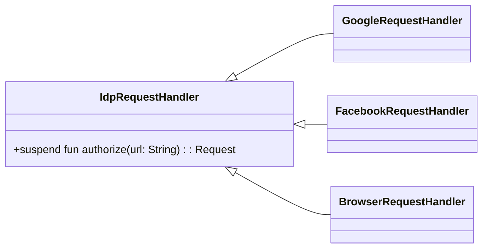
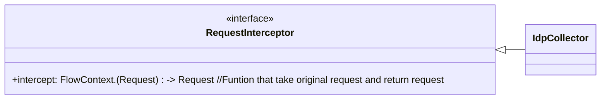
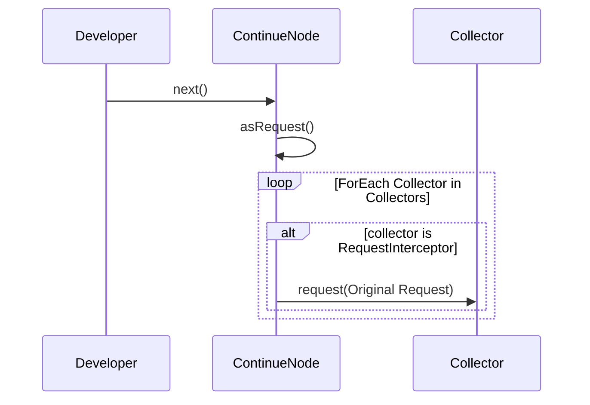
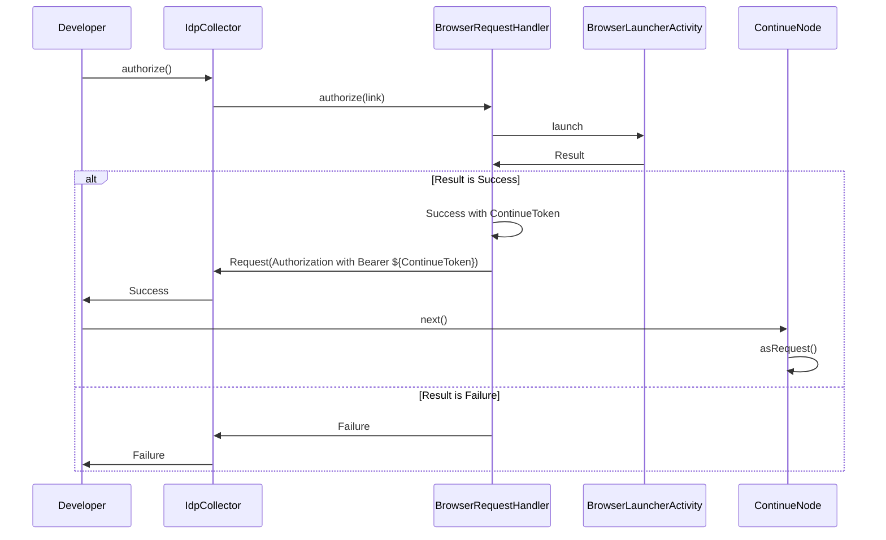
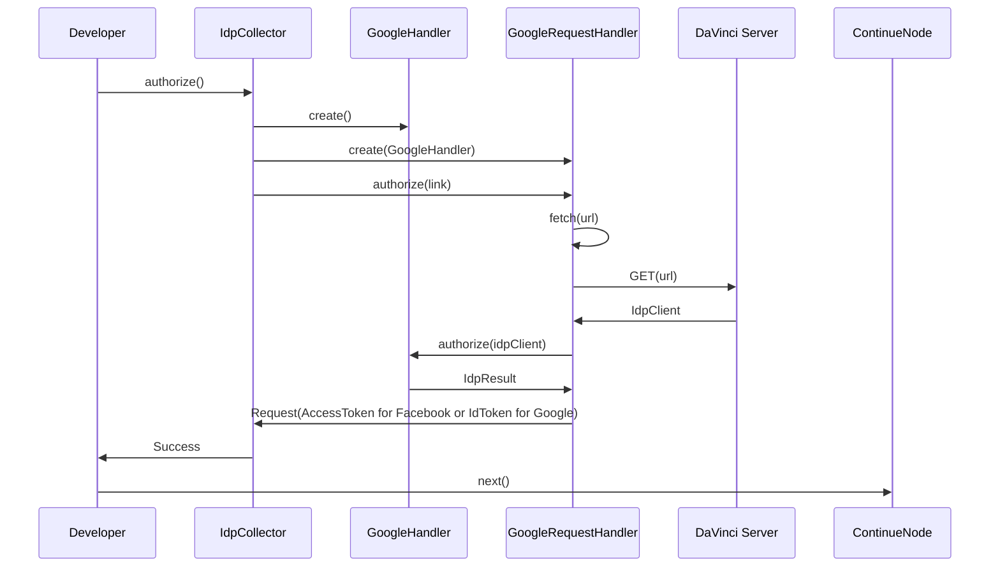

<p align="center">
  <a href="https://github.com/ForgeRock/ping-android-sdk">
    
  </a>
  <hr/>
</p>

# Design Concept

### IdpHandler class hierarchy

The `IdpHandler` is a class that handles the External IDP authentication. The `IdpHandler` is responsible for
authenticating with the External IDP, and it provides the necessary configuration to authenticate with the External IDP.
It handles the communication with the External IDP SDKs, for example, Google, Facebook, Apple, etc...

The `IdpHandler` can be used with `DaVinci` and `Journey` modules.



#### Exception

When the `IdpHandler` fails to authenticate with the External IDP, it throws `Exception`. Here are the possible
exceptions:

| Exception                | Description                                                                                                                     |
|--------------------------|---------------------------------------------------------------------------------------------------------------------------------|
| UnsupportedIdPException  | The idp is not supported                                                                                                        |
| IllegalArgumentException | Missing attribute to perform authentication from `IdpClient`                                                                    |
| IllegalStateException    | Unexpected error which result with authentication failed.                                                                       |
| IdpCanceledException     | User cancel the login operation                                                                                                 |
| Idp Specific exception   | Native SDKs specific exception, for example, `GetCredentialException` from Google SDK  or `FacebookException` from Facebook SDK | 

## DaVinci External IDP

### How IdpCollector register to DaVinci

CollectorFactory is a factory class that maps the Field Type to the Collector, to register a new Collector, provide the
Field Type and the Collector's Constructor Reference. With the Constructor Reference, the CollectorFactory can create
the Collector during parsing the DaVinci Response JSON.
When `enternal-idp` is included in the project dependencies, the `IdpCollector` is registered to the CollectorFactory.

```
CollectorFactory.register("SOCIAL_LOGIN_BUTTON", ::IdpCollector)
```



The diagram shows the initialization flow where the ContentProvider sets up the CollectorRegistry, which in turn
registers the
collectors with the CollectorFactory. This setup is crucial for the proper functioning of the DaVinci flow, as it
ensures that the correct collectors are available for handling different field types.

The response from `DaVinci` flow will be parsed and transformed the following json into the `IdpCollector` object.

```json
{
  "idpId": "0812e9a364f5279e74ece725052781be",
  "idpType": "GOOGLE",
  "type": "SOCIAL_LOGIN_BUTTON",
  "label": "Sign in with Google",
  "idpEnabled": true,
  "links": {
    "authenticate": {
      "href": "https://auth.pingone.com/c2a669c0-c396-4544-994d-9c6eb3fb1602/davinci/connections/0812e9a364f5279e74ece725052781be/capabilities/loginFirstFactor?interactionId=035036ba-921e-4da3-a26e-bead397b5171&interactionToken=18c13362061eaf160486da3412ef4d9d5c356bf4b93116d426f4322ffdd16b3ce3a4dc7a33921a5eb4aabc778b936f551359663b243e1102287da6095bab21c4afcbdc317781d62db283ff7efd474503cc0e5dc6c95be80e44948ee875ad4ac5294fa41fba13bf70d21e3cf17b1f236a1d1db5e1ad4cb259bc7987edb092ab64&skRefreshToken=true"
    }
  }
}
```

## IdpRequestHandler Interface

The `IdpRequestHandler` is an interface that use `IdpHandler` to handle Social Login request for `DaVinci`.



### RequestInterceptor interface

The `RequestInterceptor` is an interface designed to allow a Collector to override the next request in the DaVinci flow.
This interface provides a method to modify the request before it is sent to the server.



In the context of `DaVinci`, the `ContinueNode` will iterate through its Collectors and invoke the request method if the
collector implements the `RequestInterceptor` interface. This mechanism ensures that the request can be customized by
the
collector before proceeding to the next step in the flow.



### BrowserRequestHandler



### GoogleRequestHandler

FacebookRequestHandler has a similar flow as GoogleRequestHandler.



## Journey External IDP

TBD
