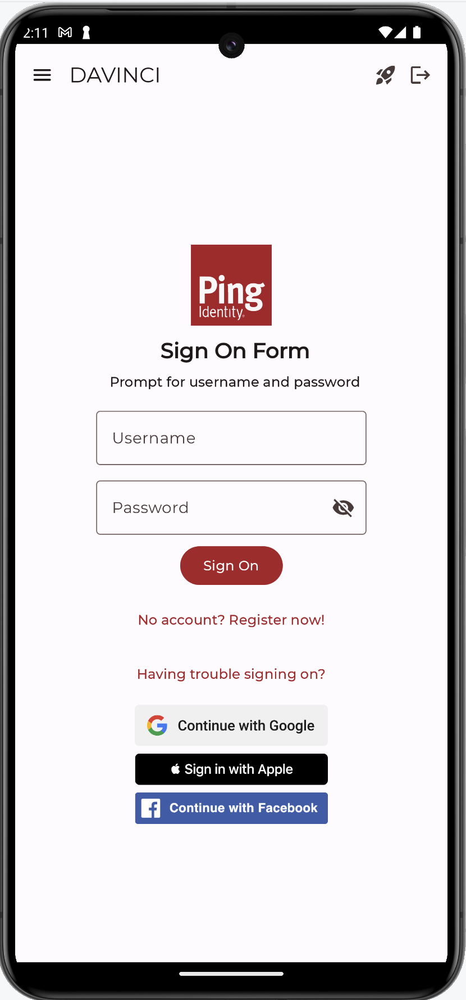
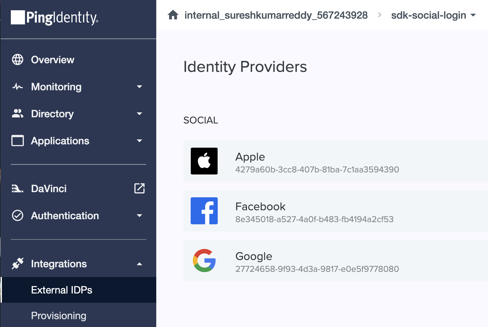
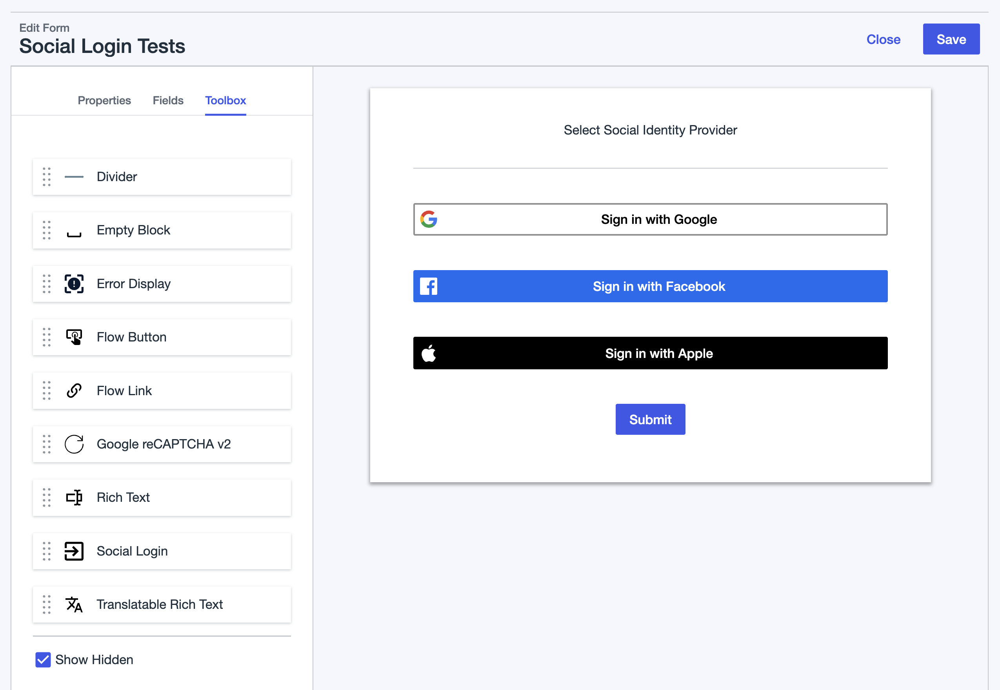
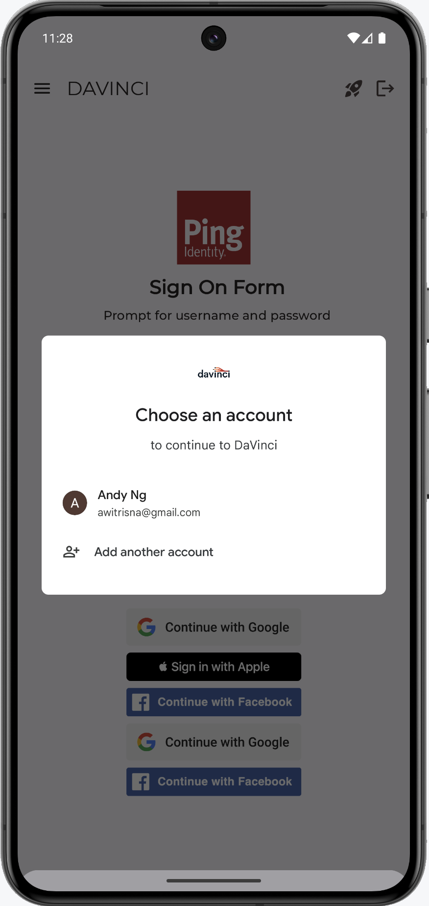
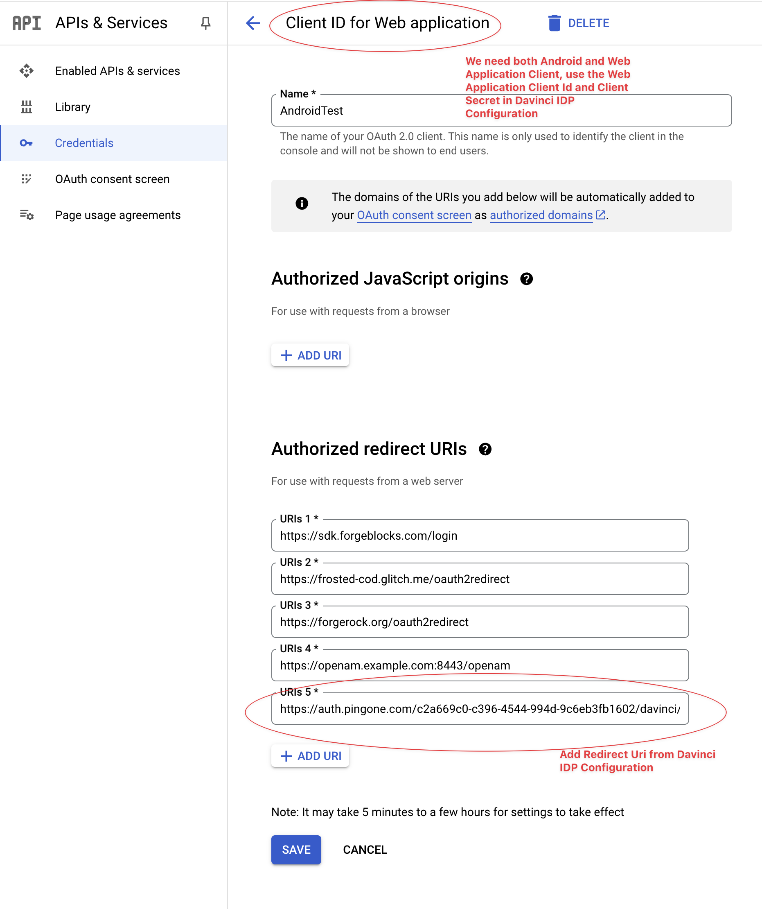
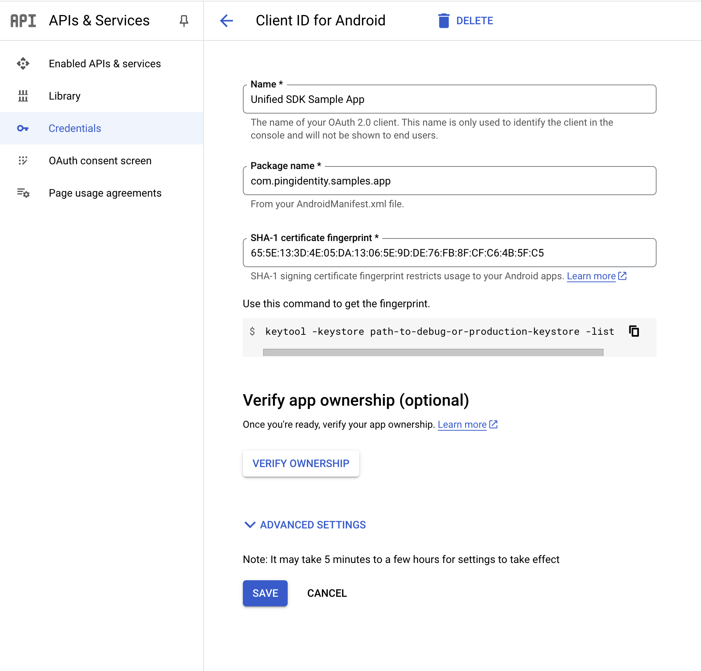
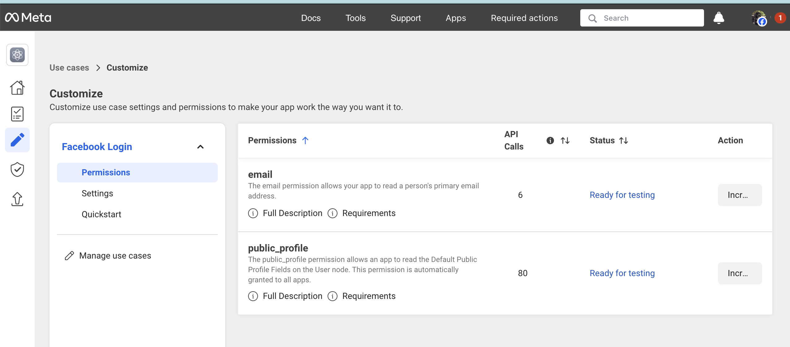

<p align="center">
  <a href="https://github.com/ForgeRock/ping-android-sdk">
    
  </a>
  <hr/>
</p>

# Ping External IDP

## Overview

The Ping External IDP library empowers your Android applications to seamlessly authenticate users through various
external Identity Providers (IDPs) such as Google, Facebook, and Apple. Acting as a plugin for
the `ping-davinci` and `ping-journey` modules, it streamlines the integration process by providing the necessary
configurations and functionalities to initiate and manage authentication flows with these external services.

This library abstracts away the complexities of dealing with different IDP protocols and SDKs, offering a unified and
developer-friendly API. By leveraging Ping External IDP, you can enhance your application's user experience by offering
familiar and convenient login options.



## Integration

### Adding the Dependency

To incorporate the Ping External IDP library into your Android project, add the following dependencies to your
app's `build.gradle.kts` (or `build.gradle`) file:

```kotlin
dependencies {
    implementation("com.pingidentity.sdks:davinci:<latest_version>") // Ensure you use the latest DaVinci SDK version
    implementation("com.pingidentity.sdks:external-idp:<latest_version>") // Ensure you use the latest External IDP SDK version
}
```

Replace `<latest_version>` with the most recent stable version of both the `davinci` and `external-idp` libraries. You
can find the latest versions on Maven Central. After adding these lines, synchronize
your Gradle project to download and link the libraries.

## Configuration and Usage

The `external-idp` library is designed to work in conjunction with the `ping-davinci` module. The authentication flow is
orchestrated by a DaVinci journey that includes an `IdpCollector` node. The configuration of the external IDPs is
handled either within the PingOne platform directly or through DaVinci Connectors. The approach depends on whether you
are implementing a browser-based or native authentication experience.

### Authentication Experience Options

* **Browser Experience:** For authentication within a custom tab
* **Native Experience:** For a more integrated, in-app authentication flow (e.g., using native Google or Facebook SDKs)

### PingOne External IDPs Setup

This method involves configuring the external IDPs within the PingOne administrative console. You'll need to register
your application with each IDP (e.g., creating a Google Cloud Platform project and configuring OAuth 2.0 credentials).
The redirect URIs configured in PingOne should match the custom scheme you define in your Android app.



### DaVinci Connector Setup

You configure the connector within your DaVinci environment, specifying the necessary details for each IDP (client IDs,
secrets, etc.).


### DaVinci Flow Setup

In your DaVinci flow, you will need to include an `skIDP` in your html template or `Social Login` in the form. This
component is responsible for initiating the authentication process with the configured External IDP. The flow will
typically involve redirecting the user to the IDP
for authentication and then processing the callback.


<br>


### Deep Linking Configuration (Application Return URL)

For the `IdpCollector` to correctly redirect the user back to your application after successful authentication, you need
to configure the `Application Return to Url` within your PingOne or DaVinci setup. This URL should use a custom scheme
that your app can handle. For example:

```kotlin
myapp://callback
```

### Android App Redirect URI Scheme Setup

To enable your Android app to handle the redirection after external authentication, you need to define a custom URI
scheme in your app's `build.gradle.kts` file. Within the `android.defaultConfig` block, add the
following `manifestPlaceholders`:

```kotlin
android {
    defaultConfig {
        manifestPlaceholders["appRedirectUriScheme"] = "myapp" // Replace "myapp" with your desired custom scheme
    }
}
```

This placeholder will be used in your `AndroidManifest.xml` to register an intent filter that intercepts the redirection
URI. While the placeholder is defined here, the actual intent filter configuration happens automatically within
the `external-idp` library, leveraging this placeholder.

### Initiating the Authentication Flow

Within your application logic, when the user initiates the external IDP login, you will interact with the `IdpCollector`
obtained from a `ContinueNode` in your DaVinci flow. Here's a typical usage pattern:

```kotlin
val daVinci = // Your DaVinci instance
var node = daVinci.start()

if (node is ContinueNode) {
    node.collectors.forEach { collector ->
        if (collector is IdpCollector) {
            val idpCollector = collector
            when (val result = idpCollector.authorize()) {
                is Success -> {
                    // Authentication successful, proceed to the next step in the DaVinci flow
                    node = node.next()
                    // Process the next node
                }
                is Failure -> {
                    // Authentication failed, handle the error
                    val error: Throwable = result.error
                    // Log or display the error message
                }
            }
            return // Assuming only one IdpCollector per node
        }
    }
}
```

The `idpCollector.authorize()` method initiates the authentication flow. For browser-based authentication, this will
typically launch a `CustomTab` to the IDP's login page.

### Handling the Authentication Result

The `authorize()` method returns a `Result` class, which can be either `Success` or `Failure`.

```kotlin
val result = idpCollector.authorize()
result
        .onSuccess {
            // Move to the next Node in the DaVinci flow
            // Example: node = node.next()
        }
        .onFailure { throwable ->
            // Handle the authentication failure
            // Display an error message to the user
        }
```

### Customizing the Custom Tab (Browser Experience)

For browser-based authentication, you can further customize the appearance and behavior of the `CustomTab` launched by
the `IdpCollector` using a trailing lambda with the `authorize()` method:

```kotlin
BrowserLauncher.customTabsCustomizer = {
    setShowTitle(false)
    setColorScheme(CustomTabsIntent.COLOR_SCHEME_SYSTEM) // Use the system default color scheme
    setToolbarColor(ContextCompat.getColor(context, R.color.colorPrimary)) // Set a specific toolbar color
    setUrlBarHidingEnabled(true)
    // Add other CustomTabsIntent configurations as needed
}
```

Refer to the AndroidX Browser library documentation for the available customization options within `CustomTabsIntent`.

## Native External Identity Providers (IDP) Integration with Google and Facebook for Android

To provide a more seamless and integrated user experience, especially for frequently used IDPs like Google and Facebook,
the Ping External IDP library can leverage their native Android SDKs if present in your project. This allows for a login
flow that feels more integrated within the app, potentially avoiding full browser redirects.



By including the native SDKs as dependencies, the Ping External IDP library can automatically detect their presence and
utilize them for the authentication process when configured. If the native SDKs are not
included, the library will gracefully fall back to the browser-based authentication flow using Custom Tabs.

### Adding Native SDK Dependencies

To enable native Google and Facebook login experiences, add the respective SDK dependencies to your
app's `build.gradle.kts` file:

```gradle
dependencies {
    // Google Sign-In
    implementation("com.google.android.libraries.identity.googleid:googleid:<version>")

    // Facebook Login
    implementation("com.facebook.android:facebook-login:<version>")
}
```

Replace `<version>` with the latest stable versions of the
respective SDKs. You can find these on their respective developer portals or Maven Central.

### Google Developer Console Configuration for Native Integration

For Google native sign-in to work correctly, you need to configure both **Web client**
and **Android client** credentials in your Google Cloud Platform project.

* **Web client ID:** This client ID is used in the server configuration for Google.
* **Android client ID:** This client ID is associated with your app's package name and signing certificate. You will
  typically need to provide the SHA-1 certificate fingerprint of your signing key.





**Crucially, when configuring the Google connector in DaVinci, use the Client ID of the *Web application* type.**

### Facebook Developer Console Configuration for Native Integration

Follow the official documentation provided by
the [Facebook Developer Console](https://developers.facebook.com/docs/facebook-login/android) to set up your Facebook
app and integrate the Facebook SDK. This involves:

1. **Creating a Facebook App:** Register your application on the Facebook for Developers platform.
2. **Adding Facebook Login Product:** Enable the Facebook Login product for your app.
3. **Configuring Android Platform:** Add your Android platform details, including your app's package name and key
   hashes.
4. **Adding Key Hashes:** You'll need to generate and add the key hashes for your development and production signing
   certificates.

Ensure that you have added the necessary permissions, such as `email` and `public_profile`, to your Facebook app
settings. These permissions will be requested from the user during the login process.



#### Configuring `strings.xml`

Add the following strings to your `app/src/main/res/values/strings.xml` file, replacing the placeholders with your
actual Facebook App ID and Client Token:

```xml

<resources>
    <string name="facebook_app_id">[your_facebook_app_id]</string>
    <string name="fb_login_protocol_scheme">fb[your_facebook_app_id]</string>
    <string name="facebook_client_token">[your_client_token]</string>
</resources>
```

#### Updating `AndroidManifest.xml`

The Facebook SDK requires the `com.facebook.CustomTabActivity` to be declared in your `AndroidManifest.xml`. Ensure you
have the following activity declaration within your `<application>` tags:

```xml

<application>
    <activity
            android:name="com.facebook.CustomTabActivity"
            android:exported="true">
        <intent-filter>
            <action android:name="android.intent.action.VIEW"/>
            <category android:name="android.intent.category.DEFAULT"/>
            <category android:name="android.intent.category.BROWSABLE"/>
            <data android:scheme="@string/fb_login_protocol_scheme"/>
        </intent-filter>
    </activity>
</application>
```

By following these steps and including the native SDK dependencies, your application can provide a more streamlined and
user-friendly authentication experience when users choose to log in with Google or Facebook. The Ping External IDP
library intelligently handles the integration with these native SDKs when they are present.