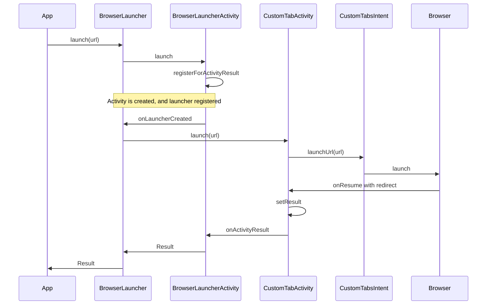

  
  

# Design Concept

### Sequence Diagram

```mermaid
sequenceDiagram
    participant App
    participant BrowserLauncher
    participant BrowserLauncherActivity
    participant CustomTabActivity
    participant CustomTabsIntent
    participant Browser
    App ->> BrowserLauncher: launch(url)
    BrowserLauncher ->> BrowserLauncherActivity: launch
    BrowserLauncherActivity ->> BrowserLauncherActivity: registerForActivityResult
    Note over BrowserLauncher, BrowserLauncherActivity: Activity is created, and launcher registered
    BrowserLauncherActivity ->> BrowserLauncher : onLauncherCreated
    BrowserLauncher ->> CustomTabActivity : launch(url)
    CustomTabActivity ->> CustomTabsIntent : launchUrl(url)
    CustomTabsIntent ->> Browser : launch
    Browser ->> CustomTabActivity: onResume with redirect
    CustomTabActivity ->> CustomTabActivity: setResult
    CustomTabActivity ->> BrowserLauncherActivity: onActivityResult
    BrowserLauncherActivity ->> BrowserLauncher: Result
    BrowserLauncher ->> App: Result
```