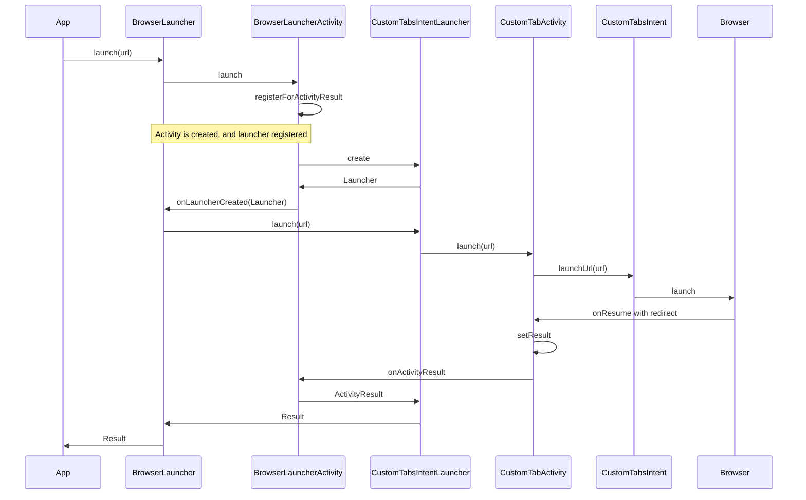
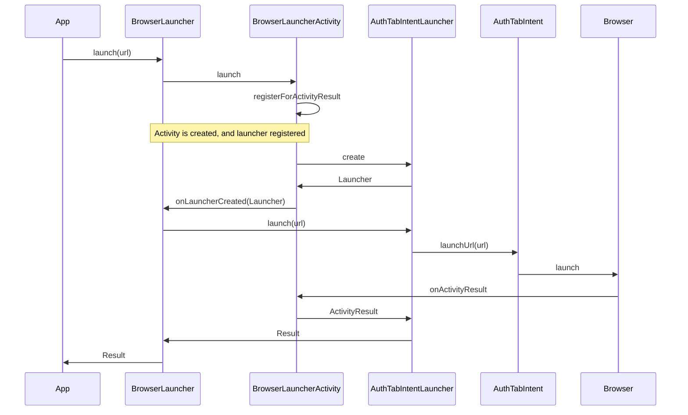

# Design Concept

### Sequence Diagram for Custom Tab Browser Launch

```mermaid
sequenceDiagram
    participant App
    participant BrowserLauncher
    participant BrowserLauncherActivity
    participant CustomTabsIntentLauncher
    participant CustomTabActivity
    participant CustomTabsIntent
    participant Browser
    App ->> BrowserLauncher: launch(url)
    BrowserLauncher ->> BrowserLauncherActivity: launch
    BrowserLauncherActivity ->> BrowserLauncherActivity: registerForActivityResult
    Note over BrowserLauncher, BrowserLauncherActivity: Activity is created, and launcher registered
    BrowserLauncherActivity ->> CustomTabsIntentLauncher : create
    CustomTabsIntentLauncher ->> BrowserLauncherActivity : Launcher
    BrowserLauncherActivity ->> BrowserLauncher : onLauncherCreated(Launcher)
    BrowserLauncher ->> CustomTabsIntentLauncher : launch(url)
    CustomTabsIntentLauncher ->> CustomTabActivity : launch(url)
    CustomTabActivity ->> CustomTabsIntent : launchUrl(url)
    CustomTabsIntent ->> Browser : launch
    Browser ->> CustomTabActivity: onResume with redirect
    CustomTabActivity ->> CustomTabActivity: setResult
    CustomTabActivity ->> BrowserLauncherActivity: onActivityResult
    BrowserLauncherActivity ->> CustomTabsIntentLauncher: ActivityResult
    CustomTabsIntentLauncher ->> BrowserLauncher: Result
    BrowserLauncher ->> App: Result
```

### Sequence Diagram for Custom Tab Browser Launch

```mermaid
sequenceDiagram
    participant App
    participant BrowserLauncher
    participant BrowserLauncherActivity
    participant AuthTabIntentLauncher
    participant AuthTabIntent
    participant Browser
    App ->> BrowserLauncher: launch(url)
    BrowserLauncher ->> BrowserLauncherActivity: launch
    BrowserLauncherActivity ->> BrowserLauncherActivity: registerForActivityResult
    Note over BrowserLauncher, BrowserLauncherActivity: Activity is created, and launcher registered
    BrowserLauncherActivity ->> AuthTabIntentLauncher : create
    AuthTabIntentLauncher ->> BrowserLauncherActivity : Launcher
    BrowserLauncherActivity ->> BrowserLauncher : onLauncherCreated(Launcher)
    BrowserLauncher ->> AuthTabIntentLauncher : launch(url)
    AuthTabIntentLauncher ->> AuthTabIntent : launchUrl(url)
    AuthTabIntent ->> Browser : launch
    Browser ->> BrowserLauncherActivity: onActivityResult
    BrowserLauncherActivity ->> AuthTabIntentLauncher: ActivityResult
    AuthTabIntentLauncher ->> BrowserLauncher: Result
    BrowserLauncher ->> App: Result
```