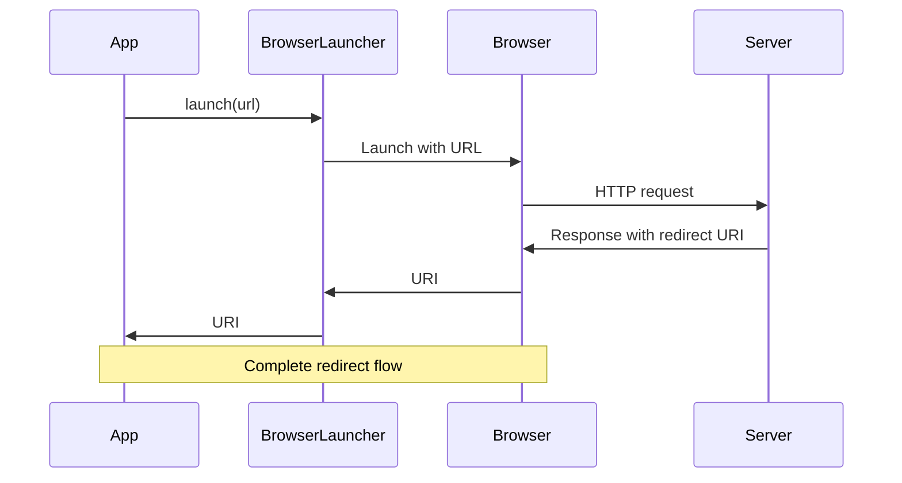

<p align="center">
  <a href="https://github.com/ForgeRock/ping-android-sdk">
    
  </a>
  <hr/>
</p>

# Ping Browser

## Overview

Ping Browser is a library that allows you to perform an in-app browser action, and receive data from the browser
redirect.

By default, the library uses the `CustomTabsIntent` to launch the browser, and it provides a callback to receive the
data from the browser redirect. However, you can customize the browser launcher to use a different browser or customize
the custom tabs.



## Add dependency to your project

```kotlin
dependencies {
    implementation("com.pingidentity.sdks:browser:<version>")
}
```

## Usage

```kotlin
val result = BrowserLauncher.launch(URL("https://www.pingidentity.com"))
val uri = result.getOrThrow()
```

### BrowserLauncher configuration

In the `build.gradle.kts` file, add a manifest placeholder for the `appRedirectUriScheme`:

```kotlin
android {
    defaultConfig {
        ...
        manifestPlaceholders["appRedirectUriScheme"] = "myapp" // replace with your app scheme
        ...
    }
}
```

#### Customize the custom tabs

```kotlin
 BrowserLauncher.customTabsCustomizer = {
    setShowTitle(false)
    setUrlBarHidingEnabled(true)
}
```

#### Customize the intents

By default the library uses the `CustomTabsIntent` to launch the system default browser. You can customize the browser launching intent
For example, you would like to use Microsoft Edge browser, you can customize the browser launching intent like this:

```kotlin
BrowserLauncher.intentCustomizer = {
    setPackage("com.microsoft.emmx")
}
```


