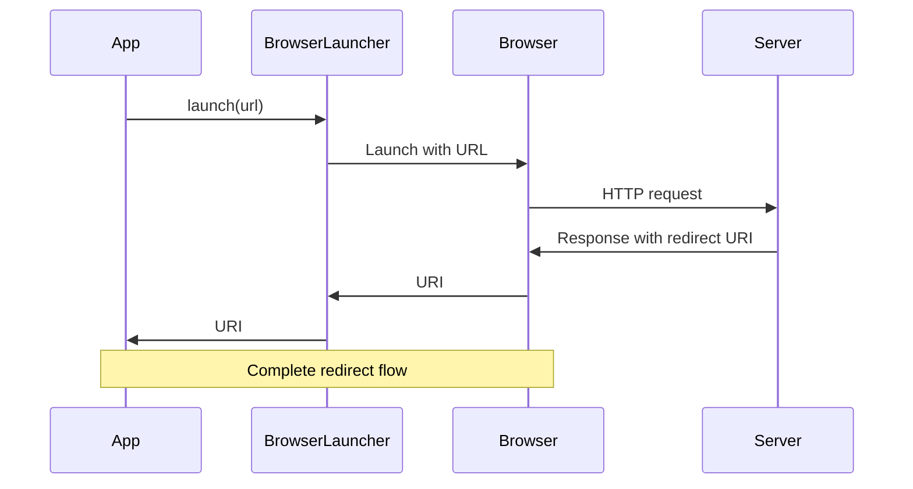

[](https://github.com/ForgeRock/ping-android-sdk)

# Ping Browser

## Overview

Ping Browser is a comprehensive library that enables seamless in-app browser functionality, allowing
you to launch browser sessions and capture redirect data from authentication and authorization
flows.

The library intelligently selects between `CustomTabsIntent` and `AuthTabsIntent` based on device
capabilities and security requirements. It provides robust callback mechanisms to handle browser
redirects while offering extensive customization options for different browser implementations and
tab configurations.


```mermaid
sequenceDiagram
    participant App
    participant BrowserLauncher
    participant Browser
    participant Server
    App ->> BrowserLauncher: launch(url)
    BrowserLauncher ->> Browser: Launch with URL
    Browser ->> Server: HTTP request
    Server ->> Browser: Response with redirect URI
    Browser ->> BrowserLauncher: URI
    BrowserLauncher ->> App: URI
    Note over App, Browser: Complete redirect flow
```

## Add dependency to your project

```kotlin
dependencies {
    implementation("com.pingidentity.sdks:browser:<version>")
}
```

## Usage

```kotlin
val result = BrowserLauncher.launch(URL("https://www.pingidentity.com"))
val uri = result.getOrThrow()
```

### Initial Configuration

Configure the browser launcher in your app's `build.gradle.kts` file by adding a manifest
placeholder for the application redirect URI scheme:

```kotlin
android {
    defaultConfig {
        ...
        manifestPlaceholders["appRedirectUriScheme"] =
            "myapp" // Replace with your unique app scheme
        ...
    }
}
```

## Redirect URI Configuration

The redirect URI is a critical component that determines where users are redirected after completing
browser-based actions such as authentication or authorization. It serves as the "return address"
that guides users back to your application.

### Understanding Redirect URI Implementation

#### Per-Launch Configuration (Recommended)

For maximum flexibility, specify a unique redirect URI for each browser launch operation:

```kotlin
val customRedirectUri = "myapp://callback".toUri()
val result = BrowserLauncher.launch(URL("https://example.com"), customRedirectUri)
```

#### Manifest Placeholder Configuration

The manifest placeholder serves as a fallback mechanism for devices that don't support Auth Tabs and
must use Custom Tabs instead. Ensure this matches the scheme portion of your redirect URI:

```kotlin
// For redirect URI "myapp://callback", configure:
manifestPlaceholders["appRedirectUriScheme"] = "myapp"
```

### Customization Options

#### Custom Tabs Customization

Tailor the appearance and behavior of Custom Tabs to match your application's design:

```kotlin
BrowserLauncher.customTabsCustomizer = {
    setShowTitle(false)
    setUrlBarHidingEnabled(true)
    setToolbarColor(ContextCompat.getColor(context, R.color.primary))
    setColorScheme(CustomTabsIntent.COLOR_SCHEME_SYSTEM)
}
```

#### Auth Tabs Customization

Configure Auth Tabs for enhanced security in OAuth flows. Auth Tabs provide superior protection
against phishing attacks and are automatically utilized when supported by the device and when using
custom URI schemes:

```kotlin
BrowserLauncher.authTabCustomizer = {
    // Configure Auth Tab-specific security features
    // Add custom parameters or headers as required
}
```

**Note:** Auth Tabs offer enhanced security features specifically designed for OAuth authentication
flows and provide better protection against malicious redirect attacks compared to standard Custom
Tabs.

> **See also:** [AuthTab support version and fallback details](https://developer.chrome.com/docs/android/custom-tabs/guide-auth-tab#fallback_to_custom_tabs)

#### Intent Customization

Customize the underlying browser launch intent to specify particular browsers or add additional
configuration:

```kotlin
// Example: Force usage of Microsoft Edge browser
BrowserLauncher.intentCustomizer = {
    setPackage("com.microsoft.emmx")
    addFlags(Intent.FLAG_ACTIVITY_NO_HISTORY)
}
```

By default, the library uses `AuthTabIntent` to launch the system's default browser. The intent
customization allows you to override this behavior for specific use cases or browser preferences.

## Comparison: WebView vs Custom Tab vs Auth Tab

| Feature/Aspect            | WebView                                                  | Custom Tab                              | Auth Tab                                                |
|---------------------------|----------------------------------------------------------|-----------------------------------------|---------------------------------------------------------|
| Security                  | ❌ Vulnerable to phishing, lacks browser security context | ✅ Uses system browser, better isolation | ✅ Enhanced security, anti-phishing, uses system browser |
| OAuth2 Compliance         | ❌ Not recommended by OAuth2/OIDC                         | ✅ Recommended by OAuth2/OIDC            | ✅ Best practice for OAuth2/OIDC                         |
| User Experience           | 😐 Limited, not full browser                             | 🙂 Seamless, shares browser state       | 🙂 Seamless, shares browser state                       |
| Cookie/Javascript Support | ✅ Full support                                           | ✅ Full support                          | ✅ Full support                                          |
| Autofill/Password Manager | ❌ Limited or unavailable                                 | ✅ Available                             | ✅ Available                                             |
| SSO Support               | ❌ No browser SSO                                         | ✅ Shares browser SSO                    | ✅ Shares browser SSO                                    |
| Customization             | ✅ Highly customizable                                    | 🙂 Toolbar color, title, etc.           | 🙂 Limited customization                                |
| Redirect Handling         | Manual, error-prone                                      | Automatic via intent filters            | Automatic via intent filters                            |
| App Store Policy          | May be restricted for auth flows                         | Fully compliant                         | Fully compliant                                         |
| Recommended For           | Embedded content, not auth                               | Secure authentication/authorization     | Secure authentication/authorization (preferred)         |
