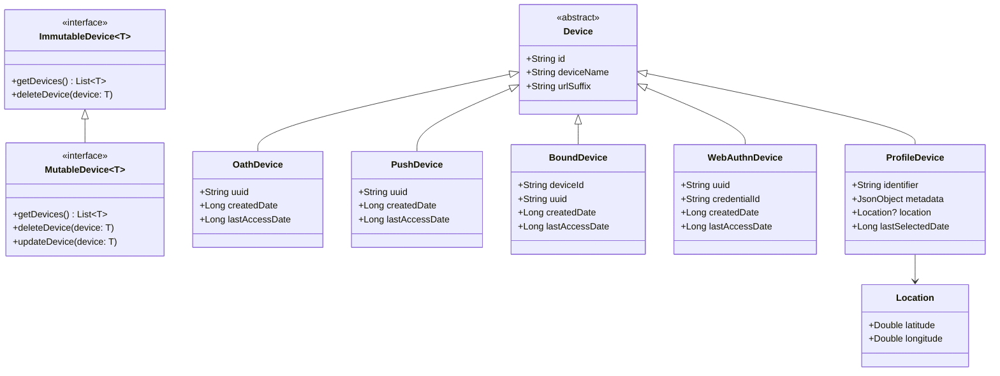
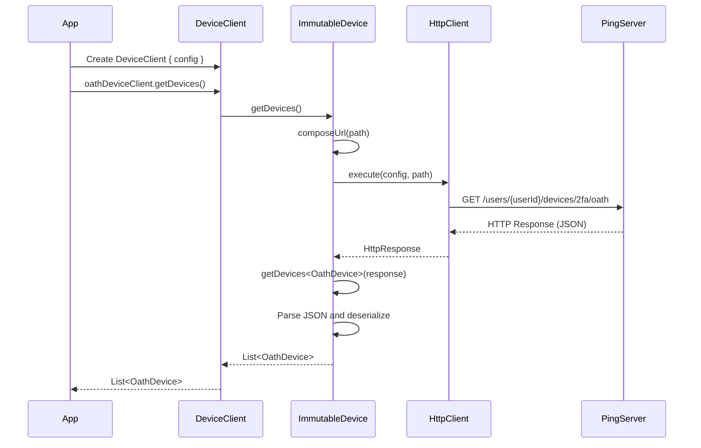

<p align="center">
  <a href="https://github.com/ForgeRock/ping-android-sdk">
    
  </a>
  <hr/>
</p>

# Design Concept

## Overview

The Device Client module provides a unified API for managing various types of Multi-Factor Authentication (MFA) devices and user profile devices registered with Ping Identity services. It abstracts the complexities of interacting with different device types through a consistent interface, enabling developers to retrieve, update, and delete user devices across multiple authentication methods.

**Documentation Note:**  
The codebase uses concise but informative KDoc comments for classes and functions, focusing on usage and intent. Single-variable documentation is omitted for properties that are self-explanatory.

## Architecture

### Device Management Interface

The Device Client follows a generic interface pattern with two distinct interfaces based on device mutability:

#### ImmutableDevice Interface

For devices that support read and delete operations only (OATH and Push devices):

```kotlin
/**
 * Interface for immutable device operations.
 * Supports fetching and deleting devices.
 */
interface ImmutableDevice<T> {
    /**
     * Fetch all devices of type [T].
     */
    suspend fun getDevices(): List<T>
    /**
     * Delete a device of type [T].
     */
    suspend fun deleteDevice(device: T)
}
```

#### MutableDevice Interface

For devices that support full CRUD operations (Bound, WebAuthn, and Profile devices):

```kotlin
/**
 * Interface for mutable device operations.
 * Extends [ImmutableDevice] and adds update support.
 */
interface MutableDevice<T> : ImmutableDevice<T> {
    /**
     * Update a device of type [T].
     */
    suspend fun updateDevice(device: T)
}
```

This segregation ensures that:
- OATH and Push devices cannot be accidentally updated via the API
- Type safety is enforced at compile time
- Clear API contracts for different device capabilities

### Supported Device Types

The module supports the following device types, all extending from the abstract `Device` class:

| Device Type    | Interface Type | Description                                                                 | URL Suffix            |
|----------------|----------------|-----------------------------------------------------------------------------|-----------------------|
| OathDevice     | ImmutableDevice| Time-based One-Time Password (TOTP) or HMAC-based OTP devices              | devices/2fa/oath      |
| PushDevice     | ImmutableDevice| Push notification-based authentication devices                              | devices/2fa/push      |
| BoundDevice    | MutableDevice  | Cryptographically bound devices for device binding authentication           | devices/2fa/binding   |
| WebAuthnDevice | MutableDevice  | FIDO2/WebAuthn biometric or security key devices                           | devices/2fa/webauthn  |
| ProfileDevice  | MutableDevice  | User profile devices tracking device metadata, location, and usage          | devices/profile       |

### Class Hierarchy



## DeviceClient Configuration

The `DeviceClient` uses a DSL-based configuration pattern for initialization, with class-level documentation describing its purpose and usage:

```kotlin
/**
 * Configuration builder for DeviceClient.
 *
 * Use this class to configure authentication and connection details for device management.
 */
@PingDsl
class DeviceClientConfig {
    var ssoTokenString: String? = null
    var serverUrl: String = ""
    var realm: String = ""
    var cookieName: String = ""
    var userId: String = ""
    var httpClient: HttpClient = HttpClient()
}
```

### Configuration Parameters

- **ssoTokenString**: The Single Sign-On token used for authentication with the server
- **serverUrl**: The base URL of the Ping Identity server
- **realm**: The authentication realm
- **cookieName**: The name of the cookie used for session management (e.g., "iPlanetDirectoryPro")
- **userId**: The user identifier for device operations
- **httpClient**: The Ktor HTTP client used for network requests (can be customized)

## Device Retrieval Flow

The following sequence diagram illustrates how device data is retrieved from the server:



### URL Composition Strategy

The module composes URLs dynamically based on the configuration and device type, using helper methods with clear KDoc:

```kotlin
/**
 * Compose the base URL for device endpoints using the provided config.
 */
private fun composeBaseUrl(config: DeviceClientConfig): Uri.Builder { ... }

/**
 * Compose the URL for fetching a list of devices of a specific type.
 */
private fun composeUrlForDeviceList(config: DeviceClientConfig, path: String): String { ... }

/**
 * Compose the URL for a specific device resource.
 */
private fun composeUrlForDevice(config: DeviceClientConfig, device: Device): String { ... }
```

## Implementation Details

### Device Operations

All device operations are implemented as suspend functions with descriptive KDoc, e.g.:

```kotlin
/**
 * Fetch a list of devices of type [T] from the server.
 *
 * @param config The client configuration.
 * @param path The API path for the device type.
 * @return List of devices of type [T].
 */
private suspend inline fun <reified T : Device> getDeviceList(
    config: DeviceClientConfig,
    path: String,
): List<T> { ... }
```

```kotlin
/**
 * Delete a device of type [T] on the server.
 *
 * @param config The client configuration.
 * @param device The device to delete.
 * @return The HTTP response from the server.
 */
private suspend inline fun <reified T : Device> deleteDevice(
    config: DeviceClientConfig,
    device: T,
): HttpResponse { ... }
```

```kotlin
/**
 * Update a device of type [T] on the server.
 *
 * @param config The client configuration.
 * @param device The device to update.
 * @return The HTTP response from the server.
 */
private suspend inline fun <reified T : Device> updateDevice(
    config: DeviceClientConfig,
    device: T,
): HttpResponse { ... }
```

### Lazy Initialization Pattern

Each device client is lazily initialized using Kotlin's `by lazy` delegate, ensuring that the implementation is only created when first accessed. This is documented at the property level in the code.

## Error Handling and Coroutines

All device operations are suspend functions and use `Dispatchers.IO` for network operations, as described in the KDoc. Applications should handle exceptions using try-catch blocks.

## Best Practices

- Use the provided configuration builder and class-level documentation for setup.
- Reference function-level KDoc for details on each operation.
- Only document variables where additional context is needed; skip obvious ones for brevity.

## Summary

The DeviceClient module is designed for clarity and maintainability, with concise but informative documentation at the class and function level. Helper methods and generics are documented for intent and usage, while self-explanatory variables are left without redundant comments.
