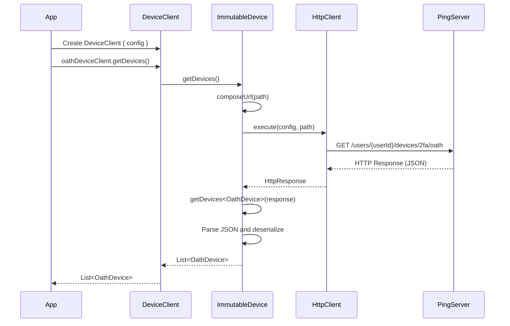
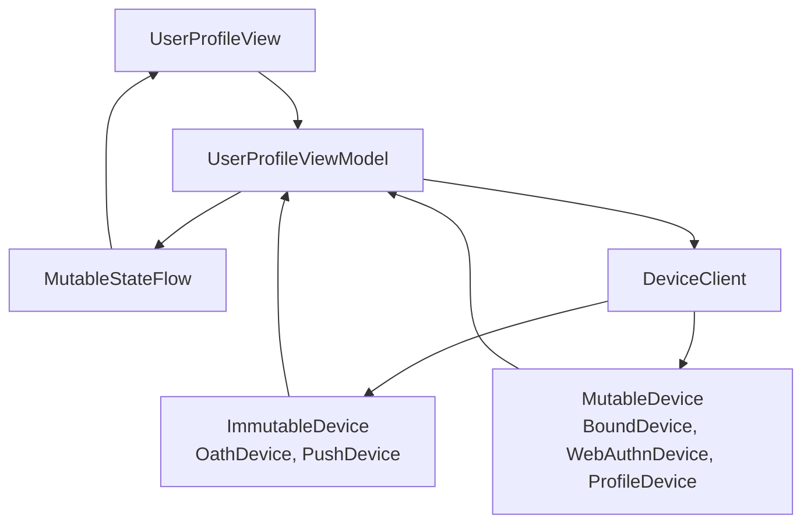
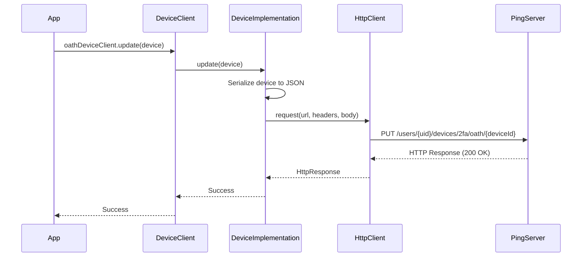
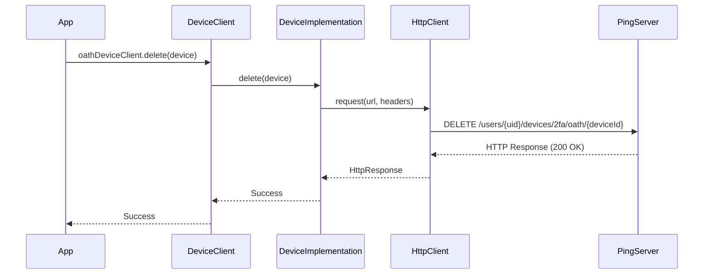

<p align="center">
  <a href="https://github.com/ForgeRock/ping-android-sdk">
    
  </a>
  <hr/>
</p>

# Design Concept

## Overview

The Device Client module provides a unified API for managing various types of Multi-Factor Authentication (MFA) devices and user profile devices registered with Ping Identity services. It abstracts the complexities of interacting with different device types through a consistent interface, enabling developers to retrieve, update, and delete user devices across multiple authentication methods.

## Architecture

### Device Management Interface

The Device Client follows a generic interface pattern with two distinct interfaces based on device mutability:

#### ImmutableDevice Interface

For devices that support read and delete operations only (OATH and Push devices):

```kotlin
interface ImmutableDevice<T> {
    suspend fun getDevices(): List<T>
    suspend fun deleteDevice(device: T)
}
```

#### MutableDevice Interface

For devices that support full CRUD operations (Bound, WebAuthn, and Profile devices):

```kotlin
interface MutableDevice<T> : ImmutableDevice<T> {
    suspend fun updateDevice(device: T)
}
```

This segregation ensures that:
- OATH and Push devices cannot be accidentally updated via the API
- Type safety is enforced at compile time
- Clear API contracts for different device capabilities

### Supported Device Types

The module supports the following device types, all extending from the sealed `Device` class:

| Device Type    | Interface Type | Description                                                                 | URL Suffix            |
|----------------|----------------|-----------------------------------------------------------------------------|-----------------------|
| OathDevice     | ImmutableDevice| Time-based One-Time Password (TOTP) or HMAC-based OTP devices              | devices/2fa/oath      |
| PushDevice     | ImmutableDevice| Push notification-based authentication devices                              | devices/2fa/push      |
| BoundDevice    | MutableDevice  | Cryptographically bound devices for device binding authentication           | devices/2fa/binding   |
| WebAuthnDevice | MutableDevice  | FIDO2/WebAuthn biometric or security key devices                           | devices/2fa/webauthn  |
| ProfileDevice  | MutableDevice  | User profile devices tracking device metadata, location, and usage          | devices/profile       |

### Class Hierarchy


## DeviceClient Configuration

The `DeviceClient` uses a DSL-based configuration pattern for initialization, similar to other modules in the SDK:

```kotlin
class DeviceClientConfig {
    var ssoTokenString: String? = null
    var serverUrl: String = ""
    var realm: String = ""
    var cookieName: String = ""
    var userId: String = ""
    var httpClient: HttpClient = HttpClient()
}
```

### Configuration Parameters

- **ssoTokenString**: The Single Sign-On token used for authentication with the server
- **serverUrl**: The base URL of the Ping Identity server
- **realm**: The authentication realm
- **cookieName**: The name of the cookie used for session management (e.g., "iPlanetDirectoryPro")
- **userId**: The user identifier for device operations
- **httpClient**: The Ktor HTTP client used for network requests (can be customized)

## Device Retrieval Flow

The following sequence diagram illustrates how device data is retrieved from the server:



### URL Composition Strategy

The module composes URLs dynamically based on the configuration and device type:

```
{serverUrl}/json/realms/{realm}/users/{userId}/{urlSuffix}?_queryFilter=true
```

Example:
```
https://openam.example.com/am/json/realms/alpha/users/demo/devices/2fa/oath?_queryFilter=true
```

### Response Parsing

The server response follows this structure:

```json
{
  "result": [
    {
      "_id": "device-123",
      "deviceName": "My Authenticator",
      "uuid": "uuid-456",
      "createdDate": 1699900800000,
      "lastAccessDate": 1700000000000
    }
  ]
}
```

The `getDevices<T>()` method:
1. Extracts the `result` array from the JSON response
2. Deserializes each object into the specified device type using Kotlin Serialization
3. Returns a type-safe list of devices

## Lazy Initialization Pattern

Each device client is lazily initialized using Kotlin's `by lazy` delegate, ensuring that the implementation is only created when first accessed:

```kotlin
val oathDeviceClient: DeviceImplementation<OathDevice> by lazy {
    object : DeviceImplementation<OathDevice> {
        // Implementation
    }
}
```

This pattern:
- Reduces initial memory footprint
- Improves performance by deferring object creation
- Ensures thread-safe initialization

## Implementation Details

### Delete Implementation

All device types follow the same pattern for deletion, using the centralized `execute()` helper method:

```kotlin
override suspend fun deleteDevice(device: OathDevice) {
    withContext(Dispatchers.IO) {
        execute<OathDevice>(
            config = config,
            path = "devices/2fa/oath",
            device = device,
            requestType = RequestType.DELETE,
        )
    }
}
```

For BoundDevice:
```kotlin
override suspend fun deleteDevice(device: BoundDevice) {
    withContext(Dispatchers.IO) {
        execute<BoundDevice>(
            config = config,
            path = "devices/2fa/binding",
            device = device,
            requestType = RequestType.DELETE,
        )
    }
}
```

The delete operation:
- Uses the centralized `execute()` method with type-specific generics
- Switches to `Dispatchers.IO` for network operations
- Passes the device type, path, device object, and DELETE request type
- The `execute()` method handles URL composition, headers, and HTTP request execution

### Update Implementation

Mutable device types (BoundDevice, WebAuthnDevice, ProfileDevice) support updates using the same centralized pattern:

```kotlin
override suspend fun updateDevice(device: BoundDevice) {
    withContext(Dispatchers.IO) {
        execute<BoundDevice>(
            config = config,
            path = "devices/2fa/binding",
            device = device,
            requestType = RequestType.UPDATE,
        )
    }
}
```

For WebAuthnDevice:
```kotlin
override suspend fun updateDevice(device: WebAuthnDevice) {
    withContext(Dispatchers.IO) {
        execute<WebAuthnDevice>(
            config = config,
            path = "devices/2fa/webauthn",
            device = device,
            requestType = RequestType.UPDATE,
        )
    }
}
```

For ProfileDevice:
```kotlin
override suspend fun updateDevice(device: ProfileDevice) {
    withContext(Dispatchers.IO) {
        execute<ProfileDevice>(
            config = config,
            path = "devices/profile",
            device = device,
            requestType = RequestType.UPDATE,
        )
    }
}
```

The update operation:
- Uses type-specific serialization with inline reified generics
- Switches to `Dispatchers.IO` for network operations
- Serializes the device object using `Json.encodeToString(device!!)` (handled by execute method)
- Sets the Content-Type header to application/json (handled by execute method)
- Sends the serialized device data in the request body
- Uses the PUT HTTP method with the device-specific URL

### Execute Helper Method

A centralized, type-safe execute method handles all HTTP operations using inline reified generics:

```kotlin
private suspend inline fun <reified T : Device> execute(
    config: DeviceClientConfig,
    path: String,
    device: T? = null,
    requestType: RequestType = RequestType.LIST,
): HttpResponse {
    val urlString = if (requestType == RequestType.LIST) {
        composeUrlForDeviceList(config, path)
    } else {
        composeUrlForDevice(
            config = config,
            device = device!!,
        )
    }
    
    val request = httpClient.prepareRequest {
        url(urlString)
        header(config.cookieName, config.ssoTokenString ?: "")
        header("Content-Type", "application/json")
        header("Accept-API-Version", "resource=1.0")
        header("x-requested-platform", "Android")
        method = when (requestType) {
            RequestType.LIST -> Get
            RequestType.DELETE -> Delete
            RequestType.UPDATE -> Put
        }
        if (requestType == RequestType.UPDATE) {
            setBody(Json.encodeToString(device!!))
            contentType(ContentType.Application.Json)
        }
    }
    return request.execute()
}

private enum class RequestType {
    LIST,
    DELETE,
    UPDATE
}
```

#### Key Design Decisions

1. **Inline Reified Generics**: Using `inline fun <reified T : Device>` allows type-safe serialization without requiring polymorphic serialization or manual serializer registration

2. **Type Safety**: Each device type is serialized correctly using its specific serializer, avoiding runtime serialization errors

3. **Centralized Logic**: All HTTP operations (GET, DELETE, PUT) are handled by a single method, reducing code duplication

4. **Platform Headers**: Custom headers like `x-requested-platform: Android` help with server-side analytics and logging

#### Benefits of This Approach

- **Compile-time Type Safety**: The compiler ensures correct device types are passed to each operation
- **Automatic Serialization**: Kotlin Serialization automatically handles device serialization based on the reified type
- **No Polymorphic Serialization Required**: Since Device is not sealed and devices don't share a common polymorphic hierarchy, inline reified functions provide type-specific serialization
- **Reduced Boilerplate**: Single execute method handles all device types and operations

### URL Composition Helper Methods

The module uses three helper methods to compose URLs for different operations:

#### Base URL Composition

```kotlin
private fun composeBaseUrl(config: DeviceClientConfig): Uri.Builder {
    return Uri.Builder()
        .encodedPath(config.serverUrl)
        .appendPath("json")
        .appendPath("realms")
        .appendEncodedPath(config.realm)
        .appendPath("users")
        .appendPath(config.userId)
}
```

This creates the base URL structure:
```
{serverUrl}/json/realms/{realm}/users/{userId}
```

#### Device List URL

```kotlin
private fun composeUrlForDeviceList(
    config: DeviceClientConfig,
    path: String,
): String {
    return composeBaseUrl(config)
        .appendEncodedPath(path)
        .appendQueryParameter("_queryFilter", "true")
        .build().toString()
}
```

Used for GET operations to retrieve all devices of a type:
```
{baseUrl}/devices/2fa/oath?_queryFilter=true
```

#### Individual Device URL

```kotlin
private fun composeUrlForDevice(
    config: DeviceClientConfig,
    device: Device,
): String {
    val uri = composeBaseUrl(config)
        .appendEncodedPath(device.urlSuffix)
        .appendEncodedPath(device.id)
    return uri.build().toString()
}
```

Used for DELETE and UPDATE operations on specific devices:
```
{baseUrl}/devices/2fa/oath/{deviceId}
```

The `device.urlSuffix` property determines the device type path segment, and `device.id` identifies the specific device instance.

## Authentication Strategy

The Device Client uses cookie-based authentication with the SSO token:

```kotlin
header(config.cookieName, config.ssoTokenString ?: "")
header("Content-Type", "application/json")
header("Accept-API-Version", "resource=1.0")
header("x-requested-platform", "Android")
```

This approach:
- Maintains session-based authentication across requests
- Leverages existing session tokens from Journey or DaVinci flows
- Provides secure access to user-specific device data
- Includes API versioning for backward compatibility
- Identifies the platform for server-side analytics

## Real-World UI Integration Pattern

### State-Driven Architecture

The recommended pattern for UI integration uses a state-driven architecture with the following components:



### State Management

The state encapsulates all UI-relevant data:

```kotlin
data class UserProfileState(
    var user: JsonObject? = null,
    var error: OidcError? = null,
    var deviceList: List<String> = emptyList(),
    var showDeviceInfo: Boolean = false,
    var selectedDeviceType: DeviceType = DeviceType.OATH,
    var isLoading: Boolean = false
)
```

Key state properties:
- **deviceList**: Currently displayed device names
- **selectedDeviceType**: Active device filter
- **isLoading**: Loading indicator state
- **error**: Error messages for user feedback

### Device Type Filtering

Users can filter devices by type using radio buttons:

```kotlin
enum class DeviceType {
    OATH,      // ImmutableDevice
    PUSH,      // ImmutableDevice
    BOUND,     // MutableDevice
    WEBAUTHN,  // MutableDevice
    PROFILE    // MutableDevice
}
```

The ViewModel switches between device clients based on the selected type:

```kotlin
fun setDeviceType(deviceType: DeviceType) {
    state.update { s ->
        s.copy(selectedDeviceType = deviceType, isLoading = true)
    }
    viewModelScope.launch {
        val deviceClient = buildDeviceClient() ?: return@launch
        try {
            when (deviceType) {
                DeviceType.OATH -> {
                    val devices = deviceClient.oathDeviceClient.getDevices()
                    state.update { s ->
                        s.copy(deviceList = devices.map { it.deviceName }, isLoading = false)
                    }
                }
                // ... other device types
            }
        } catch (exception: Exception) {
            state.update { s ->
                s.copy(deviceList = emptyList(), isLoading = false)
            }
        }
    }
}
```

### CRUD Operation Pattern

#### Delete Operation

All device types support deletion with automatic list refresh:

```kotlin
fun onDeleteDevice(deviceName: String) {
    viewModelScope.launch {
        val deviceClient = buildDeviceClient() ?: return@launch
        try {
            when (state.value.selectedDeviceType) {
                DeviceType.OATH -> {
                    val devices = deviceClient.oathDeviceClient.getDevices()
                    val deviceToDelete = devices.find { it.deviceName == deviceName }
                    deviceToDelete?.let {
                        deviceClient.oathDeviceClient.deleteDevice(it)
                        setDeviceType(DeviceType.OATH) // Refresh list
                    }
                }
                // ... other device types
            }
        } catch (exception: Exception) {
            println("Error deleting device: ${exception.message}")
            setDeviceType(state.value.selectedDeviceType) // Refresh on error
        }
    }
}
```

#### Update Operation

Only MutableDevice types (Bound, WebAuthn, Profile) support updates:

```kotlin
fun onEditDevice(deviceName: String) {
    viewModelScope.launch {
        val deviceClient = buildDeviceClient() ?: return@launch
        try {
            when (state.value.selectedDeviceType) {
                DeviceType.BOUND -> {
                    val devices = deviceClient.boundDevice.getDevices()
                    val deviceToUpdate = devices.find { it.deviceName == deviceName }
                    deviceToUpdate?.let {
                        val updatedDevice = it.copy(deviceName = "Updated Name")
                        deviceClient.boundDevice.updateDevice(updatedDevice)
                        setDeviceType(DeviceType.BOUND) // Refresh list
                    }
                }
                // ... other mutable device types
                else -> {
                    // Update not supported for immutable devices
                }
            }
        } catch (exception: Exception) {
            println("Error updating device: ${exception.message}")
        }
    }
}
```

### UI Features

#### Conditional Edit Button

The edit button is only enabled for MutableDevice types:

```kotlin
fun canUpdateDevice(): Boolean {
    return when (selectedDeviceType) {
        DeviceType.BOUND, DeviceType.WEBAUTHN, DeviceType.PROFILE -> true
        DeviceType.OATH, DeviceType.PUSH -> false
    }
}

// In the UI:
IconButton(
    onClick = { viewModel.onEditDevice(deviceName) },
    enabled = canUpdateDevice()
) {
    Icon(imageVector = Icons.Filled.Edit, ...)
}
```

#### Loading States

A loading indicator is shown during API calls:

```kotlin
if (state.isLoading) {
    CircularProgressIndicator()
} else {
    LazyColumn {
        items(state.deviceList) { deviceName ->
            DeviceRow(deviceName, onEdit, onDelete)
        }
    }
}
```

#### Automatic Refresh

The device list automatically refreshes when:
1. The user switches device types
2. After a successful delete operation
3. After a successful update operation
4. On error (to ensure consistency)

```kotlin
LaunchedEffect(state.selectedDeviceType) {
    viewModel.setDeviceType(state.selectedDeviceType)
}
```

### DeviceClient Construction

The DeviceClient is built from the user's session:

```kotlin
private suspend fun buildDeviceClient(): DeviceClient? {
    val user = journey.user() ?: return null
    val userInfo = user.userinfo(false) as? Result.Success ?: return null
    return DeviceClient {
        ssoTokenString = user.session().value
        serverUrl = "https://openam-sdks.forgeblocks.com/am"
        realm = user.session().realm
        cookieName = "iPlanetDirectoryPro"
        userId = userInfo.value["sub"]?.jsonPrimitive?.content ?: ""
    }
}
```

This pattern:
- Extracts the SSO token from the authenticated session
- Uses the user's realm from the session
- Retrieves the user ID from the userinfo endpoint
- Returns null if the user is not authenticated

### Best Practices

1. **Always Refresh After Mutations**: Call `setDeviceType()` after delete/update to ensure UI consistency
2. **Handle Errors Gracefully**: Catch exceptions and update state accordingly
3. **Use Loading States**: Show feedback during async operations
4. **Conditional Features**: Disable/hide features based on device type capabilities
5. **Type-Safe State**: Use sealed classes or enums for device types
6. **Centralized DeviceClient Creation**: Build DeviceClient once and reuse
7. **Reactive UI**: Use StateFlow with `collectAsState()` for automatic recomposition

## Device Update Flow

The following sequence diagram illustrates how device data is updated on the server:



### Update Operation Details

The `update(device: T)` method:
1. Serializes the device object to JSON using Kotlin Serialization
2. Sends a PUT request to the device-specific URL
3. Includes the device ID in the URL path: `{urlSuffix}/{deviceId}`
4. Sets the request body with the serialized device data
5. Uses Bearer token authentication

Example URL for update:
```
https://openam.example.com/json/realms/alpha/users/abc123/devices/2fa/oath/device-123
```

## Device Deletion Flow

The following sequence diagram illustrates how a device is deleted from the server:



### Delete Operation Details

The `delete(device: T)` method:
1. Sends a DELETE request to the device-specific URL
2. Includes the device ID in the URL path: `{urlSuffix}/{deviceId}`
3. Uses Bearer token authentication
4. No request body is required

Example URL for delete:
```
https://openam.example.com/json/realms/alpha/users/abc123/devices/2fa/oath/device-123
```

## Error Handling Considerations

The implementation handles various error scenarios that may occur during device operations:

1. **Network Errors**: Connection timeouts, DNS resolution failures
2. **Authentication Errors**: Invalid or expired tokens (401 Unauthorized)
3. **Authorization Errors**: Insufficient permissions (403 Forbidden)
4. **Parsing Errors**: Malformed JSON responses (for GET operations)
5. **Server Errors**: 5xx status codes indicating server-side issues
6. **Not Found Errors**: Device ID doesn't exist (404 Not Found)

Applications should wrap device operations in try-catch blocks to handle these errors gracefully.

## Coroutines and Threading

All device operations are suspend functions that execute on the `Dispatchers.IO` context:

```kotlin
override suspend fun get(): List<OathDevice> {
    return withContext(Dispatchers.IO) {
        // Network operation
    }
}
```

This ensures:
- Network operations don't block the main thread
- Proper resource management for I/O-bound operations
- Integration with Kotlin coroutines ecosystem

## Future Enhancements

The Device Client architecture is designed to support future enhancements:

1. **Enhanced Error Handling**: Wrap operations in `Result<T>` or custom sealed classes for better error handling
2. **Pagination Support**: Handling large device lists with pagination parameters
3. **Filtering and Sorting**: Advanced query capabilities using `_queryFilter` parameter
4. **Real-time Updates**: WebSocket or polling mechanisms for device status changes
5. **Caching Strategy**: Local caching of device data with TTL and invalidation policies
6. **Offline Support**: Queue operations for execution when connectivity is restored
7. **Batch Operations**: Support for deleting or updating multiple devices in a single request
8. **Device Registration**: APIs for registering new devices (currently handled by MFA modules)
9. **Device Validation**: Pre-request validation of device data before sending to server

