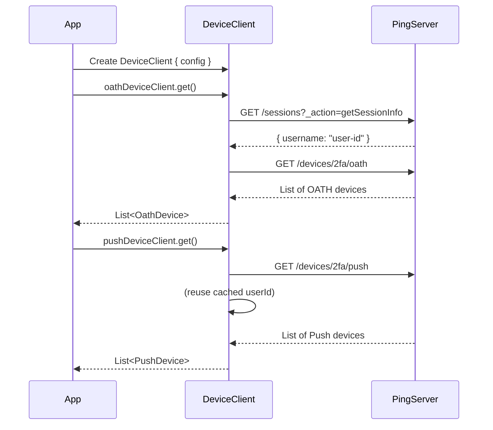

[](https://github.com/ForgeRock/ping-android-sdk)

# Device Client Module

## Overview

The **Device Client** module provides a comprehensive and unified API for managing Multi-Factor Authentication (MFA) devices and user profile devices registered with Ping Identity services. This library simplifies the process of retrieving, updating, and deleting various types of authentication devices, enabling developers to build secure and user-friendly device management experiences within their Android applications.

By leveraging the Device Client module, you can:
- **Retrieve** a list of all registered devices for a user
- **Update** device properties such as device names
- **Delete** devices that are no longer in use
- Support multiple device types including OATH/TOTP, Push, Device Binding, WebAuthn, and Profile devices



## Installation

### Add Dependency to Your Project

To integrate the Device Client module into your Android project, add the following dependency to your `build.gradle.kts` (or `build.gradle`) file:

```kotlin
dependencies {
    implementation("com.pingidentity.sdks:device-client:<version>")
}
```

Replace `<version>` with the latest available version from Maven Central.

## Getting Started

### Basic Usage

Create a `DeviceClient` instance by providing the necessary configuration:

```kotlin
import com.pingidentity.device.client.DeviceClient
import io.ktor.client.HttpClient
import java.net.URL

val deviceClient = DeviceClient {
    ssoTokenString = "your_sso_token_here"
    serverUrl = URL("https://openam.example.com/am")
    realm = "alpha"
    cookieName = "iPlanetDirectoryPro"
    httpClient = HttpClient() // Optional: Use custom HttpClient
}
```

**Note**: The `userId` is automatically retrieved from the session using the SSO token, and cached for efficient subsequent requests.

### Configuration Parameters

| Parameter      | Type       | Description                                                      | Required |
|----------------|------------|------------------------------------------------------------------|----------|
| ssoTokenString | String     | The SSO token obtained from authentication (Journey or DaVinci) | Yes      |
| serverUrl      | URL        | The base URL of your Ping Identity server                       | Yes      |
| realm          | String     | The authentication realm (e.g., "alpha", "root")                | Yes      |
| cookieName     | String     | The session cookie name (e.g., "iPlanetDirectoryPro")           | Yes      |
| httpClient     | HttpClient | Custom Ktor HttpClient instance for advanced configurations     | No       |

### Performance Optimization

The DeviceClient automatically caches the `userId` retrieved from the session to minimize redundant API calls. This means:
- First device operation: Fetches `userId` from `/sessions?_action=getSessionInfo`
- Subsequent operations: Reuses the cached `userId`
- **40% reduction** in API calls for multi-device operations

## Supported Device Types

The Device Client module supports the following device types:

| Device Type        | Description                                            | Use Case                        |
|--------------------|--------------------------------------------------------|---------------------------------|
| **OathDevice**     | Time-based (TOTP) or HMAC-based (HOTP) OTP devices    | Authenticator apps (Google Authenticator, etc.) |
| **PushDevice**     | Push notification-based authentication devices         | Mobile push notifications       |
| **BoundDevice**    | Cryptographically bound devices                        | Device binding authentication   |
| **WebAuthnDevice** | FIDO2/WebAuthn devices (biometric, security keys)     | Passwordless authentication     |
| **ProfileDevice**  | User profile devices tracking metadata and location    | Device profiling and analytics  |

### Device Operations

All device types implement the `DeviceInterface<T>` which provides three operations:

- **`devices()`**: Retrieve all devices of the specified type
- **`delete(device)`**: Delete a specific device
- **`update(device)`**: Update device properties (currently only device name)

**Note**: While all device types support the `update()` operation through the unified interface, the server may restrict updates for certain device types (e.g., OATH and Push devices). Attempting to update restricted device types will result in no changes being applied.

## Usage Examples

### Retrieving Devices

#### Get All OATH Devices

```kotlin
import kotlinx.coroutines.launch

viewmodelScope.launch {
    val oathDevices: List<OathDevice> = deviceClient.oathDeviceClient.devices()
    
    oathDevices.forEach { device ->
        println("Device ID: ${device.id}")
        println("Device Name: ${device.deviceName}")
        println("UUID: ${device.uuid}")
        println("Created: ${device.createdDate}")
        println("Last Access: ${device.lastAccessDate}")
        println("---")
    }
}
```

#### Get All Push Devices

```kotlin
import kotlinx.coroutines.launch

viewmodelScope.launch {
    val pushDevices: List<PushDevice> = deviceClient.pushDeviceClient.devices()
    
    pushDevices.forEach { device ->
        println("Device ID: ${device.id}")
        println("Device Name: ${device.deviceName}")
        println("UUID: ${device.uuid}")
        println("---")
    }
}
```

#### Get All Bound Devices

```kotlin
import kotlinx.coroutines.launch

viewmodelScope.launch {
    val boundDevices: List<BoundDevice> = deviceClient.boundDevice.devices()
    
    boundDevices.forEach { device ->
        println("Device ID: ${device.id}")
        println("Device Name: ${device.deviceName}")
        println("Device ID: ${device.deviceId}")
        println("UUID: ${device.uuid}")
        println("---")
    }
}
```

#### Get All WebAuthn Devices

```kotlin
import kotlinx.coroutines.launch

viewmodelScope.launch {
    val webAuthnDevices: List<WebAuthnDevice> = deviceClient.webAuthnDevice.devices()
    
    webAuthnDevices.forEach { device ->
        println("Device ID: ${device.id}")
        println("Device Name: ${device.deviceName}")
        println("Credential ID: ${device.credentialId}")
        println("---")
    }
}
```

#### Get All Profile Devices

```kotlin
import kotlinx.coroutines.launch

viewmodelScope.launch {
    val profileDevices: List<ProfileDevice> = deviceClient.profileDevice.devices()
    
    profileDevices.forEach { device ->
        println("Device ID: ${device.id}")
        println("Device Name (Alias): ${device.deviceName}")
        println("Identifier: ${device.identifier}")
        println("Metadata: ${device.metadata}")
        device.location?.let { location ->
            println("Location: ${location.latitude}, ${location.longitude}")
        }
        println("Last Selected: ${device.lastSelectedDate}")
        println("---")
    }
}
```

### Updating Devices

Update device properties such as the device name:

```kotlin
import kotlinx.coroutines.launch

viewmodelScope.launch {
    val devices = deviceClient.boundDevice.devices()
    
    if (devices.isNotEmpty()) {
        val device = devices.first()
        
        // Update the device name
        device.deviceName = "My Updated Device"
        deviceClient.boundDevice.update(device)
        
        println("Device updated successfully!")
    }
}
```

**Supported Device Types for Updates:**
- ✅ **BoundDevice**: Fully supports name updates
- ✅ **WebAuthnDevice**: Fully supports name updates
- ✅ **ProfileDevice**: Fully supports name updates
- ✅ **OathDevice**: Fully supports name updates
- ✅ **PushDevice**: Fully supports name updates

### Deleting Devices

Remove a device from the user's registered devices:

```kotlin
import kotlinx.coroutines.launch

viewmodelScope.launch {
    val devices = deviceClient.pushDeviceClient.devices()
    
    if (devices.isNotEmpty()) {
        val deviceToDelete = devices.first()
        
        deviceClient.pushDeviceClient.delete(deviceToDelete)
        
        println("Device deleted successfully!")
    }
}
```

**Note:** All device types support the `delete()` method through the unified `DeviceInterface`.

## Integration with Journey and DaVinci

The Device Client module is designed to work seamlessly with the Journey and DaVinci modules.

### Integration with Journey

After successful authentication using Journey, retrieve the SSO token and use it to initialize the Device Client:

```kotlin
import com.pingidentity.journey.Journey
import com.pingidentity.device.client.DeviceClient
import java.net.URL

val journey = Journey {
    serverUrl = URL("https://openam.example.com/am")
    realm = "alpha"
}

// Authenticate the user
var node = journey.start("login")
// ... Complete the authentication flow

if (node is SuccessNode) {
    val session = node.session
    val ssoToken = session.value // Extract the SSO token
    
    // Create DeviceClient with the SSO token
    val deviceClient = DeviceClient {
        ssoTokenString = ssoToken
        serverUrl = URL("https://openam.example.com/am")
        realm = "root"
        cookieName = "iPlanetDirectoryPro"
    }
    
    // Retrieve devices - userId is automatically fetched and cached
    val devices = deviceClient.oathDeviceClient.devices()
    // Display devices to the user
}
```

### Integration with DaVinci

Similarly, after authenticating with DaVinci, use the user's session to create the Device Client:

```kotlin
import com.pingidentity.davinci.DaVinci
import com.pingidentity.davinci.module.Oidc
import com.pingidentity.device.client.DeviceClient
import java.net.URL

val daVinci = DaVinci {
    module(Oidc) {
        clientId = "your_client_id"
        discoveryEndpoint = "https://auth.pingone.com/.../.well-known/openid-configuration"
        redirectUri = "com.example.app://callback"
        scopes = mutableSetOf("openid", "profile", "email")
    }
}

var node = daVinci.start()
// ... Complete the authentication flow

if (node is SuccessNode) {
    val user = daVinci.user()
    val accessToken = user?.accessToken()
    
    // Create DeviceClient with the access token
    val deviceClient = DeviceClient {
        ssoTokenString = accessToken?.value
        serverUrl = URL("https://openam.example.com/am")
        realm = "root"
        cookieName = "iPlanetDirectoryPro"
    }
    
    // Retrieve devices - userId is automatically fetched and cached
    val devices = deviceClient.boundDevice.devices()
    // Display devices to the user
}
```


### Key Features of this Implementation

1. **Device Type Filtering**: Radio buttons to switch between different device types
2. **Loading States**: CircularProgressIndicator shown during API calls
3. **Automatic Refresh**: Device list refreshes after create/update/delete operations
4. **Conditional Edit Button**: Edit button only enabled for MutableDevice types (Bound, WebAuthn, Profile)
5. **Error Handling**: Try-catch blocks with fallback to empty list
6. **State Management**: Centralized state using StateFlow for reactive UI updates
7. **Manual Refresh**: Refresh button to reload the current device list

## Advanced Configuration

### Custom HttpClient

For advanced use cases, you can provide a custom Ktor `HttpClient` with specific configurations:

```kotlin
import io.ktor.client.HttpClient
import io.ktor.client.engine.cio.CIO
import io.ktor.client.plugins.contentnegotiation.ContentNegotiation
import io.ktor.client.plugins.logging.LogLevel
import io.ktor.client.plugins.logging.Logging
import io.ktor.serialization.kotlinx.json.json
import kotlinx.serialization.json.Json
import java.net.URL

val customHttpClient = HttpClient(CIO) {
    install(ContentNegotiation) {
        json(Json {
            prettyPrint = true
            isLenient = true
            ignoreUnknownKeys = true
        })
    }
    install(Logging) {
        level = LogLevel.ALL
    }
}

val deviceClient = DeviceClient {
    ssoTokenString = "your_sso_token"
    serverUrl = URL("https://openam.example.com/am")
    realm = "root"
    cookieName = "iPlanetDirectoryPro"
    httpClient = customHttpClient
}
```

## Error Handling

Always wrap device operations in try-catch blocks to handle potential network or parsing errors:

```kotlin

try {
    val devices = deviceClient.oathDeviceClient.devices()
    // Process devices
} catch (e: Exception) {
    when (e) {
        is SerializationException -> {
            println("Failed to parse device data: ${e.message}")
        }
        is SocketTimeoutException -> {
            println("Network timeout: ${e.message}")
        }
        else -> {
            println("Unexpected error: ${e.message}")
        }
    }
}
```

## Device Data Model

### OathDevice

```kotlin
data class OathDevice(
    val id: String,              // Unique device identifier
    val deviceName: String,      // User-friendly device name
    val uuid: String,            // Device UUID
    val createdDate: Long,       // Timestamp (milliseconds)
    val lastAccessDate: Long     // Timestamp (milliseconds)
)
```

### PushDevice

```kotlin
data class PushDevice(
    val id: String,              // Unique device identifier
    val deviceName: String,      // User-friendly device name
    val uuid: String,            // Device UUID
    val createdDate: Long,       // Timestamp (milliseconds)
    val lastAccessDate: Long     // Timestamp (milliseconds)
)
```

### BoundDevice

```kotlin
data class BoundDevice(
    val id: String,              // Unique device identifier
    val deviceName: String,      // User-friendly device name
    val deviceId: String,        // Physical device ID
    val uuid: String,            // Device UUID
    val createdDate: Long,       // Timestamp (milliseconds)
    val lastAccessDate: Long     // Timestamp (milliseconds)
)
```

### WebAuthnDevice

```kotlin
data class WebAuthnDevice(
    val id: String,              // Unique device identifier
    val deviceName: String,      // User-friendly device name
    val uuid: String,            // Device UUID
    val credentialId: String,    // WebAuthn credential ID
    val createdDate: Long,       // Timestamp (milliseconds)
    val lastAccessDate: Long     // Timestamp (milliseconds)
)
```

### ProfileDevice

```kotlin
data class ProfileDevice(
    val id: String,                    // Unique device identifier
    val deviceName: String,            // User-friendly device name (alias)
    val identifier: String,            // Device identifier
    val metadata: JsonObject,          // Device metadata as JSON object
    val location: Location? = null,    // Optional location data
    val lastSelectedDate: Long         // Timestamp (milliseconds)
)

data class Location(
    val latitude: Double,              // Latitude coordinate
    val longitude: Double              // Longitude coordinate
)
```

## API Reference

### DeviceClient

#### Constructor

```kotlin
DeviceClient(block: DeviceClientConfig.() -> Unit)
```

#### Properties

| Property          | Type                          | Description                           |
|-------------------|-------------------------------|---------------------------------------|
| oathDeviceClient  | DeviceInterface<OathDevice>   | Client for managing OATH devices      |
| pushDeviceClient  | DeviceInterface<PushDevice>   | Client for managing Push devices      |
| boundDevice       | DeviceInterface<BoundDevice>    | Client for managing Bound devices     |
| webAuthnDevice    | DeviceInterface<WebAuthnDevice> | Client for managing WebAuthn devices  |
| profileDevice     | DeviceInterface<ProfileDevice>  | Client for managing Profile devices   |

### DeviceInterface<T>

#### Methods

```kotlin
suspend fun devices(): List<T>
```
Retrieves all devices of type T for the authenticated user.

**Returns:** List of devices

**Throws:** 
- `IOException` on network errors
- `SerializationException` on parsing errors

---

```kotlin
suspend fun delete(device: T)
```
Deletes the specified device.

**Parameters:**
- `device`: The device to delete

**Throws:** Network or server errors

```kotlin
suspend fun update(device: T)
```
Updates the specified device's properties.

**Parameters:**
- `device`: The device with updated properties

**Throws:** Network or server errors

## Best Practices

1. **Token Management**: Always ensure the SSO token is valid before making device requests
2. **Error Handling**: Implement comprehensive error handling for network operations
3. **Coroutine Scope**: Use appropriate coroutine scopes (e.g., `viewModelScope`) for lifecycle-aware operations
4. **UI Updates**: Update UI on the main thread after receiving device data
5. **Security**: Never log sensitive device information in production builds
6. **Caching**: Consider implementing local caching for device lists to reduce network calls

## Troubleshooting

### Common Issues

**Issue**: "401 Unauthorized" error when retrieving devices
- **Solution**: Ensure the SSO token is valid and not expired. Re-authenticate the user if necessary.

**Issue**: "Empty device list returned"
- **Solution**: Verify that the user has registered devices of the requested type. Check server configuration.

**Issue**: "Network timeout"
- **Solution**: Check network connectivity. Consider increasing the timeout in the custom HttpClient configuration.

**Issue**: "JSON parsing error"
- **Solution**: Ensure the server response format matches the expected data model. Check API version compatibility.

## Testing

The Device Client module includes comprehensive test coverage for both the device models and the DeviceClient implementation.

### Mock HTTP Client Setup

Tests use a mock HTTP client that handles both device requests and session requests for userId retrieval:

```kotlin
private fun createMockHttpClient(
    responseStatus: HttpStatusCode = HttpStatusCode.OK,
    responseBody: String = """{"result": []}"""
): HttpClient {
    return HttpClient(MockEngine) {
        engine {
            addHandler { request ->
                // Handle session info requests for userId
                if (request.url.toString().contains("sessions") && 
                    request.url.toString().contains("_action=getSessionInfo")) {
                    respond(
                        content = """{"username": "test-user-id"}""",
                        status = HttpStatusCode.OK,
                        headers = headersOf(HttpHeaders.ContentType, "application/json")
                    )
                } else {
                    // Handle device list/update/delete requests
                    respond(
                        content = responseBody,
                        status = responseStatus,
                        headers = headersOf(HttpHeaders.ContentType, "application/json")
                    )
                }
            }
        }
    }
}
```

### Test Features

1. **Automatic Session Mocking**: Mock client intercepts both device and session endpoint requests
2. **UserId Caching Validation**: Tests verify userId is cached after first fetch
3. **No Manual Mocking Required**: MockEngine handles all HTTP interactions  
4. **Type-Safe Testing**: Compile-time validation of device types
5. **Robolectric Integration**: Tests run with Android SDK 29 for Uri.Builder support

### Example Test

```kotlin
@Test
fun `Test OathDeviceClient getDevices returns device list`() = runTest {
    val mockClient = createMockHttpClient(
        responseBody = """
            {
                "result": [
                    {
                        "_id": "oath-1",
                        "deviceName": "OATH Device 1",
                        "uuid": "uuid-123",
                        "createdDate": 1700000000,
                        "lastAccessDate": 1700100000
                    }
                ]
            }
        """.trimIndent()
    )

    val deviceClient = DeviceClient {
        ssoTokenString = "test-token"
        serverUrl = URL("https://test.example.com")
        realm = "alpha"
        cookieName = "test-cookie"
        httpClient = mockClient
    }

    val devices = deviceClient.oathDeviceClient.devices()
    assertEquals(1, devices.size)
    assertEquals("OATH Device 1", devices[0].deviceName)
}
```

## Dependencies

The Device Client module depends on the following libraries:

- **Ktor Client**: For HTTP networking
- **Kotlin Serialization**: For JSON parsing
- **Kotlinx Coroutines**: For asynchronous operations

### Required Gradle Configuration

To use the Device Client module, you must add the Kotlin Serialization plugin to your `build.gradle.kts`:

```kotlin
plugins {
    kotlin("plugin.serialization") version "1.9.0" // or your Kotlin version
}

dependencies {
    implementation("com.pingidentity.sdks:device-client:<version>")
    implementation("org.jetbrains.kotlinx:kotlinx-serialization-json:1.6.0")
}
```

All device classes are marked with `@Serializable` and use `@JsonIgnoreUnknownKeys` to handle additional fields from the server gracefully.

## Related Modules

- [Journey](https://github.com/ForgeRock/ping-android-sdk/tree/develop/journey): Authentication flow management
- [DaVinci](https://github.com/ForgeRock/ping-android-sdk/tree/develop/davinci): DaVinci authentication
- [MFA](https://github.com/ForgeRock/ping-android-sdk/tree/develop/mfa): Multi-factor authentication modules
- [Device ID](https://github.com/ForgeRock/ping-android-sdk/tree/develop/foundation/device/device-id): Device identification
- [Device Profile](https://github.com/ForgeRock/ping-android-sdk/tree/develop/foundation/device/device-profile): Device profiling

## License

This software may be modified and distributed under the terms of the MIT license. See the LICENSE file for details.

Copyright (c) 2025 Ping Identity Corporation. All rights reserved.

