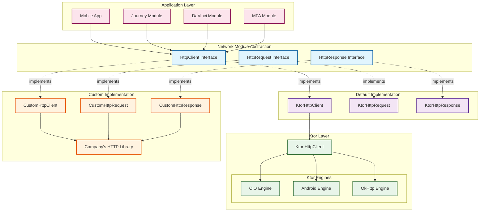
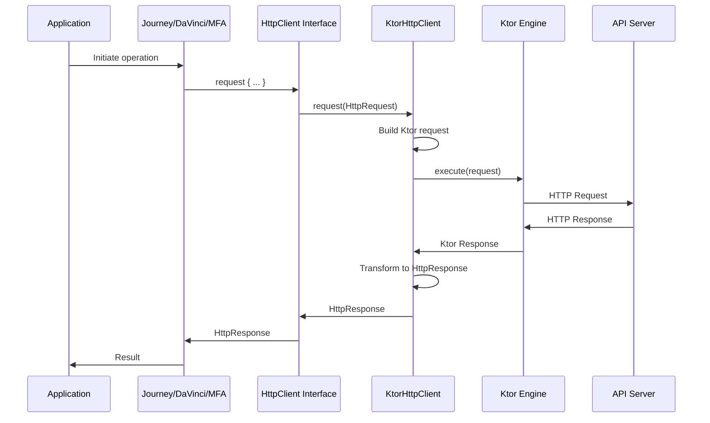

[](https://github.com/ForgeRock/ping-android-sdk)

# Network Module Design Concept

This document explains the internal design and architecture of the Network module, focusing on its
interface-based
abstraction layer, default Ktor implementation, and the flexibility it provides for custom HTTP
client implementations.

## Overview

The Network module provides a **clean, platform-agnostic HTTP client abstraction** that decouples
network operations
from specific HTTP client implementations. This design allows developers to use well-established
libraries like Ktor
while maintaining the flexibility to swap implementations without changing application code.

The module defines three core interfaces:

- **`HttpClient`** - The main entry point for making HTTP requests
- **`HttpRequest`** - Builder interface for constructing HTTP requests
- **`HttpResponse`** - Interface for accessing HTTP response data

## Architecture Components

### Component Diagram



## Design Principles

### Important Architectural Decision: Interface Flexibility

**The `HttpClient`, `HttpRequest`, and `HttpResponse` interfaces intentionally do NOT specify or
enforce how you
implement cross-cutting concerns** such as:

- ✅ Request/Response Interceptors
- ✅ Retry mechanisms with exponential backoff
- ✅ Request/Response caching
- ✅ Logging and monitoring
- ✅ Request rate limiting
- ✅ Error handling strategies
- ....

This is design choice provides maximum flexibility:

| Approach                   | Implementation Strategy                                                         |
|----------------------------|---------------------------------------------------------------------------------|
| **Default (Ktor)**         | Utilize Ktor's plugin ecosystem for interceptors, retry, logging, etc.          |
| **Custom HttpClient**      | Build interceptor logic directly into your `HttpClient` implementation          |
| **Company Infrastructure** | Integrate with existing HTTP libraries that have their own interceptor patterns |

This architecture recognizes that different organizations have different requirements:

- Some prefer using well-tested libraries like Ktor with its rich plugin ecosystem
- Others need to integrate with existing proprietary HTTP infrastructure
- Some require specific compliance or security implementations
- Others want to build custom solutions optimized for their use case

### 1. Interface-Based Abstraction

The module defining high-level abstractions that don't depend on low-level implementation details.

**Benefits:**

- **Decoupling**: Application code depends on interfaces, not concrete implementations
- **Testability**: Easy to create mock implementations for unit testing
- **Flexibility**: Swap HTTP client libraries without changing application code
- **Maintainability**: Implementation changes don't affect dependent modules

**Interface Contracts:**

```kotlin
interface HttpClient {
    fun request(): HttpRequest
    suspend fun request(request: HttpRequest): HttpResponse
    suspend fun request(requestBuilder: HttpRequest.() -> Unit): HttpResponse
    fun close()
}

interface HttpRequest {
    var url: String
    fun header(key: String, value: String)
    fun cookie(cookie: String)
    fun parameter(key: String, value: String)
    fun body(body: JsonObject)
    fun form(builder: MutableMap<String, String>.() -> Unit)
    fun post(body: JsonObject? = null)
    fun put(body: JsonObject? = null)
    fun delete(body: JsonObject? = null)
    fun get()
}

interface HttpResponse {
    val status: Int
    suspend fun body(): String
    fun header(key: String): String?
    fun headers(): Map<String, List<String>>
    fun cookies(): List<String>
}
```

### 2. Ktor as Default Implementation (Not Foundation)

**Important**: Ktor is used as the **default implementation**, not as the foundation of the module.

The `KtorHttpClient` class implements the `HttpClient` interface using Ktor's HTTP client:

```kotlin
class KtorHttpClient(
    private val client: io.ktor.client.HttpClient
) : HttpClient {
    // Implements HttpClient interface using Ktor
}
```

## Data Flow

### Request Flow Diagram



## Key Features and Patterns

### 1. Ktor Plugin System

The default Ktor implementation
leverages [Ktor's plugin system](https://ktor.io/docs/client-plugins.html) to handle cross-cutting
concerns like logging, authentication, retry logic, and interceptors. This provides a rich,
battle-tested ecosystem without reinventing the wheel.

**Available Ktor Plugins:**

- [Logging](https://ktor.io/docs/client-logging.html) - Request/response logging
- [Auth](https://ktor.io/docs/client-auth.html) - Authentication (Basic, Bearer, Digest)
- [Timeout](https://ktor.io/docs/client-timeout.html) - Request timeout configuration
- [HttpRequestRetry](https://ktor.io/docs/client-retry.html) - Automatic retry with exponential
  backoff
- [ContentNegotiation](https://ktor.io/docs/client-serialization.html) - JSON/XML serialization
- [Custom Plugins](https://ktor.io/docs/client-custom-plugins.html) - Build your own interceptors

### 2. DSL-Based Request Building

The module supports a fluent, type-safe DSL for building requests:

```kotlin
val response = httpClient.request {
    url = "https://api.example.com/users"
    header("Authorization", "Bearer token")
    parameter("page", "1")
    post(buildJsonObject {
        put("name", "John Doe")
        put("email", "john@example.com")
    })
}
```

## Custom HttpClient Implementation

For organizations with specific requirements or existing HTTP infrastructure, you can implement your
own `HttpClient`
with custom interceptor logic.

### Example: Custom HttpClient with Built-in Interceptors

```kotlin
import com.pingidentity.network.HttpClient
import com.pingidentity.network.HttpRequest
import com.pingidentity.network.HttpResponse
import kotlinx.serialization.json.JsonObject

/**
 * Custom HttpClient implementation with built-in request/response interceptors.
 */
class CustomHttpClient(
    private val baseUrl: String,
    private val requestInterceptors: List<(HttpRequest) -> HttpRequest> = emptyList(),
    private val responseInterceptors: List<(HttpResponse) -> Unit> = emptyList()
) : HttpClient {

    // Your company's HTTP library
    private val underlyingClient = YourCompanyHttpClient()

    override fun request(): HttpRequest = CustomHttpRequest()

    override suspend fun request(request: HttpRequest): HttpResponse {
        return execute(request as CustomHttpRequest)
    }

    override suspend fun request(requestBuilder: HttpRequest.() -> Unit): HttpResponse {
        val request = CustomHttpRequest().apply(requestBuilder)
        return execute(request)
    }

    private suspend fun execute(request: CustomHttpRequest): HttpResponse {
        // Apply request interceptors
        var modifiedRequest = request
        requestInterceptors.forEach { interceptor ->
            modifiedRequest = interceptor(modifiedRequest) as CustomHttpRequest
        }

        // Execute request using your company's library
        val rawResponse = underlyingClient.execute(
            url = modifiedRequest.url,
            method = modifiedRequest.method,
            headers = modifiedRequest.headers,
            body = modifiedRequest.body
        )

        // Transform to HttpResponse
        val response = CustomHttpResponse(rawResponse)

        // Apply response interceptors
        responseInterceptors.forEach { interceptor ->
            interceptor(response)
        }

        return response
    }

    override fun close() {
        underlyingClient.close()
    }
}

/**
 * Example: Add authentication token interceptor
 */
fun authTokenInterceptor(tokenProvider: () -> String): (HttpRequest) -> HttpRequest = { request ->
    request.apply {
        header("Authorization", "Bearer ${tokenProvider()}")
    }
}

/**
 * Example: Add request ID interceptor
 */
fun requestIdInterceptor(): (HttpRequest) -> HttpRequest = { request ->
    request.apply {
        header("X-Request-Id", UUID.randomUUID().toString())
    }
}

/**
 * Example: Logging response interceptor
 */
fun loggingInterceptor(): (HttpResponse) -> Unit = { response ->
    println("Response: ${response.status}")
}

/**
 * Usage example:
 */
fun createCustomHttpClient(): HttpClient {
    return CustomHttpClient(
        baseUrl = "https://api.example.com",
        requestInterceptors = listOf(
            authTokenInterceptor { getAuthToken() },
            requestIdInterceptor()
        ),
        responseInterceptors = listOf(
            loggingInterceptor()
        )
    )
}
```

Above is a simplified example, but it demonstrates how to build a custom `HttpClient` with built-in
interceptor logic.
Developers can implement their own `HttpClient`, `HttpRequest`, and `HttpResponse` classes to meet
specific needs.

## Benefits of This Architecture

### 1. **Flexibility Without Constraints**

The interface design intentionally doesn't dictate how to implement interceptors, retry logic, or
other cross-cutting
concerns. This gives developers:

- Freedom to use Ktor's rich plugin ecosystem (default)
- Ability to implement custom interceptor patterns
- Option to wrap with decorator pattern
- Choice to integrate with existing company infrastructure

### 2. **Modularity**

- Clear separation between abstraction and implementation
- Each component has a single, well-defined responsibility
- Easy to understand and maintain

### 3. **Testability**

- Mock HttpClient interface for unit tests
- Test network logic without actual HTTP calls
- Isolated testing of each component
- Easy to test custom interceptors independently

### 4. **Leverage Existing Libraries**

- Use well-known libraries (Ktor)
- Access rich ecosystems of plugins and extensions
- Find extensive documentation and community support
- Benefit from continuous improvements and security updates

### 5. **Customization**

- Configure logging, timeouts, retry logic through Ktor plugins
- Add custom interceptors for cross-cutting concerns
- Implement company-specific requirements
- Build your own HttpClient with custom interceptor architecture

## Integration with SDK Modules

All Ping Identity SDK modules use the `HttpClient` interface, allowing seamless integration and
configuration.

### HttpClient Factory Function

The module provides a convenient factory function that creates a configured Ktor-based HTTP client
with sensible defaults:

```kotlin
import com.pingidentity.network.ktor.HttpClient
import com.pingidentity.logger.Logger
import kotlin.time.DurationUnit
import kotlin.time.toDuration

// Create a basic HTTP client with defaults
val httpClient = HttpClient {
    // Optional: Configure timeout (default: 15 seconds)
    timeout = 30.toDuration(DurationUnit.SECONDS)
    // Optional: Configure logging (default: Logger.WARN)
    logger = Logger.logger  // Use default application logger

    // Optional: Intercept requests, more onRequest can be added
    onRequest {
        header("X-Correlation-ID", UUID.randomUUID().toString())
    }

    // Optional: Intercept requests, more onResponse can be added
    onResponse {
        val duration = header("X-Response-Time")
        analytics.trackResponseTime(duration)
    }
}
```

### HttpClientConfig Limitation

The `HttpClientConfig` class provides a simple, user-friendly interface to configure the underlying
Ktor HttpClient with common settings like timeout, logging, and basic request/response interceptors.
However, this simplified interface intentionally limits access to the full feature set of Ktor's
plugin ecosystem.

#### Using KtorHttpClient Directly for Advanced Features

If you need to utilize other Ktor plugins or advanced Ktor features, bypass the `HttpClient` factory
function and construct a `KtorHttpClient` directly with a fully configured Ktor client,

The `HttpClientConfig` abstraction is designed for simplicity and common use cases. For advanced
scenarios requiring Ktor's full power, use `KtorHttpClient` directly with a custom-configured Ktor
client.

## Summary

The Network module's architecture demonstrates several key principles:

1. **Abstraction over Implementation**: Define clean interfaces that decouple from implementation
   details, without
   constraining how features like interceptors, retry logic, or caching are implemented

2. **Sensible Defaults**: Provide a robust default implementation (Ktor with CIO) that works for
   most use cases, with
   rich plugin ecosystem for interceptors, retry logic, and monitoring

3. **Flexibility Without Constraints**: The interfaces intentionally don't specify or limit
   interceptor implementation
   strategies:
    - Use Ktor's plugin system for the default implementation
    - Build custom interceptor patterns into your HttpClient
    - Wrap with decorator pattern for additional layers
    - Integrate with existing company HTTP infrastructure

4. **Best Practices**: Leverage well-known, stable libraries (Ktor) while maintaining the ability to
   completely
   customize or replace the implementation

5. **Developer Experience**: Provide a simple, intuitive API that hides complexity while exposing
   power when needed,
   whether through Ktor's plugins or custom implementations