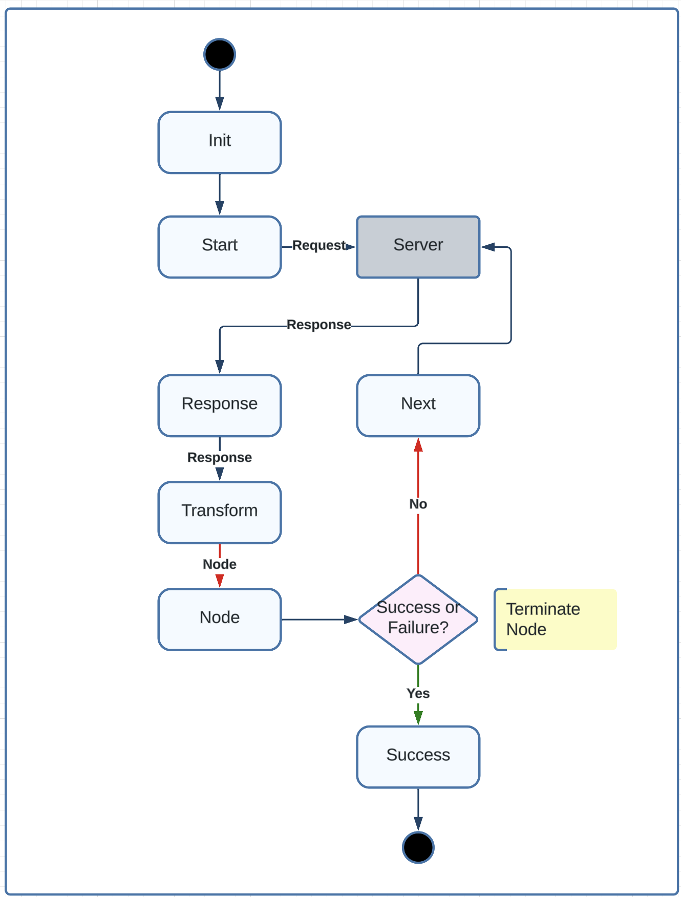
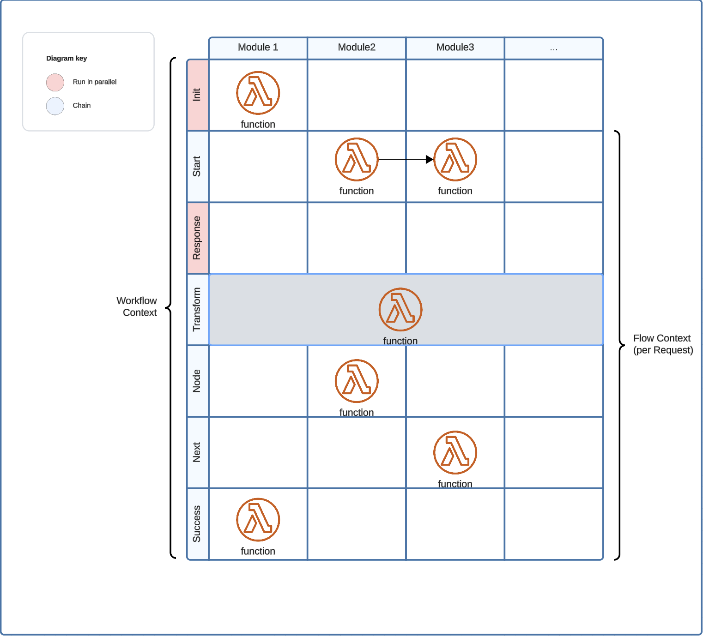

<p align="center">
  <a href="https://github.com/ForgeRock/ping-android-sdk">
    
  </a>
  <hr/>
</p>

# Orchestrate

## Overview

Orchestrate provides a simple way to build a state machine for ForgeRock Journey and PingOne DaVinci.
It allows you to define a series of states and transitions between them. You can use the workflow engine to build
complex workflows that involve multiple steps and conditions.
The Workflow engine allows you to define a series of functions and register them as a module to the `Workflow` instance
in different state of the workflow.

The Workflow engine contains the following states:



| State      |              Description               |    Input |  Output |                                                                   Use Case |
|------------|:--------------------------------------:|---------:|--------:|---------------------------------------------------------------------------:|
| Init       |         Initialize the modules         |       () |    Unit |                             OAuth module loads endpoint from discovery URL |
| Start      |             Start the flow             |  Request | Request |        Intercept the start request, for example inject forceAuth parameter |
| Response   |          Handle the response           | Response |    Unit |                    Parse the response, for example store the cookie header |
| *Transform |     Transform the response to Node     | Response |    Node | For Journey, transform response to Callback, for DaVinci transform to Form |
| Node       | Process the Node or Transform the Node |     Node |    Node |                             Transform MetadataCallback to WebAuthnCallback |
| Next       |           Move to next state           |  Request | Request |                                                 Inject noSession parameter |
| Success    |       Flow finished with Success       |  Success | Success |                                   Prepare Success with AuthCode or Session |
| SignOff    |          SignOff the Workflow          |  Request | Request |                                               Revoke Token and end session |

### Module

Module allows you to register functions in different state of the workflow. For example, you can register a function
that will be called when the workflow is initialized, when a node is received, when a node is sent, and when
the workflow is started.



Information can be shared across state, there are 2 contexts

| Context         |                Scope                |                             Access |
|-----------------|:-----------------------------------:|-----------------------------------:|
| WorkflowContext |          Workflow Instance          |   ```context["name"] = "value" ``` |
| FlowContext     | Flow from Start to Finish (Success) | ```flowContext["name"]= "value"``` |

## Add dependency to your project

```kotlin
dependencies {
    implementation(project(":orchestrate"))
}
```

## Usage

To use the `Workflow` class, you need to create an instance of it and pass a configuration block to the constructor. The
configuration block allows you to register various modules of the `Workflow` instance.

Here's an example of how to create a `Workflow` instance:

```kotlin
val workflow = Workflow {
    module(forceAuth)
    module(noSession)
    module(session)
}
workflow.start()
```
The `start` method returns a `Node` instance. The `Node` class represents the current state of the application. You can
use the `next` method to transition to the next state.

### SignOff
There is a special state called `SignOff` that is used to sign off the user. You can use the `signOff` method to sign off
the user.

```kotlin
workflow.signOff()
```

## Custom Module

You can provide a custom module to the `Workflow` instance. A module is a class that use the `Module` interface.
The `Module` interface allow the module to install `function` in different state during the `Workflow` flow .

```kotlin
@PingDsl
class CustomHeaderConfig {
    var enable = true
    var value = "Android-SDK"
}

val customerHeader =
    Module.of(::CustomHeaderConfig) {
        // Intercept all send request and inject custom header
        next { request ->
            if (config.enable) {
                request.header("Custom-Header", config.value)
            }
            request
        }
    }
```

You can then install the custom module in the `Workflow` configuration block like this:

```kotlin
val workflow = Workflow {
    module(customHeader) {
        enable = true
        value = "PingOne -SDK"
    }
}
```

More module examples:

```kotlin
@PingDsl
val forceAuth = Module {
    // Intercept all send request and inject custom header during start state
    start { request ->
        request.parameter("forceAuth", "true")
        request
    }
}

val noSession = Module {
    // Intercept all send request and inject custom header during next state
    next { request ->
        request.parameter("forceAuth", "true")
        request
    }
}
```

## Module execution order
The SDK allows you to register a module into the ```Workflow``` Engine. It accepts several parameters to control how the module is registered and configured:

- ```priority``` (optional): A numeric value that determines the module's execution order in the registry. Default value is 10. Lower priority values indicate higher precedence - modules with lower numbers will be processed first.
- ```mode``` (optional): Determines how the registration handles existing modules. Default is OVERRIDE. The available modes are:
  - ```OVERRIDE```: If a module with the same identifier already exists, the new module will replace it.
  - ```APPEND```: The new module will be added to the registry's list and cannot be overridden by future registrations. This ensures the module remains in the workflow permanently.
  - ```IGNORE```: If a module with the same identifier already exists, the registration request will be silently ignored, keeping the existing module unchanged.

Here is an example of how to register a module with a specific priority and mode:
```kotlin
module(CustomHeader, priority = 5, mode = OverrideMode.APPEND) {
  header("Accept-Language", "zh")
}
```
