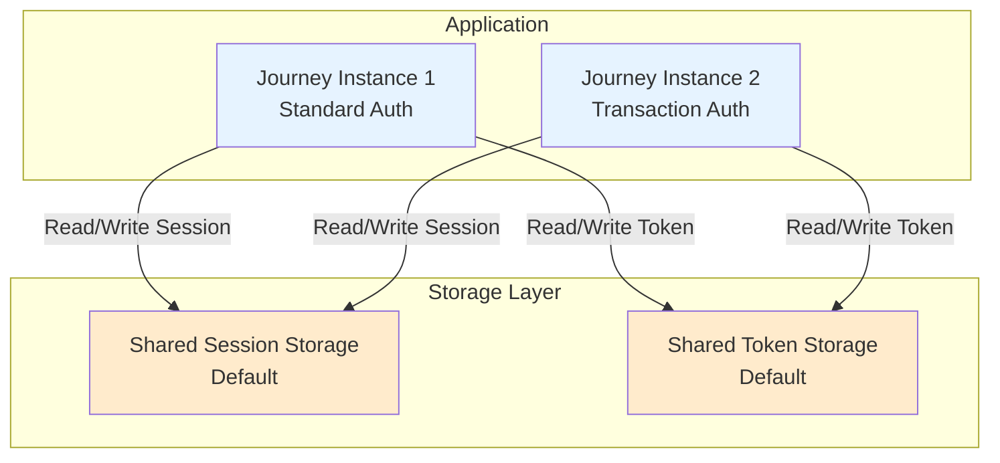
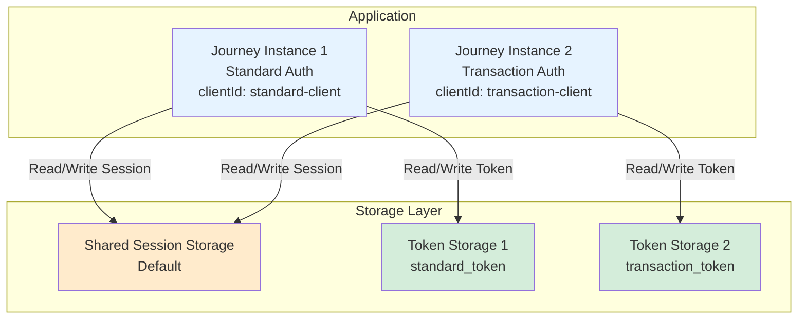
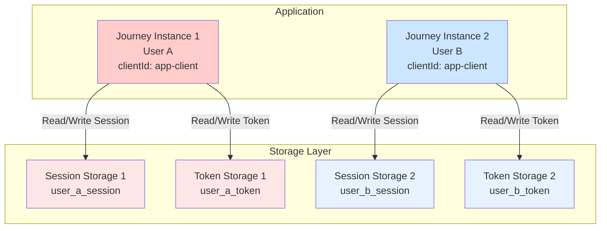
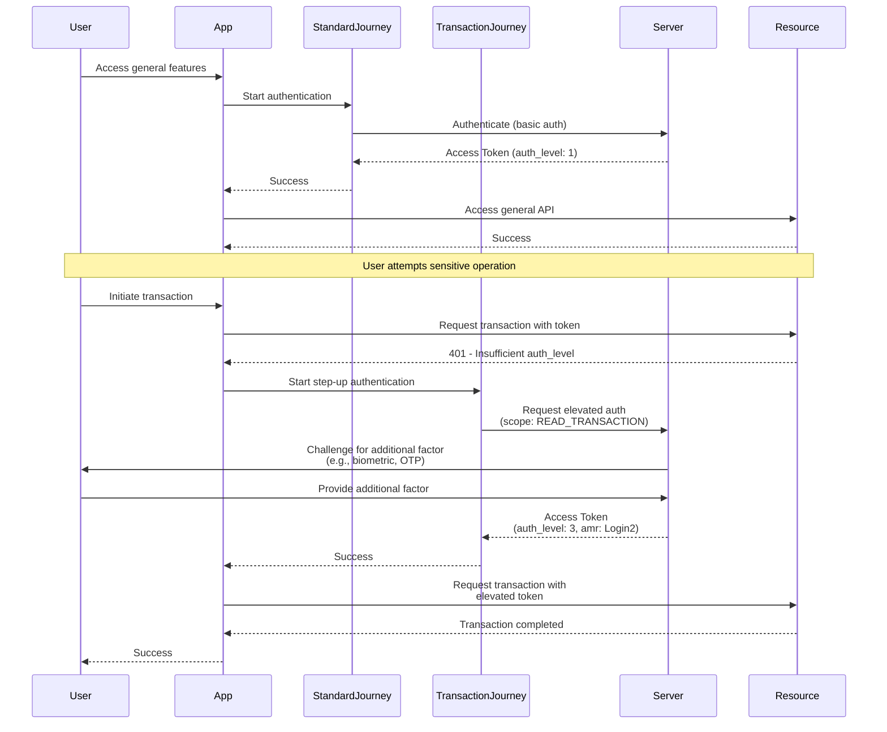
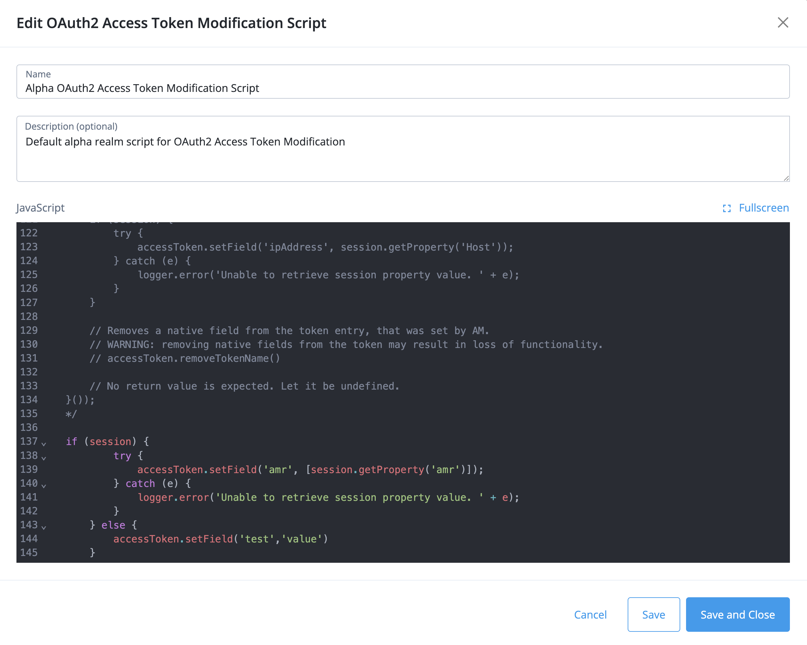
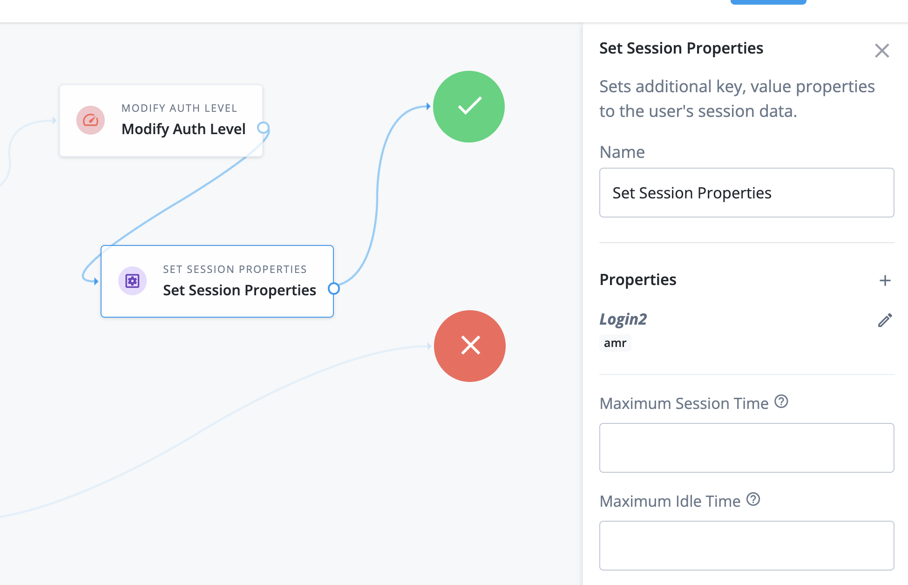

# Multiple Access Tokens Support

## Table of Contents

- [Overview](#overview)
- [Understanding Journey Object and Session Management in SDK](#understanding-journey-object-and-session-management-in-sdk)
  - [What is a Journey?](#what-is-a-journey)
    - [Key Characteristics](#key-characteristics)
    - [What Each Journey Instance Defines](#what-each-journey-instance-defines)
    - [Multiple Journey Instances in Practice](#multiple-journey-instances-in-practice)
  - [Journey with Session Only (No OIDC)](#journey-with-session-only-no-oidc)
  - [Journey with OIDC Module](#journey-with-oidc-module)
  - [Storage Isolation and Sharing](#storage-isolation-and-sharing)
- [OIDC Module and Token Management](#oidc-module-and-token-management)
  - [Overview](#overview-1)
  - [How Token Acquisition Works](#how-token-acquisition-works)
  - [Token Storage Behavior](#token-storage-behavior)
  - [Flexible Token Management](#flexible-token-management)
  - [Token Lifecycle Options](#token-lifecycle-options)
  - [Example Use Case: Transaction Security](#example-use-case-transaction-security)
  - [Token vs Session: When to Use Each](#token-vs-session-when-to-use-each)
- [Custom Storage Configuration](#custom-storage-configuration)
- [Configuration Example](#configuration-example)
  - [Shared Storage (Default Behavior)](#shared-storage-default-behavior)
  - [Custom Storage (Isolated Configuration)](#custom-storage-isolated-configuration)
  - [Code Implementation](#code-implementation)
  - [Understanding the Configuration](#understanding-the-configuration)
- [Multiple Users](#multiple-users)
  - [Multiple Users Scenario](#multiple-users-scenario)
  - [Storage Isolation Diagram](#storage-isolation-diagram)
  - [Configuration Example](#configuration-example-1)
- [Step-up Authentication](#step-up-authentication)
  - [Authentication Requirement Indicators](#authentication-requirement-indicators)
  - [Example Access Token with Step-up Claims](#example-access-token-with-step-up-claims)
  - [Step-up Flow Diagram](#step-up-flow-diagram)
  - [Implementation Example](#implementation-example)
  - [Server-Side Configuration](#server-side-configuration)
    - [Option 1: Using AMR (Authentication Methods Reference)](#option-1-using-amr-authentication-methods-reference)
    - [Option 2: Using Auth Level](#option-2-using-auth-level)
    - [Option 3: Using ACR (Authentication Context Class Reference)](#option-3-using-acr-authentication-context-class-reference)
    - [Option 4: Using Scope-based Requirements](#option-4-using-scope-based-requirements)
  - [Resource Server API Protection](#resource-server-api-protection)
    - [How it Works](#how-it-works)
    - [Example: Protecting a Transaction API](#example-protecting-a-transaction-api)
- [Managing Multiple Journey Instances](#managing-multiple-journey-instances)
  - [No Additional Abstraction Layer Required](#no-additional-abstraction-layer-required)
  - [Direct Journey Management Examples](#direct-journey-management-examples)
  - [Key Takeaway](#key-takeaway)

---

## Overview

The SDK is designed to support multiple access tokens and sessions through flexible configuration of Journey instances.

**Journey** is a runtime object in the SDK - your application can create and manage **multiple Journey instances** simultaneously, each representing a different authentication flow or context. This architecture enables:

- **Multiple concurrent sessions** for the same or different users
- **Step-up authentication** for accessing sensitive resources
- **Multi-tenant applications** with isolated authentication contexts
- **Parallel token management** with different lifecycle policies

Each Journey instance operates independently with its own configuration, state, and storage, giving developers complete control over how authentication is managed across different parts of the application.

## Understanding Journey Object and Session Management in SDK

### What is a Journey?

From the SDK's perspective, a **Journey** is a runtime instance object that manages an authentication flow. An application can create and maintain **multiple Journey instances** simultaneously, each with its own configuration and state.

#### Key Characteristics

- **Runtime Instance**: Journey is instantiated at runtime, not a configuration file or static definition
- **Multiple Instances**: An app can have multiple Journey instances running concurrently
- **Independent State**: Each Journey instance maintains its own authentication state
- **Configurable**: Each instance can be configured differently (different endpoints, clients, storage, etc.)

#### What Each Journey Instance Defines

When you create a Journey instance in your application, you configure:

- **Server endpoint**: The server URL and realm where authentication occurs
- **Authentication Journey**: The specific authentication tree or journey on the server
- **Session handling**: Where and how session data is stored after successful authentication
- **Module configuration**: Which modules (Session, OIDC, etc.) are enabled for this instance

#### Multiple Journey Instances in Practice

```kotlin
class MyApplication : Application() {
    // Instance 1: Standard user authentication
    val standardAuthJourney = Journey {
        serverUrl = "https://example.com/am"
        realm = "alpha"
        module(Session) { /* config */ }
        module(Oidc) { /* config */ }
    }
    
    // Instance 2: Transaction authentication
    val transactionJourney = Journey {
        serverUrl = "https://example.com/am"
        realm = "alpha"
        module(Session) { 
            storage { fileName = "transaction_session" }
        }
        module(Oidc) { 
            clientId = "transaction-client"
            storage { fileName = "transaction_token" }
        }
    }
    
    // Instance 3: Admin operations
    val adminJourney = Journey {
        serverUrl = "https://example.com/am"
        realm = "admin"
        module(Session) { 
            storage { fileName = "admin_session" }
        }
    }
}
```

Each Journey instance operates independently, allowing your application to manage multiple authentication contexts simultaneously.


### Journey with Session Only (No OIDC)

Developers can use Journey **without the OIDC module** for basic authentication scenarios. In this configuration:

1. User completes the authentication flow through the Journey
2. Upon successful authentication, a **session** is created on the server
3. The session is persisted to the defined **Session Storage** on the device
4. The session can be used for subsequent authenticated requests
5. **No OAuth2 tokens** (access token, refresh token) are obtained or stored

This approach is suitable for:
- Applications that only need session-based authentication
- Internal APIs that validate sessions server-side
- Scenarios where OAuth2/OIDC is not required

**Example - Journey without OIDC:**

```kotlin
val basicJourney = Journey {
    serverUrl = "https://example.com/am"
    realm = "alpha"
    
    // Only session management, no token acquisition
    module(Session) {
        storage {
            fileName = "user_session"
        }
    }
}
```

### Journey with OIDC Module

When the **OIDC module** is included in the Journey configuration, the SDK performs additional steps:

1. User completes the authentication flow
2. A **session** is created and stored (same as above)
3. The SDK automatically initiates the OAuth2/OIDC flow
4. An **access token** (and optionally a refresh token) is obtained from the authorization server
5. Tokens are persisted to the defined **Token Storage**

This approach provides:
- OAuth2 access tokens for API authorization
- Refresh tokens for automatic token renewal
- Standard OIDC claims and user information
- Support for token-based API protection

### Storage Isolation and Sharing

**By default**, all Journey instances share the same storage:

- **Shared Session Storage**: All Journeys share the same session, representing the same authenticated user
- **Shared Token Storage**: All Journeys share the same access token (if OIDC is used)

**To isolate authentication contexts**, developers can provide custom storage implementations:

- Define separate **Session Storage** for different users or authentication contexts
- Define separate **Token Storage** for different OAuth2 clients or token policies

This flexibility allows developers to create:
- Multiple user accounts on the same device
- Different authentication levels with separate tokens
- Isolated authentication contexts for different app features

## OIDC Module and Token Management

### Overview

The **OIDC module** is an optional but powerful addition to Journey configurations. When included, it extends the basic session-based authentication with OAuth2/OIDC capabilities, enabling access token management and API authorization.

### How Token Acquisition Works

When an OIDC module is included in a Journey configuration:

1. **Authentication**: User completes the authentication flow (username/password, biometric, etc.)
2. **Session Creation**: A session is created on the server and stored locally
3. **Authorization Code Exchange**: The SDK automatically exchanges the authorization code for tokens
4. **Token Persistence**: The obtained access token (and refresh token, if available) is persisted to **Token Storage**
5. **Token Usage**: The access token can be used to authorize API requests to protected resources

### Token Storage Behavior

Similar to session management, token storage follows these principles:

- **Default Behavior**: All Journeys share the same **OIDC Token Storage**
- **Custom Storage**: Developers can configure separate token storages for different Journeys
- **Storage Location**: Tokens are securely stored on the device using Android's secure storage mechanisms

### Flexible Token Management

This flexible design allows each Journey to use:

- **Different OAuth2 client applications**: Each Journey can authenticate with a different `clientId`
- **Distinct scopes and permissions**: Request different sets of permissions (e.g., `profile`, `email`, `transactions`)
- **Separate token lifetimes**: Configure short-lived tokens for sensitive operations, long-lived for general use
- **Custom refresh policies**: Allow or disallow token refresh based on security requirements

### Token Lifecycle Options

The OIDC module supports various token lifecycle strategies:

| Strategy | Use Case | Configuration |
|----------|----------|---------------|
| **Long-lived with refresh** | General app usage, user convenience | Default OIDC configuration with refresh tokens |
| **Short-lived with refresh** | Balanced security and usability | Configure shorter token expiry, enable refresh |
| **Short-lived, no refresh** | High-security operations | Disable refresh token, require re-authentication |
| **Immediate revocation** | One-time sensitive transactions | Manually revoke token after use |

### Example Use Case: Transaction Security

A Journey designed for sensitive financial transactions might use:

```kotlin
val transactionJourney = Journey {
    serverUrl = "https://example.com/am"
    realm = "alpha"
    
    module(Oidc) {
        clientId = "transaction-client"
        discoveryEndpoint = "https://example.com/.well-known/openid-configuration"
        scopes = mutableSetOf("openid", "transactions", "write_transaction")
        redirectUri = "app:/oauth2redirect"
        
        // Custom storage for isolated token management
        storage {
            fileName = "transaction_token"
        }
    }
}
```
## Custom Storage Configuration

By customizing storages, application developers have full control over how each Access Token and Session is managed, enabling fine-grained authentication and authorization strategies across multiple Journeys.

> **Note**: If no custom storage is defined, multiple Journey instances will share the same session — meaning they represent the same authenticated user.

## Configuration Example

### Shared Storage (Default Behavior)

When no custom storage is configured, all Journey instances share the same session and token storage:



**Result**: Both Journey instances share the same authenticated user session and access token. Changes in one Journey affect the other.

---

### Custom Storage (Isolated Configuration)

When custom storage is configured, each Journey can have its own isolated token storage while optionally sharing session storage:



**Result**: Both Journey instances share the same authenticated user session, but each manages its own independent access token with separate lifecycle policies.

---

### Code Implementation

```kotlin
// Journey 1 - Standard authentication with long-lived tokens
val standardJourney = Journey {
    serverUrl = "https://example.com/am"
    realm = "alpha"
    
    module(Oidc) {
        clientId = "standard-client"
        discoveryEndpoint = "https://example.com/.well-known/openid-configuration"
        scopes = mutableSetOf("openid", "profile", "email")
        redirectUri = "app:/oauth2redirect"
        
        // Custom storage for this Journey's access token
        storage {
            fileName = "standard_token"
        }
    }
    
    // No custom session storage defined - uses default shared session storage
}

// Journey 2 - High-security transactions with short-lived tokens
val transactionJourney = Journey {
    serverUrl = "https://example.com/am"
    realm = "alpha"
    
    module(Oidc) {
        clientId = "transaction-client"
        discoveryEndpoint = "https://example.com/.well-known/openid-configuration"
        scopes = mutableSetOf("openid", "transactions")
        redirectUri = "app:/oauth2redirect"
        
        // Separate storage for this Journey's access token
        storage {
            fileName = "transaction_token"
        }
    }
    
    // No custom session storage defined - uses default shared session storage
}
```

### Understanding the Configuration

In this example:

- **Session Storage**: Both Journeys use the **default shared session storage** (no custom session storage is configured). This means they represent the **same authenticated user** and share the same session state.

- **Access Token Storage**: Each Journey has its **own separate token storage** (`standard_token` and `transaction_token`). This allows:
    - Different OAuth2 clients with different capabilities
    - Independent token lifecycles and refresh policies
    - Isolated token management for different use cases

This configuration is useful when you want the same user to access different resources or perform different operations with separate access tokens, while maintaining a single authenticated session. For example:
- The user authenticates once (creating a shared session)
- They can use `standardJourney` for general app features with long-lived tokens
- They can use `transactionJourney` for sensitive operations with short-lived, non-refreshable tokens
- Both Journeys recognize the same authenticated user, but manage their access tokens independently

If you need completely isolated authentication contexts (different users or separate sessions), you would also customize the session storage for each Journey.

---

## Multiple Users

In some applications, you may need to support multiple users on the same device with completely isolated authentication contexts. This requires customizing both session storage and token storage to ensure each user's credentials are kept separate.

### Multiple Users Scenario

Common use cases include:
- **Family Sharing**: Multiple family members using the same tablet or device
- **Enterprise Applications**: Different employees using a shared kiosk or workstation
- **Testing/Demo**: Switching between different user accounts without logging out
- **Multi-Account Support**: Users managing multiple profiles (personal/work)

### Storage Isolation Diagram



**Result**: Each Journey instance has completely isolated storage, representing different authenticated users with independent sessions and tokens.

### Configuration Example

#### User A Journey Configuration

```kotlin
val userAJourney = Journey {
    serverUrl = "https://example.com/am"
    realm = "alpha"
    
    // Custom session storage for User A
    module(Session) {
        storage {
          fileName = "user_a_session"
        }
    }
    
    module(Oidc) {
        clientId = "app-client"
        discoveryEndpoint = "https://example.com/.well-known/openid-configuration"
        scopes = mutableSetOf("openid", "profile", "email")
        redirectUri = "app:/oauth2redirect"
        
        // Custom token storage for User A
        storage {
            fileName = "user_a_token"
        }
    }
}
```

#### User B Journey Configuration

```kotlin
val userBJourney = Journey {
    serverUrl = "https://example.com/am"
    realm = "alpha"
    
    // Custom session storage for User B
    module(Session) {
      storage {
        fileName = "user_b_session"
      }
    }

    module(Oidc) {
        clientId = "app-client"
        discoveryEndpoint = "https://example.com/.well-known/openid-configuration"
        scopes = mutableSetOf("openid", "profile", "email")
        redirectUri = "app:/oauth2redirect"
        
        // Custom token storage for User B
        storage {
            fileName = "user_b_token"
        }
    }
}
```

## Step-up Authentication

Step-up authentication is a security pattern where users must re-authenticate or provide additional authentication factors to access sensitive operations or resources. This is commonly used for high-value transactions, administrative actions, or accessing confidential data.

The SDK supports step-up authentication by leveraging multiple Journey instances with different authentication requirements. The authentication server can enforce step-up requirements through various mechanisms:

### Authentication Requirement Indicators

The access token can contain different claims to indicate the authentication strength:

1. **AMR (Authentication Methods Reference)** - Indicates which authentication methods were used
2. **Auth Level** - A numeric value indicating the authentication strength (higher = stronger)
3. **ACR (Authentication Context Class Reference)** - Standardized OIDC claim for authentication context
4. **Scope** - Specific scopes that require elevated authentication

### Example Access Token with Step-up Claims

```json
{
  "sub": "445957f9-8528-4d14-803e-5452214633e8",
  "cts": "OAUTH2_STATELESS_GRANT",
  "auth_level": 3,
  "auditTrackingId": "c9611769-cbb0-4f6f-89ab-cc971a9a4267-297791",
  "subname": "445957f9-8528-4d14-803e-5452214633e8",
  "iss": "https://openam-sdks.forgeblocks.com:443/am/oauth2/alpha",
  "tokenName": "access_token",
  "token_type": "Bearer",
  "authGrantId": "fpO7HNZXHhLW5ObvmIoYT7PMaHY",
  "client_id": "Basic",
  "aud": "Basic",
  "nbf": 1761261789,
  "grant_type": "authorization_code",
  "scope": [
    "address",
    "phone",
    "openid",
    "profile",
    "READ_TRANSACTION",
    "email"
  ],
  "auth_time": 1761261789,
  "realm": "/alpha",
  "exp": 1761265389,
  "iat": 1761261789,
  "expires_in": 3600,
  "jti": "Ygd5asQcPJho3ATs8Fl9-8Q25lk",
  "amr": [
    "Login2"
  ]
}
```

### Step-up Flow Diagram



### Implementation Example

#### 1. Configure Standard Journey (Low Authentication Level)

```kotlin
val standardJourney = Journey {
    serverUrl = "https://example.com/am"
    realm = "alpha"
    
    module(Oidc) {
        clientId = "standard-client"
        discoveryEndpoint = "https://example.com/.well-known/openid-configuration"
        scopes = mutableSetOf("openid", "profile", "email")
        redirectUri = "app:/oauth2redirect"
        
        storage {
            fileName = "standard_token"
        }
    }
}
```

#### 2. Configure Transaction Journey (High Authentication Level)

```kotlin
val transactionJourney = Journey {
    serverUrl = "https://example.com/am"
    realm = "alpha"
    
    module(Oidc) {
        clientId = "transaction-client"
        discoveryEndpoint = "https://example.com/.well-known/openid-configuration"
        // Request specific scope for transactions
        scopes = mutableSetOf("openid", "READ_TRANSACTION")
        redirectUri = "app:/oauth2redirect"
        
        // Separate storage for high-security token
        storage {
            fileName = "transaction_token"
        }
    }
}
```

### Server-Side Configuration

#### Option 1: Using AMR (Authentication Methods Reference)

Configure the authentication journey to set AMR values in the session:

- **Documentation**: [OIDC Authentication Requirements - AMR](https://docs.pingidentity.com/pingoneaic/latest/am-oidc1/oidc-authentication-requirements.html#allowlist-session-property-amr)
- The AMR claim indicates which authentication methods were used (e.g., "pwd", "mfa", "biometric")
- Add authentication methods to the allowlist to include them in the access token



*Example: Configuring AMR values in the authentication journey to set specific authentication methods that will be included in the access token.*

#### Option 2: Using Auth Level

Use the **Modify Auth Level** node in your authentication journey:

- **Documentation**: [Modify Auth Level Node](https://docs.pingidentity.com/auth-node-ref/latest/modify-auth-level.html)
- Set different auth levels based on the authentication strength
- Example: Level 1 for username/password, Level 3 for username/password + biometric
- The `auth_level` claim is automatically injected into the access token



*Example: Journey configuration showing auth level and AMR settings that determine the authentication strength in the resulting access token.*

#### Option 3: Using ACR (Authentication Context Class Reference)

Configure ACR values in the OIDC client and authentication policy:

- ACR is a standard OIDC claim for authentication context
- Can be requested via the `acr_values` parameter during authentication
- The server returns the ACR level that was achieved

#### Option 4: Using Scope-based Requirements

Configure the OAuth2 client to require elevated authentication for specific scopes:

- Define scopes that trigger step-up authentication (e.g., `READ_TRANSACTION`, `WRITE_TRANSACTION`)
- The authorization server enforces step-up when these scopes are requested
- Resource servers validate that the token contains the required scope

### Resource Server API Protection

The Resource Server plays a critical role in enforcing access control by validating the claims present in the access token. Based on the authentication indicators, the Resource Server can decide whether to grant or deny access to a protected API.

#### How it Works

1.  **Token Introspection**: The Resource Server receives the access token from the client application. It then introspects the token to validate its authenticity and retrieve the associated claims.
2.  **Claim Validation**: The server checks for specific claims to determine if the required authentication level has been met.
-   It may require a minimum **`auth_level`**.
-   It might check for the presence of a specific **`amr`** value (e.g., `mfa` or `biometric`).
-   It can validate if a required **`scope`** (e.g., `READ_TRANSACTION`) is present.
3.  **Access Control**:
-   If the claims meet the security policy for the requested API, the server grants access.
-   If not, it returns an error (e.g., `403 Forbidden` or `401 Unauthorized`) and may include information about the required authentication level.

#### Example: Protecting a Transaction API

A Resource Server protecting a high-value transaction API might enforce the following rules:
-   Require `auth_level` to be `3` or higher.
-   Require the `amr` claim to include `biometric`.
-   Require the `scope` to contain `WRITE_TRANSACTION`.

Here is a simplified code example of how a Resource Server might implement this validation:

```kotlin
// Example validation logic on a Resource Server
fun handleApiRequest(request: HttpRequest) {
    val accessToken = request.headers["Authorization"]?.removePrefix("Bearer ")

    if (accessToken == null) {
        return respondWith(401, "Unauthorized: Missing token")
    }

    // Introspect the token to get its claims
    val claims = introspectToken(accessToken)

    if (!claims.isActive) {
        return respondWith(401, "Unauthorized: Token is expired or invalid")
    }

    val authLevel = claims.get("auth_level") as? Int ?: 0
    val amr = claims.get("amr") as? List<String> ?: emptyList()

    // Enforce policy: require auth_level 3 and biometric AMR
    if (authLevel < 3 || !"biometric" in amr) {
        return respondWith(403, "Forbidden: Insufficient authentication level. Biometric required.")
    }

    // If validation passes, grant access to the resource
    return processTransaction(request)
}
```

By validating these claims, the Resource Server ensures that only users who have completed the required step-up authentication can access sensitive APIs, strengthening the overall security of the application.

## Managing Multiple Journey Instances

### No Additional Abstraction Layer Required

The SDK is designed so that **you do not need an additional abstraction layer** to manage multiple Journey instances. Each Journey instance is already self-contained and provides all the necessary methods to manage its lifecycle.

**Why no abstraction layer?**

- **Simplicity**: Adding an abstraction layer introduces unnecessary complexity without significant benefits
- **Flexibility**: Developers can easily implement their own management approach using any data structure (List, Map, Set, etc.)
- **Direct Control**: Working directly with Journey instances provides clearer code and better understanding of what's happening
- **No Simplification**: An abstraction layer doesn't simplify the code - it just adds another layer to maintain

### Direct Journey Management Examples

You can manage multiple Journey instances directly in your application:

**Example 1: Using a Map for Named Journeys**

```kotlin
class AuthManager {
    private val journeys = mutableMapOf<String, Journey>()
    
    init {
        journeys["standard"] = Journey { /* config */ }
        journeys["transaction"] = Journey { /* config */ }
        journeys["admin"] = Journey { /* config */ }
    }
    
    // Logout all journeys
    suspend fun logoutAll() {
        journeys.values.forEach { journey ->
            journey.user()?.logout()
        }
    }
    
    // Revoke all tokens
    suspend fun revokeAllTokens() {
        journeys.values.forEach { journey ->
            journey.user()?.revoke()
        }
    }
    
    // Refresh specific token
    suspend fun refreshToken(journeyName: String) {
        journeys[journeyName]?.user()?.refresh()
    }
    
    fun getJourney(name: String) = journeys[name]
}
```

**Example 2: Using a List for Multiple User Accounts**

```kotlin
class MultiUserManager {
    private val userJourneys = mutableListOf<Journey>()
    
    fun addUser(userId: String): Journey {
        val journey = Journey {
            serverUrl = "https://example.com/am"
            realm = "alpha"
            module(Session) {
                storage { fileName = "user_${userId}_session" }
            }
            module(Oidc) {
                clientId = "app-client"
                storage { fileName = "user_${userId}_token" }
            }
        }
        userJourneys.add(journey)
        return journey
    }
    
    suspend fun logoutAllUsers() {
        userJourneys.forEach { it.user()?.logout() }
        userJourneys.clear()
    }
    
    fun getUserCount() = userJourneys.size
}
```

**Example 3: Simple Direct References**

```kotlin
class MyApp : Application() {
    val standardJourney = Journey { /* config */ }
    val transactionJourney = Journey { /* config */ }
    
    suspend fun logoutBoth() {
        standardJourney.user()?.logout()
        transactionJourney.user()?.logout()
    }
    
    suspend fun refreshTransactionToken() {
        transactionJourney.user().refresh()
    }
}
```

### Key Takeaway

The Journey API is designed to be used directly. If you need batch operations (like logout all, revoke all tokens), you can easily implement them yourself with just a few lines of code using standard Kotlin collections. This approach:

- Keeps your code simple and maintainable
- Gives you full control over the data structure that fits your needs
- Avoids unnecessary abstraction that doesn't provide real value
- Makes the code easier to understand and debug