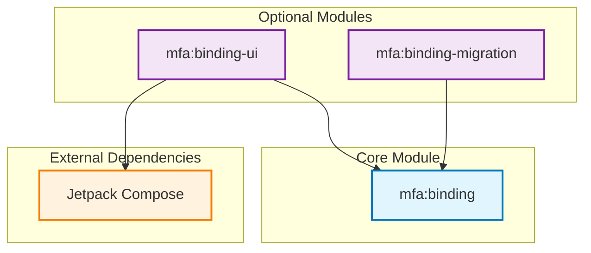
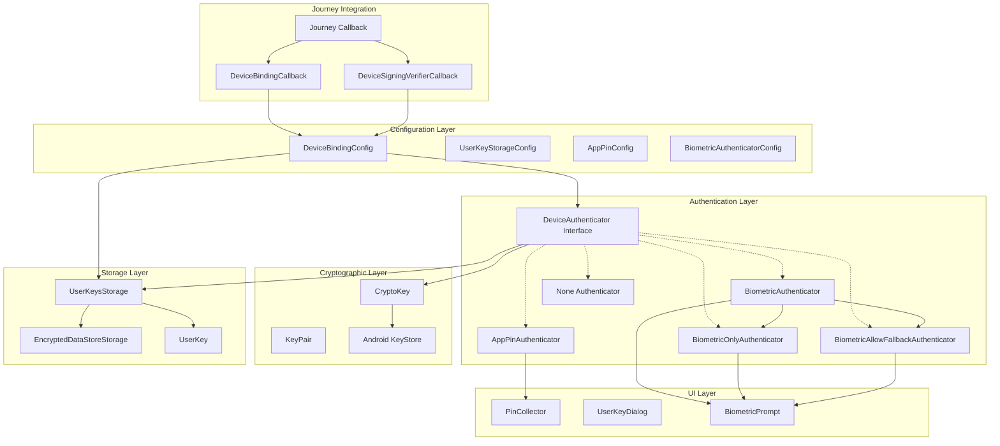
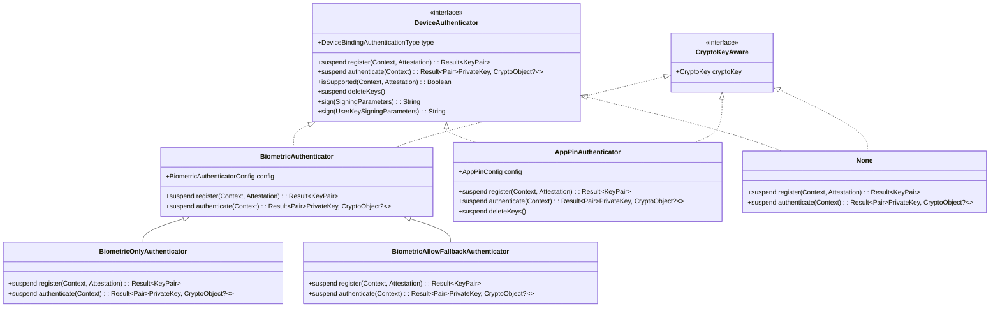
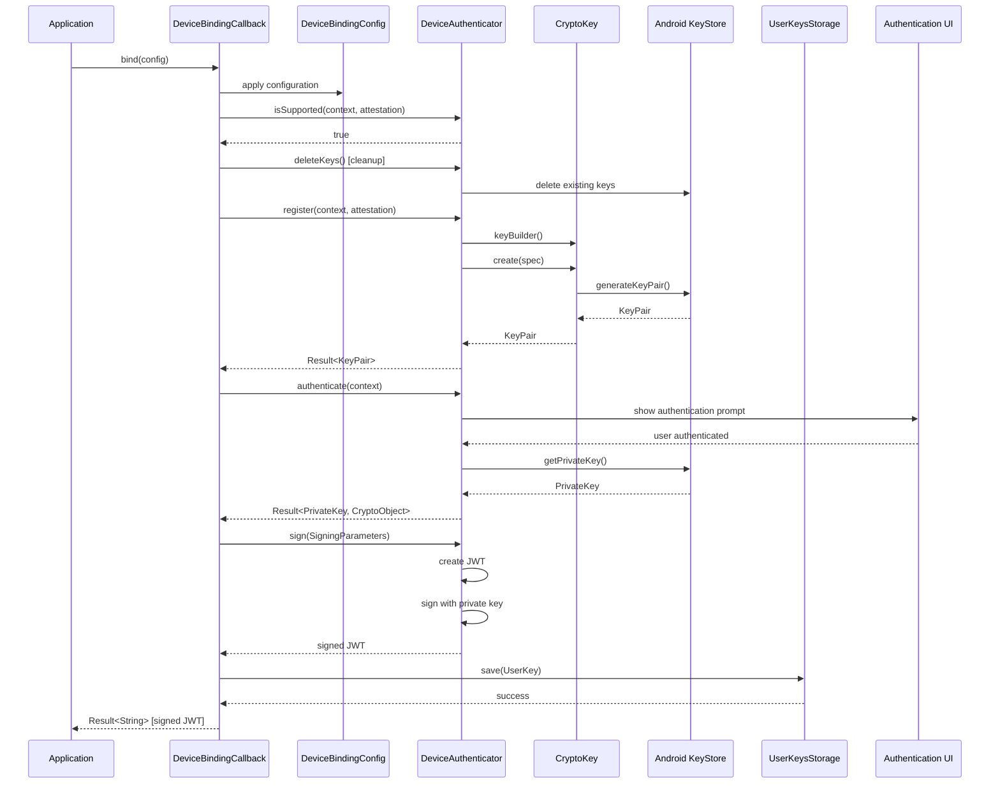
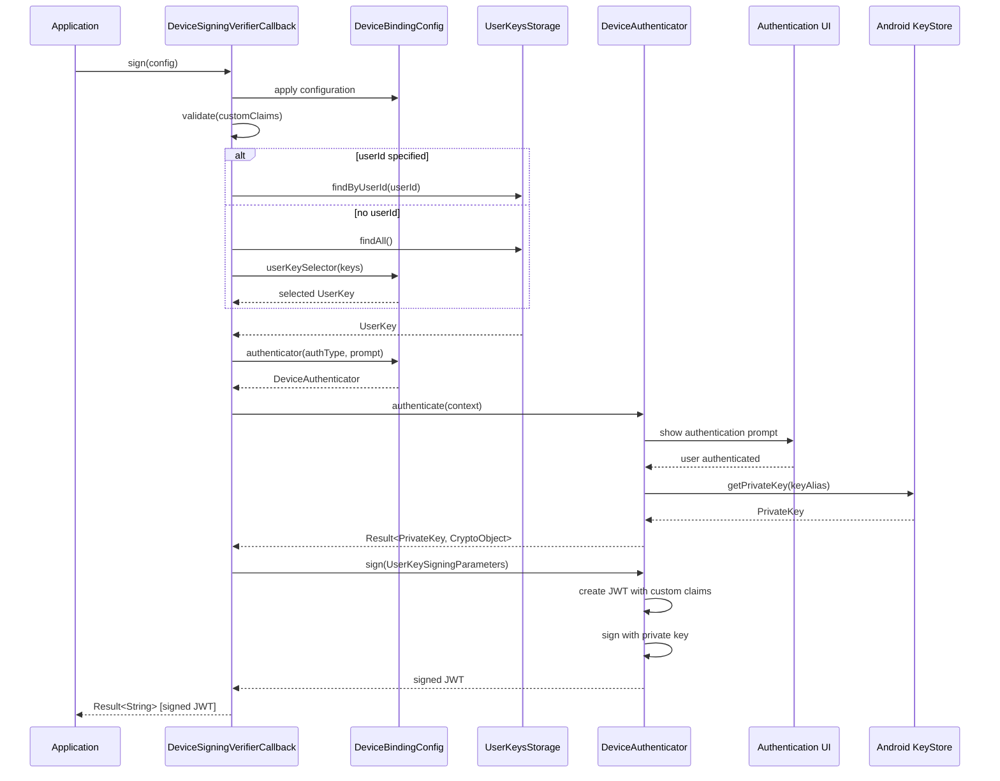
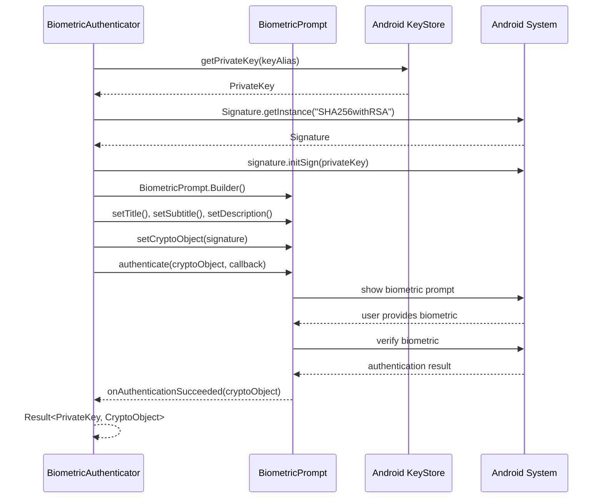

<p align="center">
  <a href="https://github.com/ForgeRock/ping-android-sdk">
    
  </a>
  <hr/>
</p>

# Design Concept

## Overview

The Device Binding module provides secure device registration and authentication capabilities for Android applications. It enables applications to bind cryptographic keys to devices and perform step-up authentication using various authentication methods including biometric, PIN, or no authentication.

The module follows a plugin-based architecture where different authentication types are handled by specific authenticator implementations, all unified under the `DeviceAuthenticator` interface.

## Core Architecture

### Module Dependency Diagram



**Module Dependencies:**
- **mfa:binding-ui** → depends on **mfa:binding** (provides default UI components)
- **mfa:binding-migration** → depends on **mfa:binding** (provides legacy SDK migration)
- **mfa:binding** → depends on **BouncyCastle** (required for Application PIN authentication)
- **mfa:binding-ui** → depends on **Jetpack Compose** (for PIN collection dialog and user selection UI)
- **mfa:binding-migration** → accesses **Legacy ForgeRock SDK Data** (for automatic migration)

### Component Diagram



### DeviceAuthenticator Class Hierarchy



## Design Patterns

### Factory Pattern
The module uses a factory pattern for creating appropriate authenticators based on authentication type:

```kotlin
internal fun authenticator(
    type: DeviceBindingAuthenticationType,
    prompt: Prompt
): DeviceAuthenticator {
    return if (::deviceAuthenticator.isInitialized) {
        deviceAuthenticator(type)
    } else {
        when (type) {
            BIOMETRIC_ONLY -> BiometricOnlyAuthenticator(createBiometricConfig(prompt))
            BIOMETRIC_ALLOW_FALLBACK -> BiometricAllowFallbackAuthenticator(createBiometricConfig(prompt))
            APPLICATION_PIN -> AppPinAuthenticator(createAppPinConfig(prompt))
            NONE -> None()
        }
    }
}
```

### Strategy Pattern
Different authentication strategies are encapsulated in separate authenticator classes, allowing runtime selection based on configuration.

### Template Method Pattern
The `DeviceAuthenticator` interface defines the template for authentication operations, with concrete implementations providing specific behaviors.

## Sequence Diagrams

### Device Binding Flow



### Device Signing Verification Flow



### Biometric Authentication Flow



## Key Components

### DeviceBindingCallback
**Purpose**: Handles initial device registration
**Lifecycle**:
1. Validation of device support
2. Cleanup of existing keys
3. Key pair generation
4. User authentication
5. JWT signing with device proof
6. Metadata storage

### DeviceSigningVerifierCallback
**Purpose**: Proves device possession for step-up authentication
**Lifecycle**:
1. Custom claims validation
2. User key lookup/selection
3. User authentication
4. Challenge signing
5. JWT creation with verification proof

### DeviceAuthenticator Implementations

| Implementation | Authentication Type | Use Case |
|----------------|-------------------|----------|
| `BiometricOnlyAuthenticator` | BIOMETRIC_ONLY | Strict biometric authentication |
| `BiometricAllowFallbackAuthenticator` | BIOMETRIC_ALLOW_FALLBACK | Biometric with device credential fallback |
| `AppPinAuthenticator` | APPLICATION_PIN | Custom PIN authentication |
| `None` | NONE | No authentication required |

### CryptoKey
**Purpose**: Manages Android KeyStore operations
**Features**:
- RSA 2048-bit key generation
- Hardware-backed security when available
- Automatic key alias generation via SHA-256 hashing
- Certificate chain access for attestation

### UserKeysStorage
**Purpose**: Manages user key metadata persistence
**Features**:
- Encrypted storage using DataStore
- Thread-safe operations
- Automatic cleanup
- Support for multiple users

## Security Considerations

### Key Management
- Private keys never leave the Android KeyStore
- Hardware security module (HSM) support when available
- Automatic key alias generation prevents key ID exposure
- Secure key deletion with proper cleanup

### Authentication Types
- **Biometric**: Leverages Android BiometricPrompt API
- **APP PIN**: Custom PIN with secure storage
- **None**: No authentication (use only for low-security scenarios)

### JWT Security
- Industry-standard JWT tokens for device proof
- Configurable signing algorithms (RS256, RS384, RS512)
- Custom claims support for enhanced verification
- Proper timing claims (iat, nbf, exp)

## Error Handling

### Exception Hierarchy

| Exception | Description | Recovery Strategy |
|-----------|-------------|-------------------|
| `DeviceNotSupportedException` | Device lacks required capabilities | Fallback authentication |
| `DeviceNotRegisteredException` | No keys found for operation | Redirect to registration |
| `InvalidClaimException` | Reserved JWT claim names used | Fix custom claims |
| `BiometricAuthenticationException` | Biometric authentication failed | Retry or fallback |
| `AbortException` | User cancelled operation | Graceful handling |

### Error Recovery
- Automatic cleanup on failure
- Partial operation recovery
- Graceful degradation for unsupported features
- Comprehensive logging for debugging

## Configuration Architecture

### DeviceBindingConfig
Central configuration class using DSL pattern:
- Device identification settings
- Cryptographic algorithm selection
- Storage configuration
- Authentication method setup
- JWT timing and claims
- Custom authenticator factories

### Extensibility
- Plugin-based authenticator architecture
- Custom storage backend support
- Configurable JWT claims
- Custom user key selection strategies
- Override-able timing functions

## Integration Points

### Journey Framework
- Seamless integration with Journey authentication flows
- Automatic callback registration via AndroidX Startup
- Configuration through Journey callback properties

### Android Platform
- Android KeyStore integration
- BiometricPrompt API usage
- DataStore for secure storage
- Activity lifecycle awareness

### UI Components
- Jetpack Compose-based dialogs
- PIN collection UI
- User key selection interface
- Biometric prompt integration