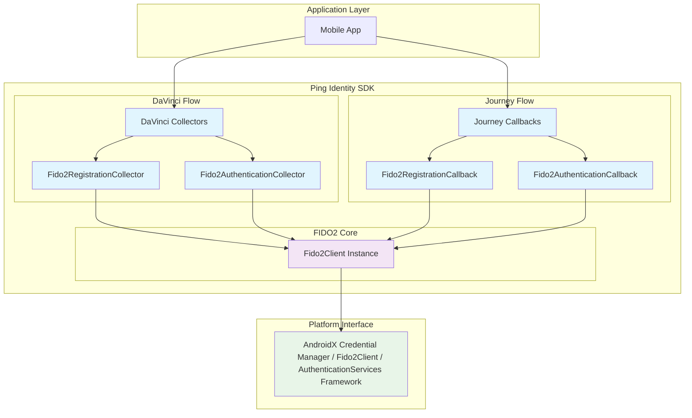
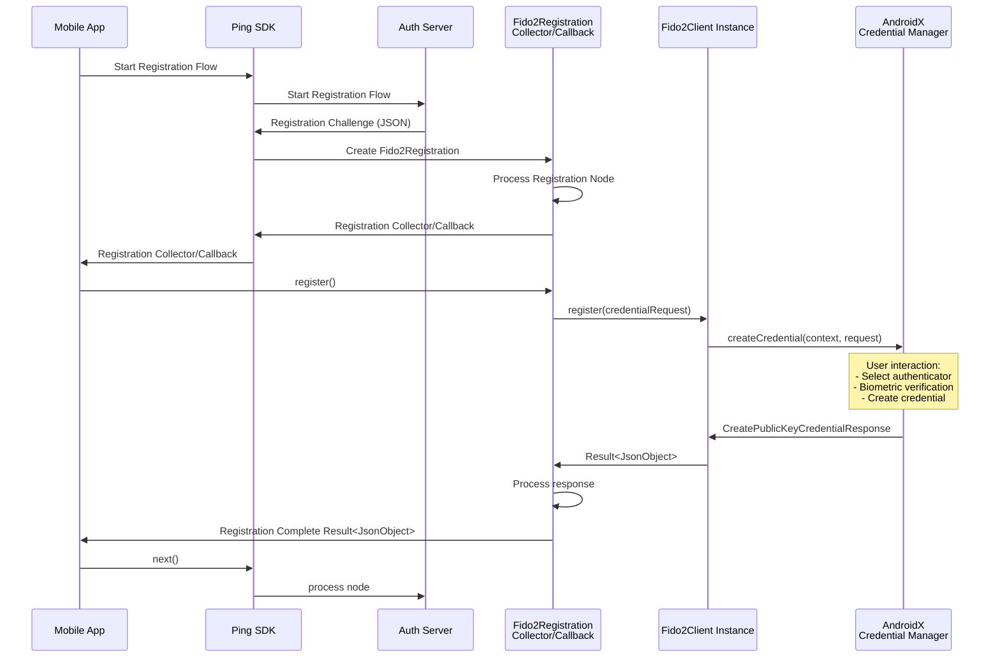

# FIDO2 Module Design Concept

This document explains the internal design and architecture of the FIDO2 module, focusing on how
DaVinci's Collectors
and Journey's Callbacks depend on the Fido2Client instance, and how it integrates with the AndroidX
Credentials library.

## Overview

The FIDO2 module serves as a bridge between Ping Identity's authentication flows (DaVinci and
Journey) and Android's
native FIDO2 capabilities through the AndroidX Credentials library. The `Fido2Client` class acts as
a proxy, abstracting
the complexity of the underlying credential management system while providing a clean, consistent
API for authentication
operations.

## Architecture Components

### Component Diagram

## Design Principles

### 1. Configurable Client Pattern

The `Fido2Client` is implemented as a configurable client to:

- Allow customization of logging, API selection, and request options
- Support different deployment scenarios and testing requirements
- Provide flexibility in choosing between Credential Manager and Google Play Services APIs
- Enable easy instantiation with sensible defaults

### 2. Proxy Pattern

The `Fido2Client` acts as a proxy to the AndroidX Credentials library and Fido2ApiClient Library:

- **Abstraction**: Hides the complexity of AndroidX Credentials API
- **Error Handling**: Provides consistent error handling and reporting

### 3. Dependency Injection

Both DaVinci Collectors and Journey Callbacks depend on configurable `Fido2Client` instances:

- **Loose Coupling**: Components depend on the abstraction, not implementation
- **Testability**: Easy to mock the `Fido2Client` instance for unit testing
- **Consistency**: All authentication flows use the same underlying FIDO2 operations
- **Configurability**: Different instances can be configured for different use cases

## Data Flow

### FIDO2 Registration Flow

### FIDO2 Authentication Flow

Similar to the registration flow, but using `Fido2AuthenticationCollector` or
`Fido2AuthenticationCallback` and calling
`authenticate()` instead of `register()`.

## Key Components Explained

### Fido2Client

- **Location**: `com.pingidentity.fido2.Fido2Client`
- **Purpose**: Central coordinator for all FIDO2 operations
- **Responsibilities**:
    - Manage AndroidX Credential Manager lifecycle
    - Handle errors and exceptions consistently
    - Provide configurable API selection (Credential Manager vs Google Play Services)
    - Support both discoverable and non-discoverable credentials

### DaVinci Collectors

- **Fido2RegistrationCollector**: Handles credential registration in DaVinci flows
- **Fido2AuthenticationCollector**: Handles credential authentication in DaVinci flows
- **Integration**: Called automatically when DaVinci flow encounters FIDO2 nodes

### Journey Callbacks

- **Fido2RegistrationCallback**: Handles credential registration in Journey flows
- **Fido2AuthenticationCallback**: Handles credential authentication in Journey flows
- **Integration**: Triggered when Journey tree contains FIDO2 authentication nodes

## Comprehensive FIDO2 Credential Compatibility Matrix

The following table outlines the compatibility scenarios between different credential types and
authentication methods across SDK versions and platforms:

### FIDO2 Cross-Platform and Cross-Implementation Test Matrix for AIC Integration

| Registration Method                         | Registration SDK | Registration Credential Type | Authentication Method | Authentication SDK | Authentication Credential Type | Expected Result       | Rationale                                                      |
|---------------------------------------------|------------------|------------------------------|-----------------------|--------------------|--------------------------------|-----------------------|----------------------------------------------------------------|
| **Android Credential Manager Registration** |
| Credential Manager                          | New SDK          | Discoverable                 | Credential Manager    | New SDK            | Discoverable                   | ✅ **PASS**            | Same API, discoverable credentials work across implementations |
| Credential Manager                          | New SDK          | Discoverable                 | Credential Manager    | New SDK            | Non-Discoverable               | ✅ **PASS**            | Same API, discoverable credentials work across implementations |
| Credential Manager                          | New SDK          | Discoverable                 | Google Play Services  | New SDK            | Discoverable                   | ✅ **PASS**            | Discoverable credentials works with Fido2Client                |
| Credential Manager                          | New SDK          | Discoverable                 | Google Play Services  | New SDK            | Non-Discoverable               | ✅ **PASS**            | Discoverable credentials works with Fido2Client                |
| Credential Manager                          | New SDK          | Discoverable                 | Platform UI           | JS-SDK             | Discoverable                   | ✅ **PASS**            | Platform UI uses passkey created from Android                  |
| Credential Manager                          | New SDK          | Non-Discoverable             | Credential Manager    | New SDK            | Discoverable                   | ❌ **Expect not work** | Credential Manager not supported Non-Discoverable key          |
| Credential Manager                          | New SDK          | Non-Discoverable             | Credential Manager    | New SDK            | Non-Discoverable               | ❌ **Expect not work** | Key not discoverable                                           |
| Credential Manager                          | New SDK          | Non-Discoverable             | Google Play Services  | New SDK            | Discoverable                   | ❌ **Expect not work** | Key not discoverable                                           |
| Credential Manager                          | New SDK          | Non-Discoverable             | Google Play Services  | New SDK            | Non-Discoverable               | ✅ **PASS**            | Non-Discoverable credentials works with Fido2Client            |
| **Legacy FIDO2 API Registration**           |
| Legacy FIDO2 API                            | Legacy SDK       | Discoverable                 | Credential Manager    | New SDK            | Discoverable                   | ✅ **PASS**            | Backward compatibility maintained                              |
| Legacy FIDO2 API                            | Legacy SDK       | Discoverable                 | Credential Manager    | New SDK            | Non-Discoverable               | ✅ **PASS**            | Backward compatibility maintained                              |
| Legacy FIDO2 API                            | Legacy SDK       | Discoverable                 | Google Play Services  | New SDK            | Discoverable                   | ✅ **PASS**            | Backward compatibility maintained                              |
| Legacy FIDO2 API                            | Legacy SDK       | Discoverable                 | Google Play Services  | New SDK            | Non-Discoverable               | ✅ **PASS**            | Backward compatibility maintained                              |
| Legacy FIDO2 API                            | Legacy SDK       | Non-Discoverable             | Credential Manager    | New SDK            | Discoverable                   | ❌ **Expect not work** | Credential Manager not supported Non-Discoverable key          |
| Legacy FIDO2 API                            | Legacy SDK       | Non-Discoverable             | Credential Manager    | New SDK            | Non-Discoverable               | ❌ **Expect not work** | Credential Manager not supported Non-Discoverable key          |
| Legacy FIDO2 API                            | Legacy SDK       | Non-Discoverable             | Google Play Services  | New SDK            | Non-Discoverable               | ✅ **PASS**            | Backward compatibility maintained                              |
| **Platform UI (Web) Registration**          |
| Platform UI                                 | JS-SDK           | Discoverable                 | Credential Manager    | New SDK            | Discoverable                   | ✅ **PASS**            | Android uses passkey created from Platform UI                  |
| Platform UI                                 | JS-SDK           | Discoverable                 | Google Play Services  | New SDK            | Discoverable                   | ✅ **PASS**            | Android uses passkey created from Platform UI                  |

### DaVinci Flow FIDO2 Compatibility Test Matrix

| Registration Method                                | Registration SDK | Registration Credential Type | Authentication Method | Authentication SDK | Authentication Credential Type | Expected Result       | Rationale                                                      |
|----------------------------------------------------|------------------|------------------------------|-----------------------|--------------------|--------------------------------|-----------------------|----------------------------------------------------------------|
| **DaVinci Flow - Credential Manager Registration** |
| Credential Manager                                 | New SDK          | Discoverable                 | Credential Manager    | New SDK            | Discoverable                   | ✅ **PASS**            | Same API, discoverable credentials work across implementations |
| Credential Manager                                 | New SDK          | Discoverable                 | Credential Manager    | New SDK            | Non-Discoverable               | ✅ **PASS**            | Same API, discoverable credentials work across implementations |
| Credential Manager                                 | New SDK          | Discoverable                 | Google Play Services  | New SDK            | Discoverable                   | ✅ **PASS**            | Discoverable credentials works with Fido2Client                |
| Credential Manager                                 | New SDK          | Discoverable                 | Google Play Services  | New SDK            | Non-Discoverable               | ✅ **PASS**            | Discoverable credentials works with Fido2Client                |
| Credential Manager                                 | New SDK          | Non-Discoverable             | Credential Manager    | New SDK            | Discoverable                   | ❌ **Expect not work** | Credential Manager not supported Non-Discoverable key          |
| Credential Manager                                 | New SDK          | Non-Discoverable             | Credential Manager    | New SDK            | Non-Discoverable               | ❌ **Expect not work** | Key not discoverable                                           |
| Credential Manager                                 | New SDK          | Non-Discoverable             | Google Play Services  | New SDK            | Discoverable                   | ❌ **Expect not work** | Key not discoverable                                           |
| Credential Manager                                 | New SDK          | Non-Discoverable             | Google Play Services  | New SDK            | Non-Discoverable               | ✅ **PASS**            | Non-Discoverable credentials works with Fido2Client            |

### Credential Type Definitions

| Credential Type      | Description                                                          | Username Requirement    | Cross-Device Sync                 | Platform Support                |
|----------------------|----------------------------------------------------------------------|-------------------------|-----------------------------------|---------------------------------|
| **Discoverable**     | UsernameLess authentication, credential contains user information    | ❌ Username not required | ✅ Yes (with compatible providers) | Modern devices, passkey-enabled |
| **Non-Discoverable** | Username required for authentication, credential ID must be provided | ✅ Username is required  | ❌ No                              | All FIDO2-compatible devices    |

