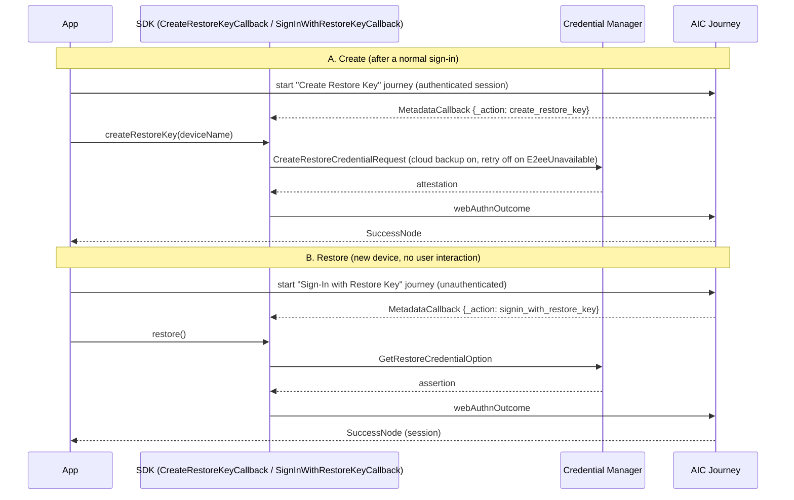
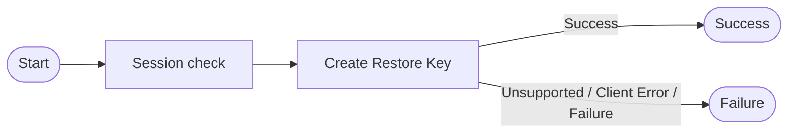
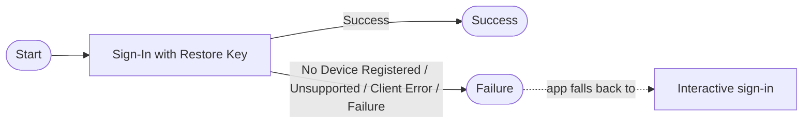
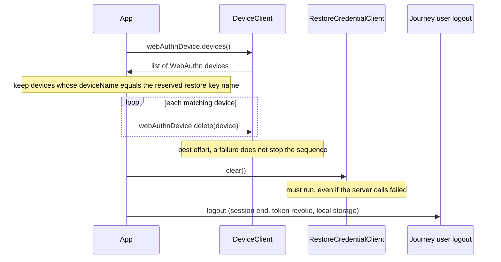

# Restore Credential — Design Document

|                     |                                                                                                                                                                                                                                                               |
|---------------------|---------------------------------------------------------------------------------------------------------------------------------------------------------------------------------------------------------------------------------------------------------------|
| **Status**          | Draft for review                                                                                                                                                                                                                                              |
| **Author**          | Andy Witrisna                                                                                                                                                                                                                                                 |
| **Date**            | 2026-10-01                                                                                                                                                                                                                                                    |
| **Module**          | `:mfa:fido` (`com.pingidentity.sdks:fido`)                                                                                                                                                                                                                    |
| **Spike**           | [SDKS-5437](https://pingidentity.atlassian.net/browse/SDKS-5437) — [SPIKE] Investigate support for Restore Credentials ([Confluence](https://pingidentity.atlassian.net/wiki/spaces/SDKS/pages/3457548399/SPIKE+Investigate+support+for+Restore+Credentials)) |
| **Customer driver** | [TRIAGE-37355](https://pingidentity.atlassian.net/browse/TRIAGE-37355)                                                                                                                                                                                        |

Items marked **TBD** are for the author to fill in. Items marked **Decision** need a call before
implementation starts (collected in [Section 9](#9-open-questions--decisions)).

---

## 1. Background

Starting April 2027, Google Play requires apps with user sign-in to support Zero-Tap Sign-In
restoration, built on Credential Manager's Restore Credentials API. The spike (SDKS-5437) concluded
that the client ceremony is
structurally identical to the WebAuthn passkey ceremony `:mfa:fido` already implements, and that the
feature belongs inside `:mfa:fido` rather than in a new module.

The spike prototyped the Journey side with a **regular WebAuthn Registration/Authentication node
placed in a Page node whose `stage` attribute says "this is for a restore credential"**. That works,
but it leaves correctness to journey configuration: nothing stops an administrator from building a
restore journey with `userVerification = required`, which cannot work because no user is present.

This document proposes **two dedicated nodes** that encode the restore-credential settings, and
**two new `_action` values** on the nodes' `MetadataCallback` so the SDK can route each to a
dedicated callback and tell a restore key apart from a regular FIDO passkey.

## 2. Goals and Non-Goals

**Goals**

- Two new AIC Journey nodes, one for creating and one for using a restore credential, with a
  deliberately small configuration surface.
- New `_action` values in the `MetadataCallback` so the SDK can distinguish restore-key callbacks
  from FIDO passkey callbacks without relying on Page node `stage` or on the app guessing.
- Reuse of the existing `MetadataCallback` parsing and
  response formatting. No new callback classes from server.
- Documented behavior for the one-account-per-app and sign-out scenarios.

**Non-Goals**

- DaVinci. The nodes here are AIC Journey nodes; the DaVinci FIDO policy is tracked in the spike's
  Known Gaps.
- Plain-OIDC-only integrations (no Journey, no DaVinci). Also a spike Known Gap.
- Automatic `clear()` on SDK sign-out (see [Section 8](#8-scenario-sign-out) for what is proposed).
- Server-side cryptographic verification. It is the existing WebAuthn verification path.

## 3. Design Overview



Two pieces of work:

| # | Piece                     | Owner | Section                |
|---|---------------------------|-------|------------------------|
| 1 | Two new AIC nodes         | TAP   | [4](#4-new-aic-nodes)  |
| 2 | SDK handling, docs, tests | SDK   | [5.3](#53-sdk-changes) |

## 4. New AIC Nodes

### 4.1 Why dedicated nodes

| Approach                                                     | Pros                                                | Cons                                                                                                                                         |
|--------------------------------------------------------------|-----------------------------------------------------|----------------------------------------------------------------------------------------------------------------------------------------------|
| Regular WebAuthn nodes + Page node `stage` (spike prototype) | No new server work                                  | Admin must set `userVerification = discouraged`, resident key, attachment, and `stage` correctly; every setting is a chance to misconfigure. |
| **Two dedicated nodes (this proposal)**                      | Fixed settings cannot drift; smaller admin surface; | New server-side work; two more node types to document and maintain                                                                           |

Each new node is a copy of its WebAuthn counterpart with every setting pinned to a
restore-appropriate default, except the handful an administrator must supply.

### 4.2 Create Restore Key node

Equivalent of the WebAuthn **Registration** node. Runs in a journey where the user is already
authenticated.

**Settings exposed to the administrator — fill in:**

| Setting                  | Existing WebAuthn Registration node property                                           | Required | Example                          | Value   |
|--------------------------|----------------------------------------------------------------------------------------|----------|----------------------------------|---------|
| Relying Party            | `relyingPartyName`                                                                     | Yes      | `Acme Mobile`                    | **TBD** |
| Relying Party Identifier | `relyingPartyDomain` (becomes `rp.id` / `_relyingPartyId`)                             | Yes      | `login.acme.com`                 | **TBD** |
| Origin Domain            | `origins` (Android origin, `android:apk-key-hash:<base64url SHA-256 of signing cert>`) | Yes      | `android:apk-key-hash:ZvFnky...` | **TBD** |

Notes for filling in:

- The Android origin is derived from the app's **signing certificate**. An app using Play App
  Signing
  is verified against the Play signing key, not the upload key; debug and release builds differ.
  List every origin that must be accepted.
- Relying Party Identifier must match the domain hosting the app's Digital Asset Links file (see
  `README.md`, "Associate your App with your server").

**Settings pinned by the node (not exposed) — proposed, confirm each:**

| Setting                                 | Existing WebAuthn Registration node property | Pinned value                                          | Why                                                                                    |
|-----------------------------------------|----------------------------------------------|-------------------------------------------------------|----------------------------------------------------------------------------------------|
| User verification requirement           | `userVerificationRequirement`                | `DISCOURAGED`                                         | No user is present at restore time; `REQUIRED` makes the credential unusable.          |
| Return challenge as JavaScript (Legacy) | `asScript`                                   | `false`                                               | The SDK only understands the `MetadataCallback` form.                                  |
| Attestation preference                  | `attestationPreference`                      | `none`                                                | Attestation adds nothing for a system-managed key.                                     |
| Authenticator attachment                | `authenticatorAttachment`                    | `platform`                                            | Restore credentials live in Credential Manager on the device.                          |
| Resident key                            | `requiresResidentKey`                        | `true`                                                | The restore journey is username-less, so the credential must be discoverable.          |
| Timeout                                 | `timeout`                                    | WebAuthn node default                                 | No reason to diverge.                                                                  |
| Accepted signing algorithms             | `acceptedSigningAlgorithms`                  | WebAuthn node default                                 | Credential Manager picks from the list.                                                |
| Device name                             | `generateDisplayName…` / client-supplied     | **Decision** (see [Q1](#9-open-questions--decisions)) | Must identify the key as system-managed. It is the only field that does (Section 8.2). |
| All other properties                    | —                                            | Same default as the WebAuthn Registration node        | Requirement: "keep all default".                                                       |

**Outcomes:** same as the WebAuthn Registration node (Success, Unsupported, Client Error, Failure).

### 4.3 Sign-In with Restore Key node

Equivalent of the WebAuthn **Authentication** node. Runs at the start of an unauthenticated journey
and produces a session on success.

**Settings exposed to the administrator — fill in:**

| Setting                  | Existing WebAuthn Authentication node property (verified)                    | Required | Example                          | Value   |
|--------------------------|------------------------------------------------------------------------------|----------|----------------------------------|---------|
| Relying Party            | **None.** The existing Authentication node has no relying party name         | —        | —                                | **N/A** |
| Relying Party Identifier | `relyingPartyDomain` ("Relying party identifier", becomes `_relyingPartyId`) | Yes      | `login.acme.com`                 | **TBD** |
| Origin Domain            | `origins` ("Origin domains")                                                 | Yes      | `android:apk-key-hash:ZvFnky...` | **TBD** |

Relying Party Identifier and Origin Domain must equal the values configured on the Create Restore
Key node, or the assertion will not verify.

**Settings pinned by the node (not exposed) — proposed, confirm each:**

| Setting                                 | Existing WebAuthn Authentication node property (verified) | Default today | Pinned value      | Why                                                                                                                                  |
|-----------------------------------------|-----------------------------------------------------------|---------------|-------------------|--------------------------------------------------------------------------------------------------------------------------------------|
| User verification requirement           | `userVerificationRequirement`                             | `PREFERRED`   | `DISCOURAGED`     | No user is present at restore time.                                                                                                  |
| Username from device                    | `requiresResidentKey`                                     | `false`       | `true`            | The journey starts with no identity; the credential's user handle identifies the user.                                               |
| Return challenge as JavaScript (Legacy) | `asScript`                                                | `false`       | `false`           | The SDK only understands the `MetadataCallback` form.                                                                                |
| Allow recovery codes                    | `isRecoveryCodeAllowed`                                   | `false`       | `false`           | Recovery codes need user input; restore is silent.                                                                                   |
| Detect sign count mismatch              | `detectSignCountMismatch`                                 | `false`       | `false` (confirm) | A restored key moves between devices, so a counter check is unlikely to be meaningful. Avoids the extra Sign Count Mismatch outcome. |
| Timeout                                 | `timeout`                                                 | `60`          | `60`              | —                                                                                                                                    |

The schema has no authentication-button, conditional-mediation or allow-credentials properties, so
there is nothing further to pin.

**Outcomes (verified):** same as the WebAuthn Authentication node: `success`, `unsupported`,
`noDevice` (No Device Registered), `failure`, `error` (Client Error).

### 4.4 Reference journey layouts

**Create journey** (user already signed in)



**Restore journey** (new device, no session)



Journey names are chosen by the integrator and passed to `Journey.start(name)`.

## 5. Restore Credential Attribute

### 5.1 Specification

|                |                                                                                                           |
|----------------|-----------------------------------------------------------------------------------------------------------|
| **Name**       | `_action` (existing field, new values)                                                                    |
| **Type**       | String                                                                                                    |
| **Where**      | Inside the `data` value of the `MetadataCallback`                                                         |
| **Values**     | `create_restore_key` (Create Restore Key node), `signin_with_restore_key` (Sign-In with Restore Key node) |
| **Emitted by** | Create Restore Key node and Sign-In with Restore Key node                                                 |

Routing is changed: `MetadataCallback` (`:journey`) selects `CreateRestoreKeyCallback` /
`SignInWithRestoreKeyCallback` from these `_action` values, in the same way it selects
`FidoRegistrationCallback` / `FidoAuthenticationCallback` from `webauthn_registration` /
`webauthn_authentication` today.

### 5.2 Sample callbacks

`// NEW` or `// CHANGED` are the differences for a restore credential.

**Create Restore Key node**

```jsonc
{
  "type": "MetadataCallback",
  "output": [
    {
      "name": "data",
      "value": {
        "_action": "create_restore_key",               // CHANGED
        "challenge": "Y2hhbGxlbmdl",
        "timeout": "60000",
        "attestationPreference": "none",
        "relyingPartyName": "Test RP",
        "_relyingPartyId": "test.example.com",
        "userId": "dXNlcklk",
        "userName": "testuser",
        "displayName": "Test User",
        "_pubKeyCredParams": [
          { "type": "public-key", "alg": -7 }
        ],
        "_excludeCredentials": [],
        "_authenticatorSelection": {
          "authenticatorAttachment": "platform",
          "requireResidentKey": true,
          "userVerification": "discouraged"            // CHANGED: pinned by node
        },
        "supportsJsonResponse": true
      }
    }
  ]
}
```

**Sign-In with Restore Key node**

```jsonc
{
  "type": "MetadataCallback",
  "output": [
    {
      "name": "data",
      "value": {
        "_action": "signin_with_restore_key",          // CHANGED
        "challenge": "IrmRP2U3shw3plwrICzAkw/yupRI60s2dnGhfwExd/o=",
        "allowCredentials": "",
        "_allowCredentials": [],
        "timeout": "60000",
        "userVerification": "discouraged",             // CHANGED: pinned by node
        "relyingPartyId": "rpId: \"idc.petrov.ca\",",
        "_relyingPartyId": "idc.petrov.ca",
        "extensions": {},
        "_type": "WebAuthn",
        "supportsJsonResponse": true
      }
    }
  ]
}
```

The `webAuthnOutcome` `HiddenValueCallback` is unchanged in shape and value format for both nodes.

### 5.3 SDK changes

| File                                                    | Change                                                                                                                                                                                                        |
|---------------------------------------------------------|---------------------------------------------------------------------------------------------------------------------------------------------------------------------------------------------------------------|
| `journey/CreateRestoreKeyCallback.kt` (`:mfa:fido`)     | New callback. Parses the `create_restore_key` data in `init()`; creates the restore key and submits `webAuthnOutcome`.                                                                                        |
| `journey/SignInWithRestoreKeyCallback.kt` (`:mfa:fido`) | New callback. Parses the `signin_with_restore_key` data in `init()`; signs in with the restore key and submits `webAuthnOutcome`.                                                                             |
| `RestoreCredentialClient`                               | As defined in the spike (Section 4). Not yet present on `develop`; this design depends on it landing.                                                                                                         |
| `Constants.kt` (`:mfa:fido`)                            | Add the two `_action` values.                                                                                                                                                                                 |
| `journey/CallbackInitializer.kt` (`:mfa:fido`)          | Register `CreateRestoreKeyCallback` and `SignInWithRestoreKeyCallback` with `CallbackRegistry`.                                                                                                               |
| `callback/MetadataCallback.kt` (`:journey`)             | Route the two new `_action` values to the registered callbacks (same pattern as `isFidoRegistration()` / `isFidoAuthentication()`).                                                                           |
| `README.md`                                             | Document the two nodes and the new `_action` values.                                                                                                                                                          |
| Tests                                                   | New `CreateRestoreKeyCallbackTest` and `SignInWithRestoreKeyCallbackTest`; update `CallbackInitializerTest` (it asserts exactly two registrations today); add `MetadataCallback` routing cases in `:journey`. |

Both callbacks need the same option parsing and response formatting as `FidoRegistrationCallback` /
`FidoAuthenticationCallback`.

### 5.4 Compatibility

| SDK     | Server                  | Result                                                                                                                                                                            |
|---------|-------------------------|-----------------------------------------------------------------------------------------------------------------------------------------------------------------------------------|
| New     | New nodes               | Full behavior                                                                                                                                                                     |
| New     | Existing WebAuthn nodes | Regular FIDO. `register()` / `authenticate()` unchanged                                                                                                                           |
| **Old** | New nodes               | The unknown `_action` is not routed, so the app receives a bare `MetadataCallback` and nothing happens: no exception, no passkey sheet. Integrators must adopt the new SDK first. |

## 6. API Usage (summary)

Public API is defined by the spike.

```kotlin
if (node is ContinueNode) {
    node.callbacks.forEach { callback ->
        when (callback) {
            is CreateRestoreKeyCallback ->
                callback.create(deviceName = "...")
            is SignInWithRestoreKeyCallback ->
                callback.signin()
        }
    }
}
```

Two-tier restore (`BackupAgent.onRestoreFinished()` plus launcher `Activity`), the
`E2eeUnavailableException` fallback, and `credentials-play-services-auth` for API 33 and below are
described in the spike and not repeated here. Restore Credential is not supported with
`Fido2Client`.

## 7. Scenario: One Account per App

### 7.1 Scope

"One account per app" means that, on a device, the app holds **one restore key at a time, and that
key signs in one account**. Restoring a device brings back that account only. Apps that keep several
accounts signed in at once, or that offer an account picker, are out of scope: only the account that
last created a restore key can be restored silently.

### 7.2 Current behavior

- The Create Restore Key node has no limit. Every successful execution registers a **new** key for
  the user; nothing replaces or removes earlier ones.
- Google's guidance is to create a restore key at every sign-in, including when the user is already
  signed in. After *N* sign-ins the user has *N* restore keys for the same app.
- Only the newest key corresponds to what Credential Manager holds on the device (to be
  confirmed). The rest are orphans: never used again, but they stay on
  the user's record.

### 7.3 Proposal: replace the existing key for the same app

A restore key belongs to a **(user, app)** pair. The app is identified by the **origin** in the
attestation (`clientDataJSON.origin`, for example `android:apk-key-hash:ZvFnky...`), the same value
that is validated against the node's Origin Domain setting.

When the Create Restore Key node runs, the server:

1. Verifies the attestation as it does today (challenge, relying party identifier, origin).
2. Stores the new key under the reserved restore-key device name, which encodes the app
   ([Q1](#9-open-questions--decisions)). The stored record has no origin or type field, so the
   name is the only thing that identifies it later.
3. Removes every **other** restore key of the same user with the App.
4. Returns Success.

Design points:

- **Store first, remove second.** A registration that fails verification must never leave the user
  without a working key.
- **Only touch restore keys.** The removal filters on the reserved device name, so a user-managed
  passkey is never deleted.

### 7.4 Behavior by scenario

| # | Scenario                                                            | Behavior with the proposal                                                                                                                    | Result                                    |
|---|---------------------------------------------------------------------|-----------------------------------------------------------------------------------------------------------------------------------------------|-------------------------------------------|
| 1 | Same user signs in again on the same device                         | New key created; the previous key for the same origin is removed                                                                              | Still exactly one key                     |
| 2 | Same user signs in to the same app on a **second device**           | The second device's key replaces the first device's key (same user, same origin)                                                              | The first device's key is no longer valid |
| 3 | Device transfer or restore, then the app signs in with the key      | Sign-in succeeds with the latest key; the app then creates a fresh key (Google: create even if signed in), which replaces the transferred one | One key                                   |
| 4 | User A signs out, user B signs in on the same device                | Sign-out removes A's key (Section 8); B creates their own                                                                                     | One key per user, device holds B's        |
| 6 | Same user, different app (different package or signing certificate) | Different origin, so no replacement                                                                                                           | One key per app                           |

## 8. Scenario: Sign-Out

### 8.1 Current behavior and constraints

- Credential Manager is stateless and **never** deletes a restore key on its own. If the app does
  not call `clear()`, the user is silently signed back in on the next launch, even after an explicit
  sign-out.
- SDK sign-out (`Journey.user()?.logout()` or equivalent) does **not** call
  `RestoreCredentialClient.clear()` and does **not** remove the credential on the server.
- `clear()` calls `clearCredentialState(TYPE_CLEAR_RESTORE_CREDENTIAL)`, which removes the key
  locally and from the cloud backup copy. A plain `clearCredentialState()` without the type does not
  touch restore keys.
- Each sign-in that creates a restore credential adds one more on the server unless something
  removes the previous one (addressed by the replace behavior in Section 7).
- On the server a restore key is an ordinary WebAuthn device record. **It carries no restore-key
  flag and no origin**, so `deviceName` is the only field that can identify it.

### 8.2 Identifying the restore key on the server

Querying the user's WebAuthn devices (`DeviceClient.webAuthnDevice.devices()`) returns records like
the first one below (paging wrapper omitted). The second record is illustrative: a restore key
created with the reserved device name ([Q1](#9-open-questions--decisions)).

```json
{
  "result": [
    {
      "_id": "e025d0c4-b7bd-437f-925a-ef5fe502eec7",
      "_rev": "2126128136",
      "createdDate": 1790353906374,
      "lastAccessDate": 1790353906374,
      "credentialId": "UdCOic32329KPtuLyH9SxA",
      "deviceName": "sdk_gphone64_arm64",
      "uuid": "e025d0c4-b7bd-437f-925a-ef5fe502eec7",
      "deviceManagementStatus": false
    },
    {
      "_id": "<id>",
      "_rev": "<rev>",
      "createdDate": 1790353999999,
      "lastAccessDate": 1790353999999,
      "credentialId": "<credential id>",
      "deviceName": "RestoreKey:com.acme.app",
      "uuid": "<uuid>",
      "deviceManagementStatus": false
    }
  ],
  "resultCount": 2
}
```

Nothing in a record says which one is a restore key. The rule is therefore:

1. Restore keys are created with a **reserved device name** that encodes the app, for example
   `RestoreKey:com.acme.app` (format decided in [Q1](#9-open-questions--decisions)).
2. At sign-out the app lists the user's WebAuthn devices, keeps the records whose `deviceName`
   **equals** that name exactly, and deletes each one. An exact match, not a prefix match, so the
   user's restore keys for other apps are left alone.

Consequences:

- **Deletion is per user and app, not per device.** Every restore key with that name is removed,
  including one created from another device. This is the one-key-per-user-per-app model of
  Section 7: after sign-out on device A, device B falls back to interactive sign-in.
- **Restore keys show up in the normal device list.** An app with a passkey management screen must
  hide records that carry the reserved name.
- **The name can be edited.** `WebAuthnDevice` supports `update`, so a restore key renamed by the
  user or the app is no longer found at sign-out. Low risk, but it is a reason not to expose
  rename for these records.

### 8.3 Proposed app sign-out sequence



```kotlin
suspend fun signOut() {
    // 1. Server: best effort. Needs the session that logout destroys.
    runCatching {
        deviceClient.webAuthnDevice.devices().getOrThrow()
            .filter { it.deviceName == restoreKeyName }
            .forEach { deviceClient.webAuthnDevice.delete(it) }   // returns Result; one failure does not stop the rest
    }.onFailure { Log.w(TAG, "Restore key not removed on server", it) }

    // 2. Device: always.
    restoreCredentialClient.clear()

    // 3. Session.
    journey.user()?.logout()
}
```

`deviceClient` is configured as for any other device operation, and `restoreKeyName` is the reserved
name the key was created with.

Order rationale:

1. **Server delete first** because both the query and the delete send the SSO token and use the
   user ID of the current session, which logout destroys.
2. **`clear()` always runs** even if step 1 failed. A leftover local or cloud-backed key is the real
   security exposure; a leftover server record is only an orphan.
3. **Logout last.**

### 8.4 Other events that must clear the restore key

| Event                                                                                | Action                                                       |
|--------------------------------------------------------------------------------------|--------------------------------------------------------------|
| User taps sign out                                                                   | Sequence above                                               |
| Server-side session invalidation (for example HTTP 401, or password reset elsewhere) | Call `clear()`; server delete not possible without a session |
| App uninstall / clear data                                                           | Handled by the OS                                            |
| Token expiry                                                                         | `clear()` is not triggered when token expired                |

An invalidation is only visible to the app when it makes a call that the server rejects. If the
app is not opened or makes no call, it learns nothing.

## 9. Open Questions / Decisions

| #  | Question                                                                                                                                                       | Options                                                                                                                                                                                               | Recommendation                                                                                                                                                                                                                                                                                                                                                                                                                                                                      |
|----|----------------------------------------------------------------------------------------------------------------------------------------------------------------|-------------------------------------------------------------------------------------------------------------------------------------------------------------------------------------------------------|-------------------------------------------------------------------------------------------------------------------------------------------------------------------------------------------------------------------------------------------------------------------------------------------------------------------------------------------------------------------------------------------------------------------------------------------------------------------------------------|
| Q1 | How is a restore key named so the node (replace, Section 7) and the app (sign-out, Section 8) can both find it? The stored record has no origin or type field. | A: reserved prefix + package name, e.g. `RestoreKey:com.acme.app` / B: reserved prefix + origin hash / C: one fixed name `RestoreKey` for every app / D: delete by `credentialId` saved on the device | A. The app computes it trivially and the node reads it from the registration outcome. B matches the server's "app = origin" identity but the app must derive its signing-certificate hash. C makes one app's sign-out (and the replace) remove the user's keys for other apps. D needs the app to persist the credential ID, which does not survive a restore unless backed up. Note that A treats debug and release builds of one package as the same app (Section 7, scenario 7). |

## 10. References

- [SDKS-5437 spike page](https://pingidentity.atlassian.net/wiki/spaces/SDKS/pages/3457548399/SPIKE+Investigate+support+for+Restore+Credentials)
- [TRIAGE-37355](https://pingidentity.atlassian.net/browse/TRIAGE-37355)
- [SDKS-4790](https://pingidentity.atlassian.net/browse/SDKS-4790) — Keystore-backed token storage
  cannot decrypt after restore
- [Android: Restore Credentials implementation](https://developer.android.com/identity/sign-in/restore-credentials-implementation)
- [Google Play: Zero-Tap Sign-In policy](https://support.google.com/googleplay/android-developer/answer/17492799)
- Existing samples: `src/test/kotlin/com/pingidentity/fido/journey/FidoRegistrationCallbackTest.kt`,
  `FidoAuthenticationCallbackTest.kt`
- Routing: `journey/src/main/kotlin/com/pingidentity/journey/callback/MetadataCallback.kt`
