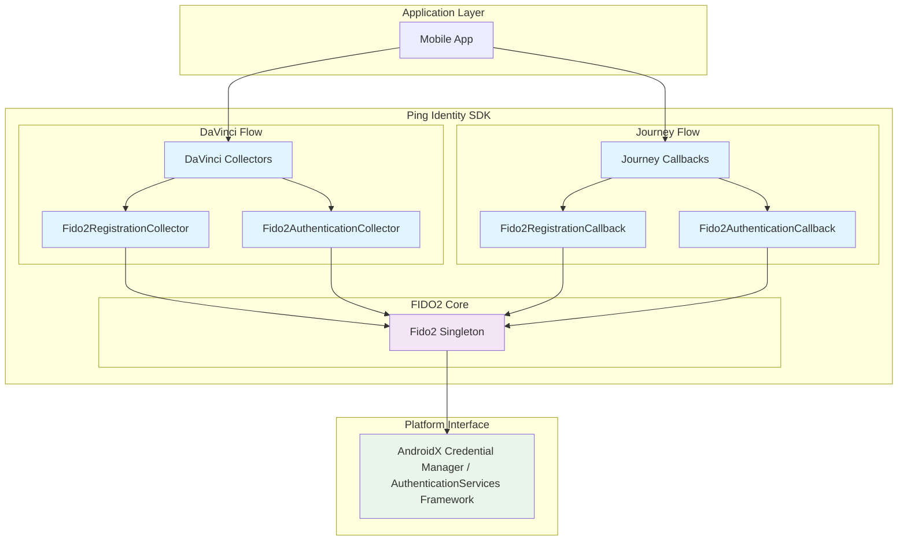
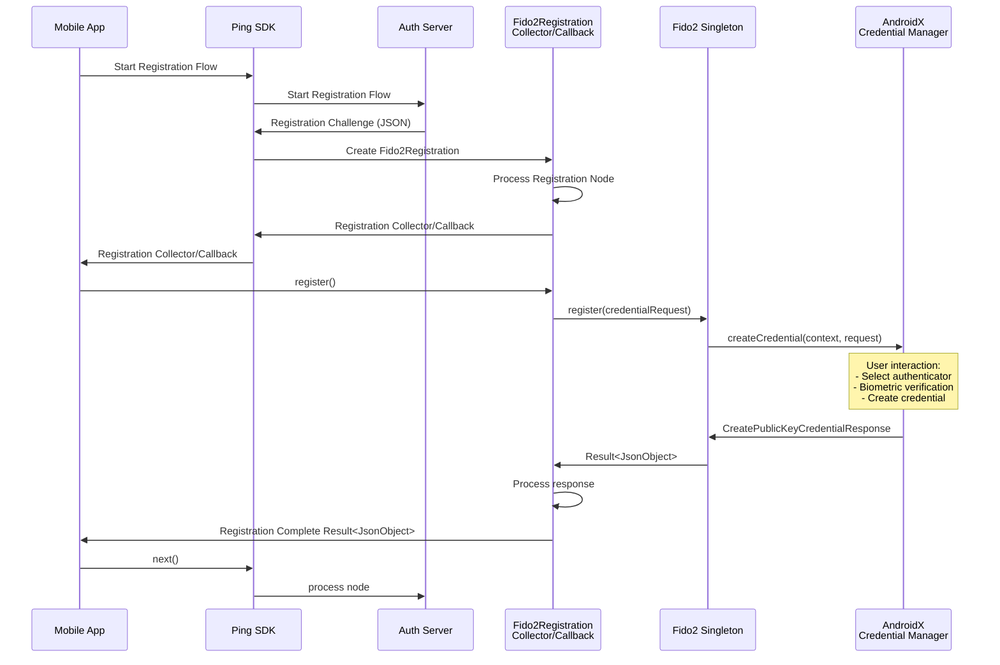

# FIDO2 Module Design Concept

This document explains the internal design and architecture of the FIDO2 module, focusing on how DaVinci's Collectors
and Journey's Callbacks depend on the Fido2 instance, and how it integrates with the AndroidX Credentials library.

## Overview

The FIDO2 module serves as a bridge between Ping Identity's authentication flows (DaVinci and Journey) and Android's
native FIDO2 capabilities through the AndroidX Credentials library. The `Fido2` singleton acts as a proxy, abstracting
the complexity of the underlying credential management system while providing a clean, consistent API for authentication
operations.

## Architecture Components

### Component Diagram

## Design Principles

### 1. Singleton Pattern

The `Fido2` object is implemented as a singleton to:

- Ensure consistent state management across the application
- Provide a single point of access to FIDO2 operations
- Optimize resource usage by reusing the same instance

### 2. Proxy Pattern

The `Fido2` singleton acts as a proxy to the AndroidX Credentials library:

- **Abstraction**: Hides the complexity of AndroidX Credentials API
- **Error Handling**: Provides consistent error handling and reporting

### 3. Dependency Injection

Both DaVinci Collectors and Journey Callbacks depend on the `Fido2` singleton:

- **Loose Coupling**: Components depend on the abstraction, not implementation
- **Testability**: Easy to mock the `Fido2` instance for unit testing
- **Consistency**: All authentication flows use the same underlying FIDO2 operations

## Data Flow

### FIDO2 Registration Flow

### FIDO2 Authentication Flow

Similar to the registration flow, but using `Fido2AuthenticationCollector` or `Fido2AuthenticationCallback` and calling
`authenticate()` instead of `register()`.

## Key Components Explained

### Fido2 Singleton

- **Location**: `com.pingidentity.fido2.Fido2`
- **Purpose**: Central coordinator for all FIDO2 operations
- **Responsibilities**:
  - Manage AndroidX Credential Manager lifecycle
  - Handle errors and exceptions consistently
  - Ensure thread safety for concurrent operations

### DaVinci Collectors

- **Fido2RegistrationCollector**: Handles credential registration in DaVinci flows
- **Fido2AuthenticationCollector**: Handles credential authentication in DaVinci flows
- **Integration**: Called automatically when DaVinci flow encounters FIDO2 nodes

### Journey Callbacks

- **Fido2RegistrationCallback**: Handles credential registration in Journey flows
- **Fido2AuthenticationCallback**: Handles credential authentication in Journey flows
- **Integration**: Triggered when Journey tree contains FIDO2 authentication nodes