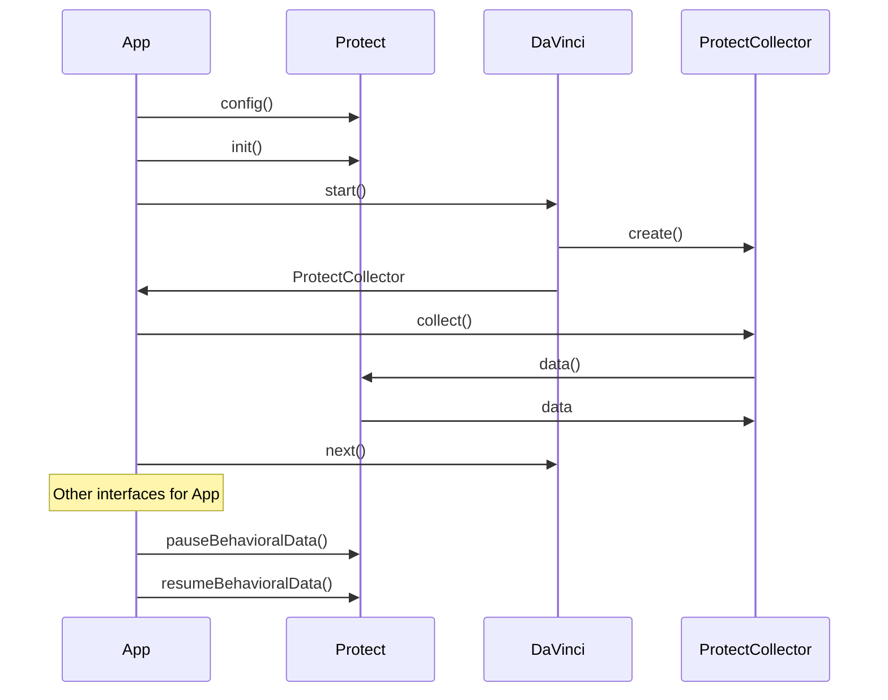
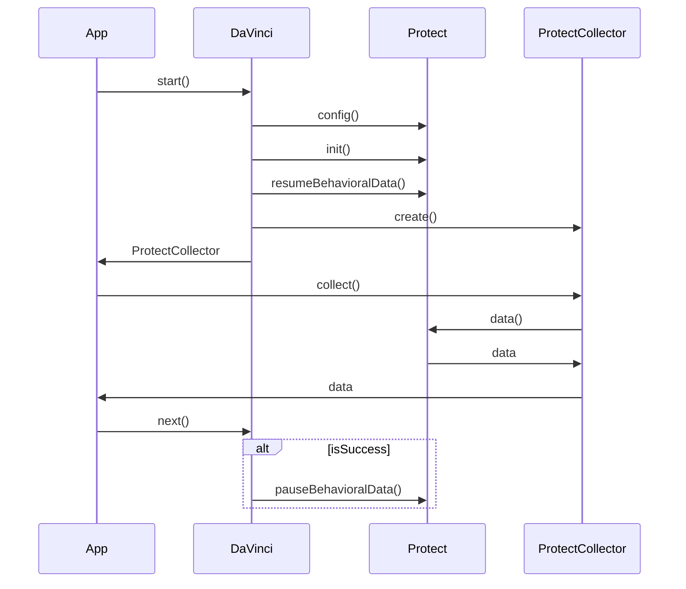
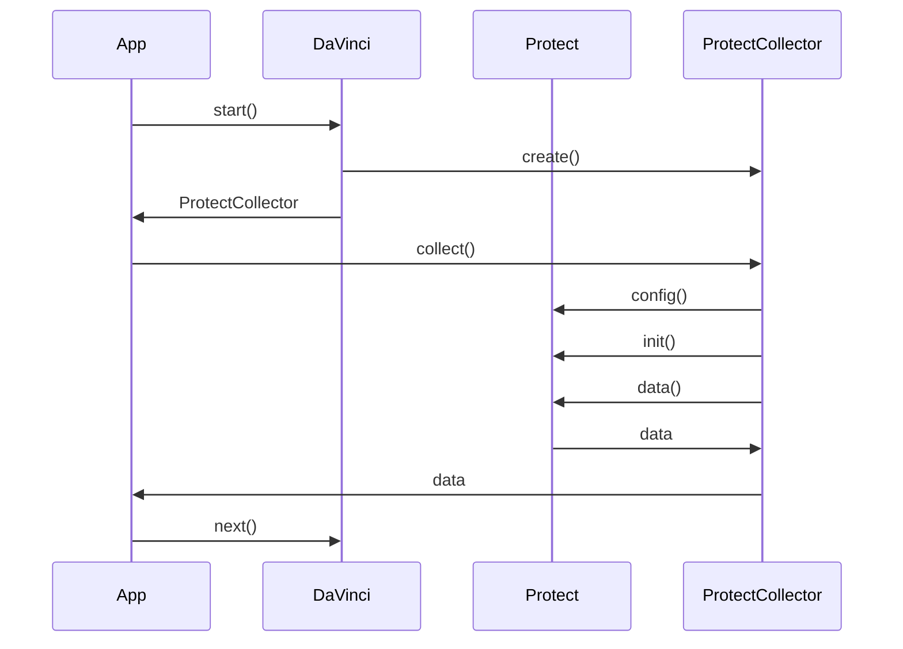

<p align="center">
  <a href="https://github.com/ForgeRock/ping-android-sdk">
    
  </a>
  <hr/>
</p>

# Protect Module: Advanced Security Integration

## Overview

The `protect` module is a powerful component of the Ping Identity Android SDK, designed to seamlessly integrate Ping
Identity's Protect service into your mobile applications. It provides comprehensive tools for real-time behavioral data
collection, sophisticated risk analysis, and adaptive authentication strategies. By leveraging this module, developers
can significantly enhance application security, detect and mitigate fraudulent activities, and create a more secure and
user-friendly authentication experience.

## Add Dependency to Your Project

To incorporate the Protect module into your Android project, include the following dependency in
your `build.gradle.kts` (or `build.gradle`) file:

```kotlin
dependencies {
  implementation("com.pingidentity.sdks:protect:<version>")
}
```

Replace `<version>` with the latest available version of the Protect SDK from the Maven repository. Ensure your
project's `repositories` block includes Maven Central or the Ping Identity Maven repository.

## Usage

### DaVinci Integration:

The `ProtectCollector` Kotlin class, implementing the `Collector` interface, is a critical component for gathering
behavioral risk data. It enables real-time risk assessment during DaVinci flows.

**Detailed Data Collection Process:**

```kotlin
node.collectors.forEach {
    when (it) {
        is ProtectCollector -> {
            when (val result = it.collect()) {
                is Success -> {
                    // Data collection successful: Proceed to the next node in the DaVinci flow.
                    node.next()
                }
                is Failure -> {
                    // Data collection failed: Implement robust error handling.
                    // Example: Log the error, display an informative message, or implement a retry mechanism.
                }
            }
        }
        // ... Handle other collector types (e.g., OidcCollector, etc.)
    }
}
```

The `collect()` method triggers the risk data collection, returning a `Success` or `Failure` result. Upon
success, `node.next()` advances the DaVinci flow. In case of failure, implement detailed error handling to maintain a
smooth user experience.

**Out of scope**

The Protect module's data collection results in a payload size that exceeds the practical limits for URL parameters in a
GET request. Consequently, the data cannot be included during DaVinci's start. Instead, the collect() function is
employed to retrieve the necessary data when required by the flow.

## Journey Integration

The `PingOneProtectInitializeCallback` is a specialized callback designed to initialize the Protect SDK within the
Journey. It ensures that the SDK is properly configured and ready to collect behavioral data during the user journey.
The `PingOneProtectEvaluationCallback` is another callback that collect data from the Protect SDK,
allowing the Journey to collect and utilize risk data for decision-making.

```kotlin
node.callbacks.forEach {
    when (it) {
        is PingOneProtectInitializeCallback -> {
            // Initialize the Protect SDK
            when (val result = it.start()) {
                is Success -> {
                    // Initialization successful: Proceed to the next step in the Journey.
                }
                is Failure -> {
                    // Initialization failed: Implement robust error handling.
                }
            }
        }
        is PingOneProtectEvaluationCallback -> {
            // Collect risk data from the Protect SDK
            when (val result = it.collect()) {
                is Success -> {
                    // Data collection successful: Process the collected data.
                }
                is Failure -> {
                    // Data collection failed: Implement robust error handling.
                }
            }
        }
    }
}
```

## Ping Protect SDK Initialization

Proper initialization is crucial for the Protect SDK's functionality. The SDK offers multiple initialization methods to
suit various application architectures and requirements.

### Direct Initialization Using the `Protect` Interface: Fine-Grained Control

For maximum control over SDK configuration, use the `Protect` interface directly:

```kotlin
import java.net.URL
import android.util.Log

Protect.config {
    isBehavioralDataCollection = true // Enable behavioral data collection.
    isLazyMetadata = true // Enable lazy loading of device metadata.
    envId = URL("[https://api.pingone.com](https://api.pingone.com)").host // Set the PingOne environment ID.
    deviceAttributesToIgnore = listOf("deviceId", "androidId", "serialNumber") // Exclude sensitive device attributes.
    isConsoleLogEnabled = true // Enable detailed console logging for debugging.
}

Protect.init() // Initialize the Protect SDK with the provided configuration.

Log.d("Protect", "Protect SDK initialized.")

Protect.pauseBehavioralData() // Temporarily pause behavioral data collection.
Protect.resumeBehavioralData() // Resume behavioral data collection.
```

**Configuration Parameters Explained:**

* `isBehavioralDataCollection`: Enables or disables the collection of user behavioral data.
* `isLazyMetadata`: Enables lazy loading of device metadata, improving performance by deferring metadata retrieval until
  needed.
* `envId`: Specifies the PingOne environment ID, essential for connecting to your PingOne tenant.
* `deviceAttributesToIgnore`: Provides a list of device attributes to exclude from data collection, enhancing privacy
  and security.
* `customHost`: Allows specifying a custom host for the Protect API, useful in specific deployment scenarios.
* `isConsoleLogEnabled`: Enables detailed console logging, aiding in debugging and troubleshooting.



### Automatic Initialization with the `ProtectLifecycle` Module: Simplified Management

The `ProtectLifecycle` module automates the SDK's lifecycle management, simplifying its integration within DaVinci
flows:

```kotlin
DaVinci {
    timeout = 30
    module(Oidc) {
        clientId = "dummy"
        // ... Other Oidc configurations
    }
    module(ProtectLifecycle) {
        isBehavioralDataCollection = true // Default: true
        isLazyMetadata = true // Default: false
        envId = "api.pingone.com" // Default: null
        deviceAttributesToIgnore = listOf("deviceId") // Default: empty list
        customHost = "[https://api.pingone.com](https://api.pingone.com)" // Default: null
        isConsoleLogEnabled = true // Default: false

        pauseBehavioralDataOnSuccess = true // Pause data collection after successful authentication.
        resumeBehavioralDataOnStart = true // Resume data collection on application start.
    }
}
```



### Lazy Initialization: On-Demand SDK Activation

The SDK employs lazy initialization, meaning it only activates when triggered by server responses, such as the
instantiation of Collector or Callback objects. This approach conserves resources and accelerates application startup.
However, the initial interaction with the Protect SDK might experience a slight delay. Furthermore, if behavioral data
collection is active, the initial lack of SDK activation could result in incomplete data capture, potentially requiring
data collection later in the application flow.



> [!WARNING]
> The Signal SDK, used internally by the Protect SDK, employs a Singleton pattern. This means it can only be initialized
> once per JVM process. Subsequent `init()` calls are ignored.

### Pause and Resume Behavioral Data Collection: Granular Control

Control behavioral data collection with the following methods:

```kotlin
Protect.pauseBehavioralData() // Pause data collection.
Protect.resumeBehavioralData() // Resume data collection.
```

These methods allow for granular control over data collection, enabling you to pause collection during sensitive
operations or when required by user privacy preferences.
