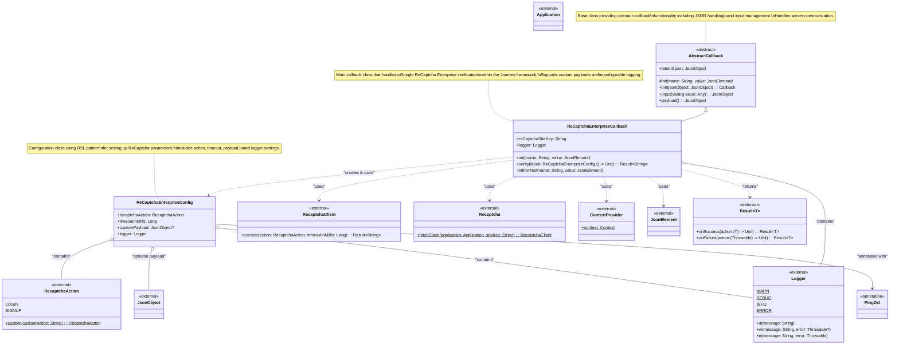

# ReCaptchaEnterpriseCallback Class Diagram

This class diagram shows the structure and relationships of the `ReCaptchaEnterpriseCallback` class based on the Journey Module concept and the plugin architecture.



## Architecture Overview

The `ReCaptchaEnterpriseCallback` implementation follows modern Android and Kotlin best practices with these architectural patterns:

### 1. Plugin Architecture
- **AbstractCallback**: Provides the foundation for all callbacks in the Journey module. `ReCaptchaEnterpriseCallback` extends this class to integrate into the authentication flow.
- **Journey Integration**: The callback receives configuration from the server (site key) and submits verification results back through the `input()` method.

### 2. DSL Configuration Pattern
- **ReCaptchaEnterpriseConfig**: Uses the `@PingDsl` annotation to provide a domain-specific language for configuration.
- **Type-Safe Builder**: Allows fluent and type-safe setup of verification parameters using lambda blocks.
- **Default Values**: Provides sensible defaults (LOGIN action, 10-second timeout) while allowing full customization.

### 3. Direct Integration Pattern
- **Google ReCaptcha SDK**: Integrates directly with Google's ReCaptcha Enterprise SDK (`com.google.android.recaptcha.Recaptcha`).
- **No Abstraction Overhead**: Uses the SDK directly for simplicity and transparency.
- **Context Management**: Uses `ContextProvider` to access the Android Application context.

### 4. Coroutine-Based Async
- **Suspend Functions**: The `verify()` method is a suspend function for non-blocking operations.
- **Result Type**: Uses Kotlin's `Result` type for robust error handling without exceptions.
- **Structured Concurrency**: Fits naturally into coroutine-based Android architectures.

### Key Design Features:

#### 1. **Flexibility**
- Supports multiple ReCaptcha actions (LOGIN, SIGNUP, custom)
- Configurable timeouts for different network conditions
- Optional custom payload for additional metadata
- Adjustable logging levels (DEBUG, INFO, WARN, ERROR)

#### 2. **Error Handling**
- Uses Kotlin's `Result` type for type-safe error handling
- Provides specific error codes (UNKNOWN_ERROR)
- Logs errors at appropriate levels for debugging

#### 3. **Testability**
- Internal `initForTest()` method for unit testing
- Clean separation of concerns
- Mockable dependencies

### 4. **Custom Payload Support**
- Allows sending additional metadata with verification
- Useful for risk assessment and analytics
- Flexible JsonObject format

### 5. **Logging Integration**
- Configurable logger at both callback and config levels
- Supports different log levels for development and production
- Detailed error messages for troubleshooting

### 6. **Robust Error Handling**
- Uses Kotlin's `Result` type for type-safe error handling
- Single error code: `UNKNOWN_ERROR` for all failure scenarios
- Detailed logging with exception chaining for debugging

## Verification Flow

```
1. Server sends ReCaptchaEnterpriseCallback with site key
2. App receives callback and calls verify() with optional config
3. Config is applied (action, timeout, payload, logger)
4. Recaptcha.fetchClient() creates a client
5. client.execute() performs verification
6. Token is validated (non-empty check)
7. Token (and optional payload) submitted via input()
8. Result returned to application
9. Application continues Journey flow with next()
```

## Configuration Options

| Property | Type | Default | Description |
|----------|------|---------|-------------|
| `recaptchaAction` | `RecaptchaAction` | `LOGIN` | The action type being verified (LOGIN, SIGNUP, or custom) |
| `timeoutInMills` | `Long` | `10000L` | Timeout in milliseconds |
| `customPayload` | `JsonObject?` | `null` | Optional metadata payload |
| `logger` | `Logger` | `Logger.WARN` | Logger for verification process |

## Error Handling

The callback provides robust error handling:

- **UNKNOWN_ERROR**: All verification failures (client setup, execution, network errors, etc.)
- Detailed logging at appropriate levels with exception chaining
- Result type prevents uncaught exceptions
- Graceful error wrapping with cause preservation
