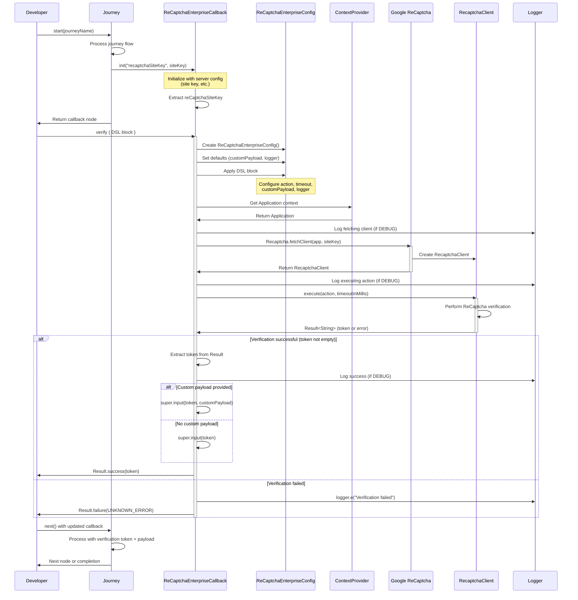

[](https://github.com/ForgeRock/ping-android-sdk)

# ReCaptcha Enterprise Module

Seamless integration of Google ReCaptcha Enterprise into Ping Identity's Journey workflows for Android.

## Getting Started

### Prerequisites

- Ping Identity Platform
    - Ping Advanced Identity Cloud
    - PingAM 6.5.2 or higher
- Android API level 29 or higher
- Google ReCaptcha Enterprise Site key configured in Google Cloud Console
- The `Journey` module must be integrated in your project
- Ensure your app has internet permissions in `AndroidManifest.xml`

```xml
<uses-permission android:name="android.permission.INTERNET" />
```

For more information about Google ReCaptcha Enterprise, refer to the [official documentation](https://cloud.google.com/recaptcha-enterprise/docs).


### Add Dependency to Your Project

```kotlin
dependencies {
    implementation("com.pingidentity.sdks:recaptcha-enterprise:<version>")
}
```

Replace `<version>` with the latest available version of the ReCaptcha Enterprise module.

---

## Overview

The **ReCaptcha Enterprise** module provides seamless integration of Google ReCaptcha Enterprise verification into Ping Identity's Journey authentication flows. This powerful module enables developers to add advanced bot detection and abuse protection to their Android applications with minimal configuration.

The module is designed as a Journey plugin callback, automatically handling ReCaptcha client initialization, token generation, and server validation within your authentication workflows.

## Quick Start

```kotlin
// In your Journey flow
val callback = journey.next() as ReCaptchaEnterpriseCallback

// Simple verification with defaults
val result = callback.verify()

result.onSuccess { token ->
    // Proceed with authentication
    println("ReCaptcha verification successful: $token")
}.onFailure { error ->
    // Handle verification failure
    println("ReCaptcha verification failed: ${error.message}")
}
```


## Configuration

> **Note:** All configuration options are set through the `ReCaptchaEnterpriseConfig` DSL block passed to the `verify()` method. The callback itself only receives the `reCaptchaSiteKey` from the server - all other settings are configured at verification time.

### Basic Configuration

Configure the callback using the provided DSL:

```kotlin
callback.verify {
    // Set the action type
    recaptchaAction = RecaptchaAction.LOGIN
    
    // Set timeout in milliseconds
    timeoutInMills = 10000L
}
```

### Advanced Configuration

All configuration options are set via the `ReCaptchaEnterpriseConfig` DSL block:

```kotlin
callback.verify {
    // Different action types
    recaptchaAction = RecaptchaAction.SIGNUP
    // or custom action
    recaptchaAction = RecaptchaAction.custom("PASSWORD_RESET")
    
    // Longer timeout for slower networks
    timeoutInMills = 15000L
    
    // Add custom payload for risk assessment
    customPayload = buildJsonObject {
        put("userId", "user123")
        put("deviceId", "device456")
        put("metadata", "additional-info")
    }
    
    // Enable debug logging
    logger = Logger.DEBUG
}
```

### Configuration Properties

| Property | Type | Default | Description |
|----------|------|---------|-------------|
| `reCaptchaSiteKey` | `String` | From server | ReCaptcha Enterprise site key (set by server, read-only) |
| `recaptchaAction` | `RecaptchaAction` | `RecaptchaAction.LOGIN` | Type of action being verified (configurable via config) |
| `timeoutInMills` | `Long` | `10000L` | Timeout in milliseconds (configurable via config) |
| `customPayload` | `JsonObject?` | `null` | Optional metadata to send with verification (configurable via config) |
| `logger` | `Logger` | `Logger.WARN` | Logger instance for verification process (configurable via config) |

### Available Actions

The module supports the following built-in actions:

```kotlin
// Predefined actions
recaptchaAction = RecaptchaAction.LOGIN      // For login flows
recaptchaAction = RecaptchaAction.SIGNUP     // For registration flows

// Custom actions
recaptchaAction = RecaptchaAction.custom("PASSWORD_RESET")
recaptchaAction = RecaptchaAction.custom("PAYMENT")
recaptchaAction = RecaptchaAction.custom("ADD_TO_CART")
```

### Configuration with Custom Payload

Send additional metadata with your verification request:

```kotlin
callback.verify {
    recaptchaAction = RecaptchaAction.LOGIN
    
    // Include user context for better risk assessment
    customPayload = buildJsonObject {
        put("userId", currentUser.id)
        put("accountAge", currentUser.accountAgeDays)
        put("previousFailures", loginAttempts)
        put("deviceFingerprint", deviceInfo.fingerprint)
    }
}
```

This is particularly useful for:
- **Risk Assessment**: Include additional context for server-side risk analysis
- **Analytics**: Track verification attempts with custom metadata
- **Session Management**: Link verification to specific user sessions or devices
- **Debugging**: Include diagnostic information for troubleshooting

### Logging Configuration

Control logging levels for different environments:

```kotlin
// Development: detailed debugging
callback.verify {
    logger = Logger.DEBUG
}

// Production: warnings and errors only
callback.verify {
    logger = Logger.WARN
}

// Testing: info level
callback.verify {
    logger = Logger.INFO
}

// Or disable logging
callback.verify {
    logger = Logger.NONE
}
```

**Logging Output Examples:**

```kotlin
// DEBUG level - Shows detailed flow
logger.d("Fetching ReCaptcha client with siteKey: ${reCaptchaSiteKey}")
logger.d("Executing verification with action: LOGIN, timeout: 10000ms")
logger.d("Verification successful, token received")

// WARN level - Shows warnings
logger.w("reCAPTCHA execution failed or returned empty token.", error)

// ERROR level - Shows errors
logger.e("An unexpected error occurred during reCAPTCHA setup or execution.", exception)
```

## Usage Examples

### Basic Usage with Journey Flow

```kotlin
val node = journey.start("login")

node.callbacks.forEach { callback ->
    when (callback) {
        is ReCaptchaEnterpriseCallback -> {
            val result = callback.verify()
            result.onSuccess { token ->
                // Verification successful, proceed with the flow
                println("ReCaptcha token: $token")
            }.onFailure { error ->
                // Handle verification failure
                println("Verification failed: ${error.message}")
            }
        }
        // Handle other callbacks
    }
}

// Continue the journey
val next = node.next()
```

### Basic Usage in Compose UI

```kotlin
@Composable
fun ReCaptchaScreen(callback: ReCaptchaEnterpriseCallback, onNext: () -> Unit) {
    var isLoading by remember { mutableStateOf(true) }
    val scope = rememberCoroutineScope()
    
    LaunchedEffect(key1 = true) {
        scope.launch {
            callback.verify().onSuccess { result ->
                println("Verification successful: $result")
                isLoading = false
                onNext()
            }.onFailure { error ->
                println("Verification failed: ${error.message}")
                isLoading = false
                // Handle error appropriately
            }
        }
    }
    
    if (isLoading) {
        CircularProgressIndicator()
    }
}
```

### Custom Action Usage

```kotlin
// For different user actions
callback.verify {
    recaptchaAction = when (userAction) {
        "login" -> RecaptchaAction.LOGIN
        "signup" -> RecaptchaAction.SIGNUP
        "reset_password" -> RecaptchaAction.custom("PASSWORD_RESET")
        else -> RecaptchaAction.LOGIN
    }
    timeoutInMills = 12000L
}
```

### Real-World Example with Custom Payload

```kotlin
// E-commerce checkout verification
callback.verify {
    recaptchaAction = RecaptchaAction.custom("CHECKOUT")
    timeoutInMills = 20000L
    
    customPayload = buildJsonObject {
        put("cartValue", cartTotal.toString())
        put("itemCount", cart.items.size)
        put("isFirstPurchase", user.orderHistory.isEmpty())
        put("paymentMethod", selectedPaymentMethod)
    }
    
    logger = if (BuildConfig.DEBUG) Logger.DEBUG else Logger.WARN
}

// High-risk operation verification
callback.verify {
    recaptchaAction = RecaptchaAction.custom("ACCOUNT_DELETE")
    
    customPayload = buildJsonObject {
        put("accountAge", user.accountAgeDays)
        put("hasActiveSubscription", user.hasActiveSubscription)
        put("requestedBy", "user")
    }
    
    logger = Logger.INFO
}
```

### Complete Example with Jetpack Compose

```kotlin
@Composable
fun AuthenticationScreen(
    journey: Journey,
    onSuccess: () -> Unit,
    onError: (String) -> Unit
) {
    var isLoading by remember { mutableStateOf(false) }
    var node by remember { mutableStateOf<Node?>(null) }
    val scope = rememberCoroutineScope()
    
    LaunchedEffect(Unit) {
        node = journey.start("login")
    }
    
    node?.let { currentNode ->
        when (currentNode) {
            is ContinueNode -> {
                currentNode.callbacks.forEach { callback ->
                    when (callback) {
                        is ReCaptchaEnterpriseCallback -> {
                            LaunchedEffect(callback) {
                                isLoading = true
                                scope.launch {
                                    callback.verify {
                                        recaptchaAction = RecaptchaAction.LOGIN
                                        timeoutInMills = 15000L
                                        logger = Logger.DEBUG
                                        
                                        // Include device context
                                        customPayload = buildJsonObject {
                                            put("deviceModel", Build.MODEL)
                                            put("osVersion", Build.VERSION.RELEASE)
                                            put("appVersion", BuildConfig.VERSION_NAME)
                                        }
                                    }.onSuccess {
                                        // Proceed to next node
                                        node = currentNode.next()
                                        isLoading = false
                                    }.onFailure { error ->
                                        onError("ReCaptcha verification failed: ${error.message}")
                                        isLoading = false
                                    }
                                }
                            }
                        }
                        // Handle other callback types
                    }
                }
            }
            is SuccessNode -> {
                onSuccess()
            }
            is ErrorNode -> {
                onError(currentNode.message)
            }
            is FailureNode -> {
                onError(currentNode.cause.message ?: "Authentication failed")
            }
        }
    }
    
    if (isLoading) {
        CircularProgressIndicator()
    }
}
```

### Error Handling

The `verify()` method returns a `Result<String>` type. Handle errors appropriately:

```kotlin
callback.verify {
    logger = Logger.DEBUG  // Enable detailed logging for debugging
}.fold(
    onSuccess = { token ->
        // Verification successful
        println("ReCaptcha verification successful")
        // Continue with authentication flow
    },
    onFailure = { error ->
        when {
            error.message?.contains("UNKNOWN_ERROR") == true -> {
                // All verification failures are returned as UNKNOWN_ERROR
                println("Verification failed: ${error.cause?.message}")
                showUserMessage("Verification failed. Please try again.")
            }
            else -> {
                // Fallback for other errors
                println("Verification error: ${error.message}")
                showUserMessage("Verification failed. Please try again.")
            }
        }
    }
)
```

### Different Action Types Based on Context

```kotlin
fun verifyUserAction(
    callback: ReCaptchaEnterpriseCallback,
    actionType: String,
    userId: String? = null
): Result<String> = runBlocking {
    callback.verify {
        recaptchaAction = when (actionType) {
            "login" -> RecaptchaAction.LOGIN
            "signup" -> RecaptchaAction.SIGNUP
            "password_reset" -> RecaptchaAction.custom("PASSWORD_RESET")
            "checkout" -> RecaptchaAction.custom("CHECKOUT")
            else -> RecaptchaAction.LOGIN
        }
        
        // Adjust timeout based on action complexity
        timeoutInMills = when (actionType) {
            "checkout" -> 20000L  // Longer timeout for critical actions
            else -> 10000L
        }
        
        // Include user context if available
        userId?.let {
            customPayload = buildJsonObject {
                put("userId", it)
                put("actionType", actionType)
                put("timestamp", System.currentTimeMillis())
            }
        }
        
        // Enable detailed logging for sensitive actions
        logger = if (actionType == "checkout") Logger.DEBUG else Logger.WARN
    }
}
```

---

## API Reference

### ReCaptchaEnterpriseCallback

The main callback class for handling ReCaptcha Enterprise verification.

#### Properties

- `reCaptchaSiteKey: String` - The site key (read-only, set by server)
- `logger: Logger` - Logger instance for the callback (read-only, default: `Logger.WARN`)

#### Methods

##### `suspend fun verify(block: ReCaptchaEnterpriseConfig.() -> Unit = {}): Result<String>`

Performs ReCaptcha Enterprise verification with optional configuration.

**Parameters:**
- `block` - Configuration DSL block (optional)

**Returns:**
- `Result<String>` - Success with verification token or failure with exception

**Throws:**
- `Exception` - For any verification failures (UNKNOWN_ERROR) including network errors, client setup failures, or ReCaptcha service errors

**Example:**
```kotlin
val result = callback.verify {
    recaptchaAction = RecaptchaAction.SIGNUP
    timeoutInMills = 15000L
    customPayload = buildJsonObject {
        put("userId", "123")
    }
    logger = Logger.DEBUG
}
```

### ReCaptchaEnterpriseConfig

DSL configuration class for ReCaptcha settings.

#### Properties

All properties are configured via the `ReCaptchaEnterpriseConfig` DSL block passed to `verify()`:

- `recaptchaAction: RecaptchaAction` - Action type (LOGIN, SIGNUP, or custom via `RecaptchaAction.custom()`). Default: `RecaptchaAction.LOGIN`
- `timeoutInMills: Long` - Timeout in milliseconds. Default: `10000L`
- `customPayload: JsonObject?` - Optional metadata to send with verification. Default: `null`
- `logger: Logger` - Logger instance for verification process. Default: `Logger.WARN`


## Architecture

The ReCaptcha Enterprise module follows a clean architecture pattern:

- **Callback Integration**: Seamlessly integrates with the Journey plugin system
- **Async Operations**: Uses Kotlin coroutines for non-blocking verification
- **Type-Safe DSL**: Provides compile-time safe configuration
- **Automatic Token Management**: Handles token generation and injection into the Journey flow
- **Custom Payload Support**: Allows sending additional metadata with verification requests
- **Configurable Logging**: Flexible logging for different environments and debugging needs

### Class Relationships

```
ReCaptchaEnterpriseCallback
    └── ReCaptchaEnterpriseConfig (DSL)
```

For a detailed class diagram and architectural overview, see the [CONCEPT.md](CONCEPT.md) file.

---

## Sequence Diagram

The following sequence diagram illustrates the complete ReCaptcha Enterprise verification flow:



## Troubleshooting

### Common Issues

#### 1. "UNKNOWN_ERROR" Error

**Cause:** ReCaptcha client fetch failed or unexpected error during verification.

**Solutions:**
- Check network connectivity
- Verify site key configuration in Google Cloud Console
- Ensure Google Play Services is installed and up-to-date
- Check Google Cloud Console ReCaptcha settings
- Enable debug logging to see detailed error messages

**Example:**
```kotlin
callback.verify {
    logger = Logger.DEBUG // Enable detailed logging
    timeoutInMills = 20000L // Increase timeout
}
```

#### 2. "Site key not found" error

**Problem**: The callback doesn't receive the site key from the server.

**Solution**: Ensure your Journey is configured with the ReCaptcha Enterprise node and the site key is properly set on the server side.

#### 3. Timeout errors

**Problem**: Verification times out on slow networks.

**Solution**: Increase the timeout value:

```kotlin
callback.verify {
    timeoutInMills = 20000L  // 20 seconds
    logger = Logger.WARN
}

// Or for very slow networks
callback.verify {
    timeoutInMills = 30000L  // 30 seconds
}
```

#### 4. Token validation fails on server

**Problem**: The server rejects the generated token.

**Solution**: Verify that:
- The site key matches between client and server
- The action name matches what's configured on the server
- The token is being sent to the server correctly
- Custom payload format matches server expectations

#### 5. Site Key Issues

**Cause:** Invalid or misconfigured site key.

**Solutions:**
- Verify site key in Google Cloud Console
- Ensure key is enabled for your domain/app
- Check key type (must be Enterprise, not Standard)
- Verify the key is registered for Android platform

#### 6. Custom Payload Issues

**Cause:** Invalid JSON payload or serialization errors.

**Solutions:**
```kotlin
// Ensure valid JSON structure
callback.verify {
    customPayload = buildJsonObject {
        // Use proper types
        put("stringValue", "text")
        put("intValue", 123)
        put("boolValue", true)
        put("doubleValue", 45.67)
    }
}
```

#### 7. "libcore/io/Memory" error in tests

**Problem**: `NoClassDefFoundError: libcore/io/Memory` when running unit tests.

**Solution**: This is a known issue when testing Google ReCaptcha in unit tests. Use instrumented tests (androidTest) instead, or mock the ReCaptcha functionality in unit tests:

```kotlin
// Mock the callback in unit tests
val mockCallback = mockk<ReCaptchaEnterpriseCallback>()
coEvery { mockCallback.verify(any()) } returns Result.success("mock_token_12345")
```

#### 8. Custom payload not reaching server

**Problem**: The custom payload data is not being processed on the server.

**Solution**:
- Ensure the server-side Journey configuration accepts custom input data
- Verify the JSON structure matches server expectations
- Check server logs to see if the payload is being received
- Use DEBUG logging to confirm the payload is being sent:
```kotlin
callback.verify {
    logger = Logger.DEBUG
    customPayload = buildJsonObject {
        put("test", "value")
    }
}
```

### Debug Tips

1. **Enable Debug Logging**
   ```kotlin
   callback.verify {
       logger = Logger.DEBUG
   }
   ```

2. **Test with Increased Timeout**
   ```kotlin
   callback.verify {
       timeoutInMills = 30000L
   }
   ```

3. **Verify Network Connectivity**
   - Ensure device has internet access
   - Check firewall/proxy settings
   - Test on different networks

4. **Validate Google Cloud Configuration**
   - Site key is correct and active
   - ReCaptcha Enterprise is enabled
   - Android app is registered
   - API keys are properly configured

5. **Check Custom Payload Size**
   - Keep payloads reasonably small
   - Avoid sensitive data in payloads
   - Test without payload first to isolate issues

### Error Codes

| Error Code | Description | Common Causes |
|------------|-------------|---------------|
| `UNKNOWN_ERROR` | All verification failures | Network issues, invalid site key, ReCaptcha service unavailable, timeout, configuration errors, token validation failures, client setup failures, empty tokens, verification timeouts |

### Getting Help

If you continue to experience issues:
1. Enable DEBUG logging and capture logs
2. Verify your Google Cloud Console ReCaptcha configuration
3. Test with a minimal configuration first
4. Check the [CONCEPT.md](CONCEPT.md) for architecture details
5. Review the test cases in `ReCaptchaEnterpriseCallbackTest` for examples

---

## Best Practices

1. **Use Appropriate Actions**: Choose the correct `RecaptchaAction` for your use case to improve risk analysis accuracy.

2. **Set Reasonable Timeouts**: Balance between user experience and reliability. Use longer timeouts for slow networks or critical operations.

3. **Include Context in Payload**: Add relevant metadata to help with risk assessment and debugging:
   ```kotlin
   customPayload = buildJsonObject {
       put("userId", userId)
       put("deviceId", deviceId)
       put("appVersion", BuildConfig.VERSION_NAME)
   }
   ```

4. **Configure Logging by Environment**:
   ```kotlin
   logger = if (BuildConfig.DEBUG) Logger.DEBUG else Logger.WARN
   ```

5. **Handle Errors Gracefully**: Provide clear user feedback and fallback mechanisms.

6. **Test Thoroughly**: Use both unit tests (with mocks) and integration tests (with real verification).

---

## License

This software may be modified and distributed under the terms of the MIT license. See the LICENSE file for details.

© Copyright 2025-2026 Ping Identity Corporation. All rights reserved.
