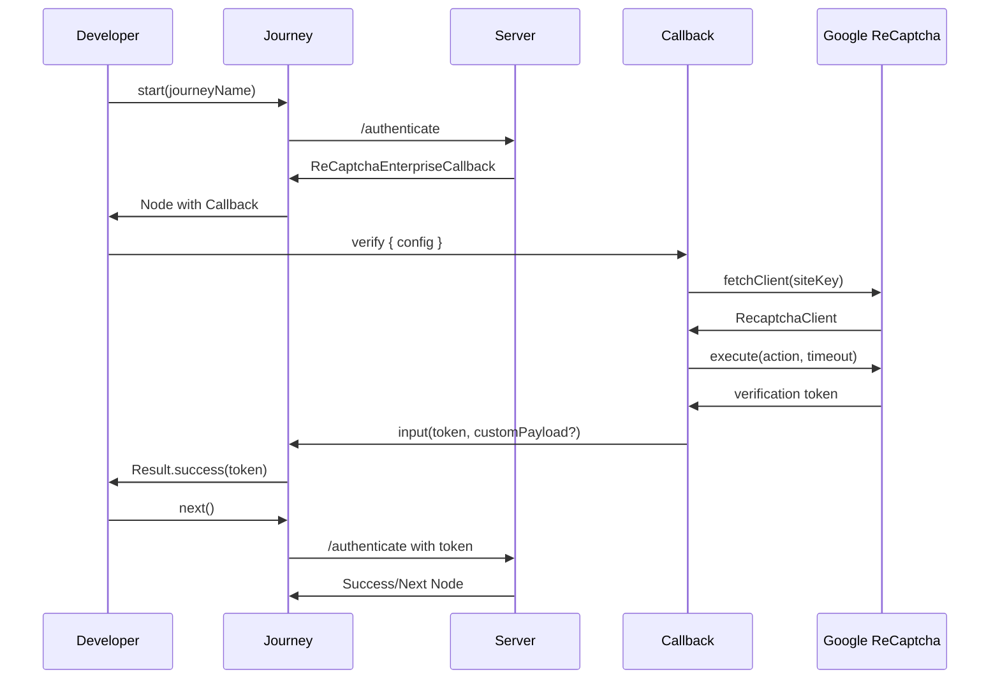
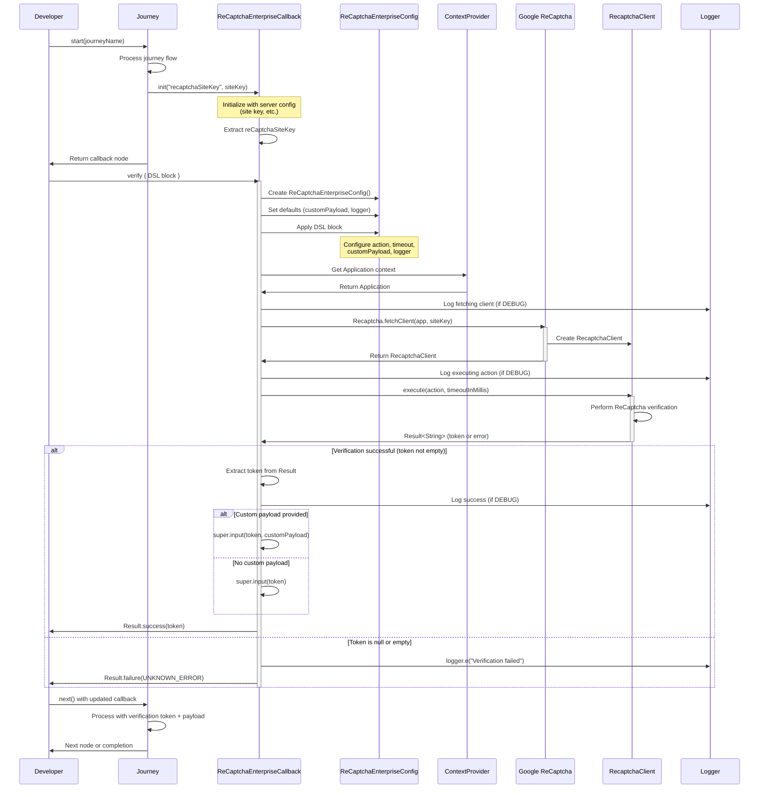

[](https://github.com/ForgeRock/ping-android-sdk)

# ReCaptcha Enterprise Module

## Overview

The **ReCaptcha Enterprise** module provides seamless integration of Google ReCaptcha Enterprise verification into Ping Identity's Journey authentication flows. This powerful module enables developers to add advanced bot detection and abuse protection to their Android applications with minimal configuration.

The module is designed as a Journey plugin callback, automatically handling ReCaptcha client initialization, token generation, and server validation within your authentication workflows.



For more information about Google ReCaptcha Enterprise, refer to the [official documentation](https://cloud.google.com/recaptcha-enterprise/docs).

---

## Add dependency to your project

```kotlin
dependencies {
    implementation("com.pingidentity.sdks:recaptcha-enterprise:<version>")
}
```

Replace `<version>` with the latest available version of the ReCaptcha Enterprise module.

---

## Usage

### Basic Usage

The simplest way to use the ReCaptcha Enterprise callback is to call `verify()` with default settings:

```kotlin
val node = journey.start("login")

node.callbacks.forEach { callback ->
    when (callback) {
        is ReCaptchaEnterpriseCallback -> {
            val result = callback.verify()
            result.onSuccess { token ->
                // Verification successful, proceed with the flow
                println("ReCaptcha token: $token")
            }.onFailure { error ->
                // Handle verification failure
                println("Verification failed: ${error.message}")
            }
        }
        // Handle other callbacks
    }
}

// Continue the journey
val next = node.next()
```

### Advanced Configuration

Customize the verification process using the DSL configuration block:

```kotlin
callback.verify {
    // Set the action type based on your use case
    recaptchaAction = RecaptchaAction.LOGIN
    
    // Adjust timeout for different network conditions (in milliseconds)
    timeoutInMills = 15000L
    
    // Add custom metadata/payload to be sent with the verification
    customPayload = buildJsonObject {
        put("userId", "user123")
        put("deviceId", "device456")
        put("sessionId", "session789")
    }
    
    // Configure logging level
    logger = Logger.DEBUG
}
```

### Configuration Options

| Property | Type | Default | Description |
|----------|------|---------|-------------|
| `recaptchaAction` | `RecaptchaAction` | `RecaptchaAction.LOGIN` | The type of user action being verified (LOGIN, SIGNUP, or custom) |
| `timeoutInMills` | `Long` | `10000L` | Timeout duration in milliseconds for the verification request |
| `customPayload` | `JsonObject?` | `null` | Optional custom JSON payload to be sent with the verification token |
| `logger` | `Logger` | `Logger.WARN` | Logger instance for logging verification process (DEBUG, INFO, WARN, ERROR) |

### Available Actions

The module supports the following built-in actions:

```kotlin
// Predefined actions
recaptchaAction = RecaptchaAction.LOGIN      // For login flows
recaptchaAction = RecaptchaAction.SIGNUP     // For registration flows

// Custom actions
recaptchaAction = RecaptchaAction.custom("PASSWORD_RESET")
recaptchaAction = RecaptchaAction.custom("PAYMENT")
recaptchaAction = RecaptchaAction.custom("ADD_TO_CART")
```

### Using Custom Payload

You can include additional metadata with your ReCaptcha verification that will be sent to the server along with the token:

```kotlin
import kotlinx.serialization.json.buildJsonObject
import kotlinx.serialization.json.put

callback.verify {
    recaptchaAction = RecaptchaAction.LOGIN
    
    // Add custom data for risk analysis or tracking
    customPayload = buildJsonObject {
        put("clientVersion", "1.0.5")
        put("platform", "android")
        put("riskScore", 0.85)
        putJsonObject("metadata") {
            put("country", "US")
            put("language", "en")
        }
    }
}
```

This is particularly useful for:
- **Risk Assessment**: Include additional context for server-side risk analysis
- **Analytics**: Track verification attempts with custom metadata
- **Session Management**: Link verification to specific user sessions or devices
- **Debugging**: Include diagnostic information for troubleshooting

### Logging Configuration

Control the verbosity of ReCaptcha verification logging:

```kotlin
callback.verify {
    // Different logging levels
    logger = Logger.DEBUG  // Detailed logs for development
    logger = Logger.INFO   // Informational messages
    logger = Logger.WARN   // Warnings only (default)
    logger = Logger.ERROR  // Errors only
    
    // Or use Logger.NONE to disable logging
    logger = Logger.NONE
}
```

**Logging Output Examples:**

```kotlin
// DEBUG level - Shows detailed flow
logger.d("Fetching ReCaptcha client with siteKey: ${reCaptchaSiteKey}")
logger.d("Executing verification with action: LOGIN, timeout: 10000ms")
logger.d("Verification successful, token received")

// WARN level - Shows warnings
logger.w("reCAPTCHA execution failed or returned empty token.", error)

// ERROR level - Shows errors
logger.e("An unexpected error occurred during reCAPTCHA setup or execution.", exception)
```

### Complete Example with Jetpack Compose

```kotlin
@Composable
fun AuthenticationScreen(
    journey: Journey,
    onSuccess: () -> Unit,
    onError: (String) -> Unit
) {
    var isLoading by remember { mutableStateOf(false) }
    var node by remember { mutableStateOf<Node?>(null) }
    val scope = rememberCoroutineScope()
    
    LaunchedEffect(Unit) {
        node = journey.start("login")
    }
    
    node?.let { currentNode ->
        when (currentNode) {
            is ContinueNode -> {
                currentNode.callbacks.forEach { callback ->
                    when (callback) {
                        is ReCaptchaEnterpriseCallback -> {
                            LaunchedEffect(callback) {
                                isLoading = true
                                scope.launch {
                                    callback.verify {
                                        recaptchaAction = RecaptchaAction.LOGIN
                                        timeoutInMills = 15000L
                                        logger = Logger.DEBUG
                                        
                                        // Include device context
                                        customPayload = buildJsonObject {
                                            put("deviceModel", Build.MODEL)
                                            put("osVersion", Build.VERSION.RELEASE)
                                            put("appVersion", BuildConfig.VERSION_NAME)
                                        }
                                    }.onSuccess {
                                        // Proceed to next node
                                        node = currentNode.next()
                                        isLoading = false
                                    }.onFailure { error ->
                                        onError("ReCaptcha verification failed: ${error.message}")
                                        isLoading = false
                                    }
                                }
                            }
                        }
                        // Handle other callback types
                    }
                }
            }
            is SuccessNode -> {
                onSuccess()
            }
            is ErrorNode -> {
                onError(currentNode.message)
            }
            is FailureNode -> {
                onError(currentNode.cause.message ?: "Authentication failed")
            }
        }
    }
    
    if (isLoading) {
        CircularProgressIndicator()
    }
}
```

### Error Handling

The `verify()` method returns a `Result<String>` type. Handle errors appropriately:

```kotlin
callback.verify {
    logger = Logger.DEBUG  // Enable detailed logging for debugging
}.fold(
    onSuccess = { token ->
        // Verification successful
        println("ReCaptcha verification successful")
        // Continue with authentication flow
    },
    onFailure = { error ->
        when {
            error.message?.contains("UNKNOWN_ERROR") == true -> {
                // All verification failures are returned as UNKNOWN_ERROR
                println("Verification failed: ${error.cause?.message}")
                showUserMessage("Verification failed. Please try again.")
            }
            else -> {
                // Fallback for other errors
                println("Verification error: ${error.message}")
                showUserMessage("Verification failed. Please try again.")
            }
        }
    }
)
```

**Error Codes:**

| Error Code | Description | Common Causes |
|------------|-------------|---------------|
| `UNKNOWN_ERROR` | All verification failures | Network issues, invalid site key, ReCaptcha service unavailable, timeout, configuration errors, token validation failures |

### Different Action Types Based on Context

```kotlin
fun verifyUserAction(
    callback: ReCaptchaEnterpriseCallback,
    actionType: String,
    userId: String? = null
): Result<String> = runBlocking {
    callback.verify {
        recaptchaAction = when (actionType) {
            "login" -> RecaptchaAction.LOGIN
            "signup" -> RecaptchaAction.SIGNUP
            "password_reset" -> RecaptchaAction.custom("PASSWORD_RESET")
            "checkout" -> RecaptchaAction.custom("CHECKOUT")
            else -> RecaptchaAction.LOGIN
        }
        
        // Adjust timeout based on action complexity
        timeoutInMills = when (actionType) {
            "checkout" -> 20000L  // Longer timeout for critical actions
            else -> 10000L
        }
        
        // Include user context if available
        userId?.let {
            customPayload = buildJsonObject {
                put("userId", it)
                put("actionType", actionType)
                put("timestamp", System.currentTimeMillis())
            }
        }
        
        // Enable detailed logging for sensitive actions
        logger = if (actionType == "checkout") Logger.DEBUG else Logger.WARN
    }
}
```

---

## Architecture

The ReCaptcha Enterprise module follows a clean architecture pattern:

- **Callback Integration**: Seamlessly integrates with the Journey plugin system
- **Async Operations**: Uses Kotlin coroutines for non-blocking verification
- **Type-Safe DSL**: Provides compile-time safe configuration
- **Automatic Token Management**: Handles token generation and injection into the Journey flow
- **Custom Payload Support**: Allows sending additional metadata with verification requests
- **Configurable Logging**: Flexible logging for different environments and debugging needs

For a detailed class diagram and architectural overview, see the [CONCEPT.md](recaptcha-enterprise/CONCEPT.md) file.

---

## Sequence Diagram

The following sequence diagram illustrates the complete ReCaptcha Enterprise verification flow:



---

## Prerequisites

- **Android API Level**: 21 (Lollipop) or higher
- **Google ReCaptcha Enterprise**: Site key configured in Google Cloud Console
- **Journey SDK**: The Journey module must be integrated in your project
- **Network Permissions**: Ensure your app has internet permissions in `AndroidManifest.xml`

```xml
<uses-permission android:name="android.permission.INTERNET" />
```

---

## Troubleshooting

### Common Issues

#### 1. "Site key not found" error

**Problem**: The callback doesn't receive the site key from the server.

**Solution**: Ensure your Journey is configured with the ReCaptcha Enterprise node and the site key is properly set on the server side.

#### 2. Timeout errors

**Problem**: Verification times out on slow networks.

**Solution**: Increase the timeout value:

```kotlin
callback.verify {
    timeoutInMills = 20000L  // 20 seconds
}
```

#### 3. Token validation fails on server

**Problem**: The server rejects the generated token.

**Solution**: Verify that:
- The site key matches between client and server
- The action name matches what's configured on the server
- The token is being sent to the server correctly
- Custom payload format matches server expectations

#### 4. "UNKNOWN_ERROR" during verification

**Problem**: All verification failures including empty tokens, network errors, or client setup issues.

**Solution**:
- Check if the Google ReCaptcha service is accessible
- Verify your app's internet permissions
- Review logs for detailed error information
- Try with a longer timeout if on a slow network

#### 6. "libcore/io/Memory" error in tests

**Problem**: `NoClassDefFoundError: libcore/io/Memory` when running unit tests.

**Solution**: This is a known issue when testing Google ReCaptcha in unit tests. Use instrumented tests (androidTest) instead, or mock the ReCaptcha functionality in unit tests:

```kotlin
// Mock the callback in unit tests
val mockCallback = mockk<ReCaptchaEnterpriseCallback>()
coEvery { mockCallback.verify(any()) } returns Result.success("mock_token_12345")
```

#### 7. Custom payload not reaching server

**Problem**: The custom payload data is not being processed on the server.

**Solution**:
- Ensure the server-side Journey configuration accepts custom input data
- Verify the JSON structure matches server expectations
- Check server logs to see if the payload is being received
- Use DEBUG logging to confirm the payload is being sent:
```kotlin
callback.verify {
    logger = Logger.DEBUG
    customPayload = buildJsonObject {
        put("test", "value")
    }
}
```

---

## Testing

The ReCaptcha Enterprise module includes comprehensive unit test coverage with **17 passing tests** covering all major scenarios including success cases, failure cases, custom configurations, and error handling.

### Mocking for Unit Tests

For testing purposes, you can mock the ReCaptcha verification:

```kotlin
import io.mockk.coEvery
import io.mockk.mockk

class MyViewModelTest {
    
    @Test
    fun `test successful verification`() = runTest {
        // Mock the callback
        val mockCallback = mockk<ReCaptchaEnterpriseCallback>()
        coEvery { mockCallback.verify(any()) } returns Result.success("mock_token_12345")
        
        // Test your flow
        val result = mockCallback.verify()
        
        assertTrue(result.isSuccess)
        assertEquals("mock_token_12345", result.getOrNull())
    }
    
    @Test
    fun `test failed verification`() = runTest {
        val mockCallback = mockk<ReCaptchaEnterpriseCallback>()
        coEvery { mockCallback.verify(any()) } returns 
            Result.failure(Exception("UNKNOWN_ERROR"))
        
        val result = mockCallback.verify()
        
        assertTrue(result.isFailure)
        assertTrue(result.exceptionOrNull()?.message?.contains("UNKNOWN_ERROR") == true)
    }
    
    @Test
    fun `test verification with custom payload`() = runTest {
        val mockCallback = mockk<ReCaptchaEnterpriseCallback>(relaxed = true)
        coEvery { mockCallback.verify(any()) } returns Result.success("payload_token")
        
        val result = mockCallback.verify {
            customPayload = buildJsonObject {
                put("userId", "12345")
            }
        }
        
        assertTrue(result.isSuccess)
    }
}
```

### Testing Best Practices

1. **Unit Tests**: Mock the callback to test your application logic without actual ReCaptcha verification
2. **Focus on Integration**: Test how your app handles success and failure scenarios
3. **Avoid Native Dependencies**: The Google ReCaptcha SDK has native dependencies that cannot be properly tested in standard unit tests
4. **Use Instrumented Tests**: For end-to-end testing with real verification, use Android instrumented tests (androidTest)

### Test Coverage

The module's own test suite covers:
- ✅ Initialization and configuration
- ✅ Successful verification with various actions
- ✅ Custom timeout and payload handling
- ✅ Error scenarios (empty token, execution failures, fetch errors)
- ✅ Config inheritance and default values

---

## Best Practices

1. **Use Appropriate Actions**: Choose the correct `RecaptchaAction` for your use case to improve risk analysis accuracy.

2. **Set Reasonable Timeouts**: Balance between user experience and reliability. Use longer timeouts for slow networks or critical operations.

3. **Include Context in Payload**: Add relevant metadata to help with risk assessment and debugging:
   ```kotlin
   customPayload = buildJsonObject {
       put("userId", userId)
       put("deviceId", deviceId)
       put("appVersion", BuildConfig.VERSION_NAME)
   }
   ```

4. **Configure Logging by Environment**:
   ```kotlin
   logger = if (BuildConfig.DEBUG) Logger.DEBUG else Logger.WARN
   ```

5. **Handle Errors Gracefully**: Provide clear user feedback and fallback mechanisms.

6. **Test Thoroughly**: Use both unit tests (with mocks) and integration tests (with real verification).

---

## License

This software may be modified and distributed under the terms of the MIT license. See the LICENSE file for details.
