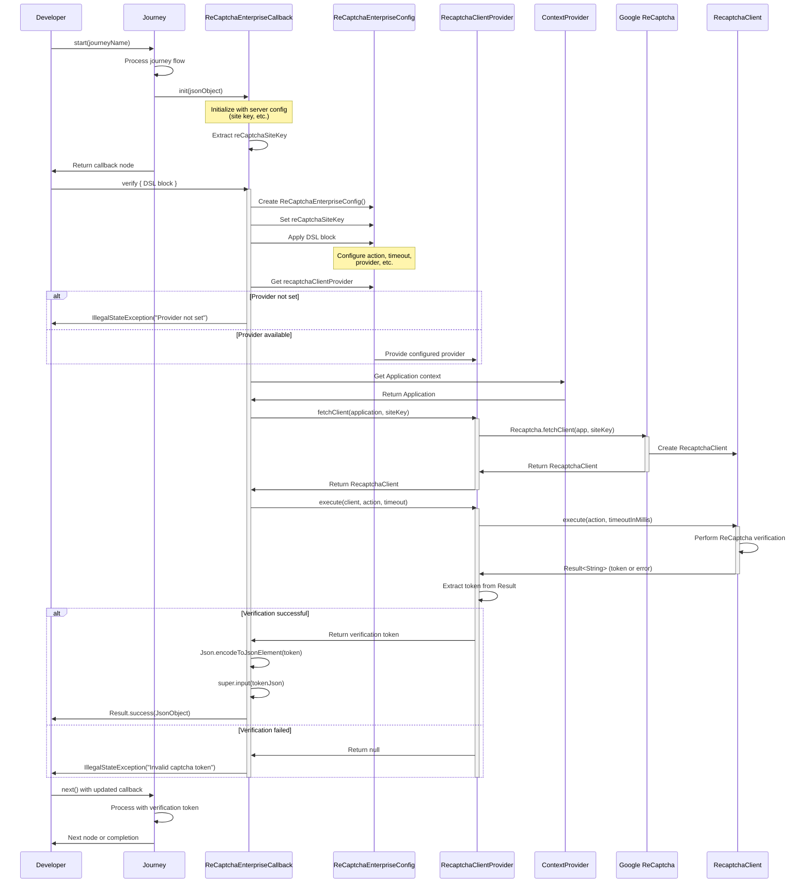

[](https://github.com/ForgeRock/ping-android-sdk)

# ReCaptcha Enterprise Module

> **Seamless integration of Google ReCaptcha Enterprise into Ping Identity's Journey workflows for Android.**

The ReCaptcha Enterprise module provides a flexible, extensible, and developer-friendly way to add Google ReCaptcha Enterprise verification to your authentication flows using the Journey plugin architecture.

---

## ✨ Features

- **🔌 Plugin Architecture**: Integrates with the Journey framework for authentication orchestration
- **🛡️ Security**: Adds bot and abuse protection to your flows using Google ReCaptcha Enterprise
- **⚡ Asynchronous API**: Suspend functions for smooth, non-blocking UI
- **🧩 Extensible Provider**: Strategy pattern for custom Recaptcha client providers
- **📝 DSL Configuration**: Fluent, type-safe configuration using Kotlin DSL
- **📦 JSON Serialization**: Uses Kotlin serialization for easy data handling

---

## 📋 Table of Contents

- [Overview](#overview)
- [Getting Started](#getting-started)
- [Configuration](#configuration)
- [Usage Example](#usage-example)
- [Sequence Diagram](#sequence-diagram)
- [Extensibility](#extensibility)
- [Architecture](#architecture)
- [License](#license)

---

## Overview

This module enables you to add Google ReCaptcha Enterprise verification to your authentication journeys. It is designed to be used as a callback within the Journey plugin system, providing a secure and customizable way to verify user actions.

---

## Getting Started

Add the module to your project dependencies (see the main SDK documentation for details).

---

## Configuration

Configure the callback using the provided DSL:

```kotlin
callback.verify {
    reCaptchaSiteKey = "YOUR_SITE_KEY"
    recaptchaAction = RecaptchaAction.LOGIN
    timeoutInMills = 10000L
    setProvider(DefaultRecaptchaClientProvider(this))
}
```

---

## Usage Example

```kotlin
val result = callback.verify {
    reCaptchaSiteKey = "YOUR_SITE_KEY"
    // Optionally customize action, timeout, or provider
}
result.onSuccess { json ->
    // Handle successful verification
}.onFailure { error ->
    // Handle error
}
```

---

## Sequence Diagram

The following sequence diagram shows the complete flow of ReCaptcha Enterprise verification within the Journey framework:



---

## Extensibility

You can provide your own implementation of `RecaptchaClientProvider` to customize how the Recaptcha client is fetched or executed.

---

## Architecture

- **Plugin/Callback**: Integrates with the Journey plugin system
- **Strategy Pattern**: Customizable Recaptcha client provider
- **DSL**: Type-safe configuration
- **Kotlin Serialization**: For JSON handling

For a detailed class diagram and architecture, see the [CONCEPT.md](CONCEPT.md) file.

---

## License

This software may be modified and distributed under the terms of the MIT license. See the LICENSE file for details.
