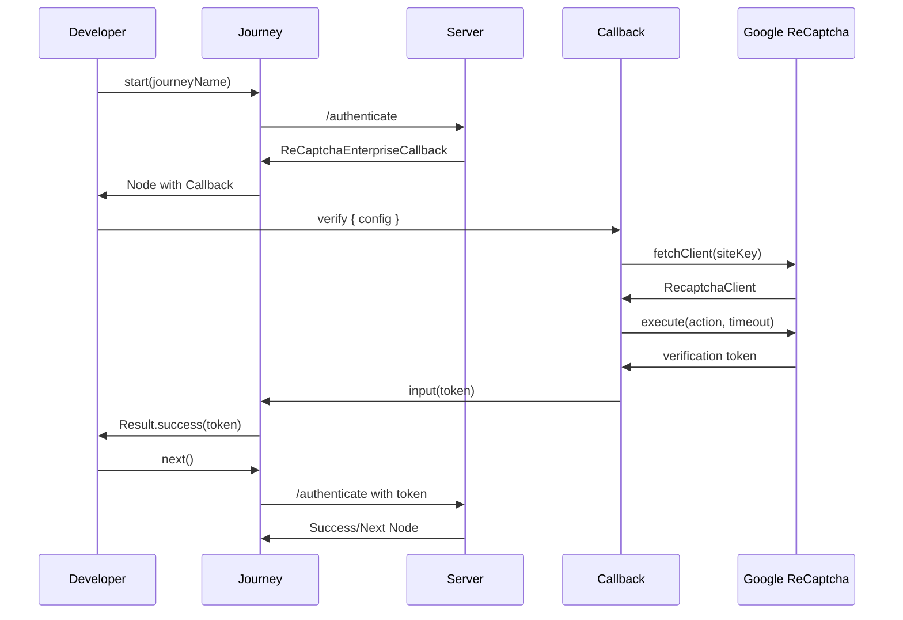
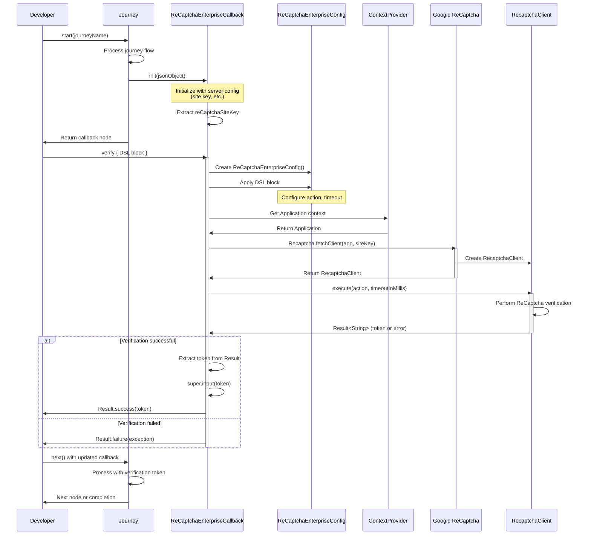

[](https://github.com/ForgeRock/ping-android-sdk)

# ReCaptcha Enterprise Module

## Overview

The **ReCaptcha Enterprise** module provides seamless integration of Google ReCaptcha Enterprise verification into Ping Identity's Journey authentication flows. This powerful module enables developers to add advanced bot detection and abuse protection to their Android applications with minimal configuration.

The module is designed as a Journey plugin callback, automatically handling ReCaptcha client initialization, token generation, and server validation within your authentication workflows.



For more information about Google ReCaptcha Enterprise, refer to the [official documentation](https://cloud.google.com/recaptcha-enterprise/docs).

---

## Add dependency to your project

```kotlin
dependencies {
    implementation("com.pingidentity.sdks:recaptcha-enterprise:<version>")
}
```

Replace `<version>` with the latest available version of the ReCaptcha Enterprise module.

---

## Usage

### Basic Usage

The simplest way to use the ReCaptcha Enterprise callback is to call `verify()` with default settings:

```kotlin
val node = journey.start("login")

node.callbacks.forEach { callback ->
    when (callback) {
        is ReCaptchaEnterpriseCallback -> {
            val result = callback.verify()
            result.onSuccess { token ->
                // Verification successful, proceed with the flow
                println("ReCaptcha token: $token")
            }.onFailure { error ->
                // Handle verification failure
                println("Verification failed: ${error.message}")
            }
        }
        // Handle other callbacks
    }
}

// Continue the journey
val next = node.next()
```

### Advanced Configuration

Customize the verification process using the DSL configuration block:

```kotlin
callback.verify {
    // Set the action type based on your use case
    recaptchaAction = RecaptchaAction.LOGIN
    
    // Adjust timeout for different network conditions (in milliseconds)
    timeoutInMills = 15000L
}
```

### Configuration Options

| Property | Type | Default | Description |
|----------|------|---------|-------------|
| `recaptchaAction` | `RecaptchaAction` | `RecaptchaAction.LOGIN` | The type of user action being verified (LOGIN, SIGNUP, or custom) |
| `timeoutInMills` | `Long` | `10000L` | Timeout duration in milliseconds for the verification request |

### Available Actions

The module supports the following built-in actions:

```kotlin
// Predefined actions
recaptchaAction = RecaptchaAction.LOGIN      // For login flows
recaptchaAction = RecaptchaAction.SIGNUP     // For registration flows

// Custom actions
recaptchaAction = RecaptchaAction.custom("PASSWORD_RESET")
recaptchaAction = RecaptchaAction.custom("PAYMENT")
recaptchaAction = RecaptchaAction.custom("ADD_TO_CART")
```

### Complete Example with Jetpack Compose

```kotlin
@Composable
fun AuthenticationScreen(
    journey: Journey,
    onSuccess: () -> Unit,
    onError: (String) -> Unit
) {
    var isLoading by remember { mutableStateOf(false) }
    var node by remember { mutableStateOf<Node?>(null) }
    val scope = rememberCoroutineScope()
    
    LaunchedEffect(Unit) {
        node = journey.start("login")
    }
    
    node?.let { currentNode ->
        when (currentNode) {
            is ContinueNode -> {
                currentNode.callbacks.forEach { callback ->
                    when (callback) {
                        is ReCaptchaEnterpriseCallback -> {
                            LaunchedEffect(callback) {
                                isLoading = true
                                scope.launch {
                                    callback.verify {
                                        recaptchaAction = RecaptchaAction.LOGIN
                                        timeoutInMills = 15000L
                                    }.onSuccess {
                                        // Proceed to next node
                                        node = currentNode.next()
                                        isLoading = false
                                    }.onFailure { error ->
                                        onError("ReCaptcha verification failed: ${error.message}")
                                        isLoading = false
                                    }
                                }
                            }
                        }
                        // Handle other callback types
                    }
                }
            }
            is SuccessNode -> {
                onSuccess()
            }
            is ErrorNode -> {
                onError(currentNode.message)
            }
            is FailureNode -> {
                onError(currentNode.cause.message ?: "Authentication failed")
            }
        }
    }
    
    if (isLoading) {
        CircularProgressIndicator()
    }
}
```

### Error Handling

The `verify()` method returns a `Result<String>` type. Handle errors appropriately:

```kotlin
callback.verify().fold(
    onSuccess = { token ->
        // Verification successful
        logger.debug("ReCaptcha verification successful")
        // Continue with authentication flow
    },
    onFailure = { error ->
        when (error) {
            is IllegalStateException -> {
                // Configuration error or invalid token
                logger.error("ReCaptcha configuration error: ${error.message}")
                showUserMessage("Verification setup error. Please try again.")
            }
            is RuntimeException -> {
                // Network error or ReCaptcha service issue
                logger.error("ReCaptcha service error: ${error.message}")
                showUserMessage("Network error. Please check your connection.")
            }
            else -> {
                // Unknown error
                logger.error("Unexpected error: ${error.message}")
                showUserMessage("Verification failed. Please try again.")
            }
        }
    }
)
```

### Different Action Types Based on Context

```kotlin
fun verifyUserAction(
    callback: ReCaptchaEnterpriseCallback,
    actionType: String
): Result<String> = runBlocking {
    callback.verify {
        recaptchaAction = when (actionType) {
            "login" -> RecaptchaAction.LOGIN
            "signup" -> RecaptchaAction.SIGNUP
            "password_reset" -> RecaptchaAction.custom("PASSWORD_RESET")
            "checkout" -> RecaptchaAction.custom("CHECKOUT")
            else -> RecaptchaAction.LOGIN
        }
        
        // Adjust timeout based on action complexity
        timeoutInMills = when (actionType) {
            "checkout" -> 20000L  // Longer timeout for critical actions
            else -> 10000L
        }
    }
}
```

---

## Architecture

The ReCaptcha Enterprise module follows a clean architecture pattern:

- **Callback Integration**: Seamlessly integrates with the Journey plugin system
- **Async Operations**: Uses Kotlin coroutines for non-blocking verification
- **Type-Safe DSL**: Provides compile-time safe configuration
- **Automatic Token Management**: Handles token generation and injection into the Journey flow

For a detailed class diagram and architectural overview, see the [CONCEPT.md](CONCEPT.md) file.

---

## Sequence Diagram

The following sequence diagram illustrates the complete ReCaptcha Enterprise verification flow:



---

## Prerequisites

- **Android API Level**: 21 (Lollipop) or higher
- **Google ReCaptcha Enterprise**: Site key configured in Google Cloud Console
- **Journey SDK**: The Journey module must be integrated in your project
- **Network Permissions**: Ensure your app has internet permissions in `AndroidManifest.xml`

```xml
<uses-permission android:name="android.permission.INTERNET" />
```

---

## Troubleshooting

### Common Issues

#### 1. "Site key not found" error

**Problem**: The callback doesn't receive the site key from the server.

**Solution**: Ensure your Journey is configured with the ReCaptcha Enterprise node and the site key is properly set on the server side.

#### 2. Timeout errors

**Problem**: Verification times out on slow networks.

**Solution**: Increase the timeout value:

```kotlin
callback.verify {
    timeoutInMills = 20000L  // 20 seconds
}
```

#### 3. Token validation fails on server

**Problem**: The server rejects the generated token.

**Solution**: Verify that:
- The site key matches between client and server
- The action name matches what's configured on the server
- The token is being sent to the server correctly

#### 4. "libcore/io/Memory" error in tests

**Problem**: `NoClassDefFoundError: libcore/io/Memory` when running unit tests.

**Solution**: This is a known issue when testing Google ReCaptcha in unit tests. Use instrumented tests (androidTest) instead, or mock the ReCaptcha functionality in unit tests.

---

## Testing

For testing purposes, you can mock the ReCaptcha verification:

```kotlin
// In your test
val mockCallback = mockk<ReCaptchaEnterpriseCallback>()
coEvery { mockCallback.verify(any()) } returns Result.success("mock_token_12345")

// Test your flow
val result = mockCallback.verify()
assertTrue(result.isSuccess)
assertEquals("mock_token_12345", result.getOrNull())
```

---

## License

This software may be modified and distributed under the terms of the MIT license. See the LICENSE file for details.
