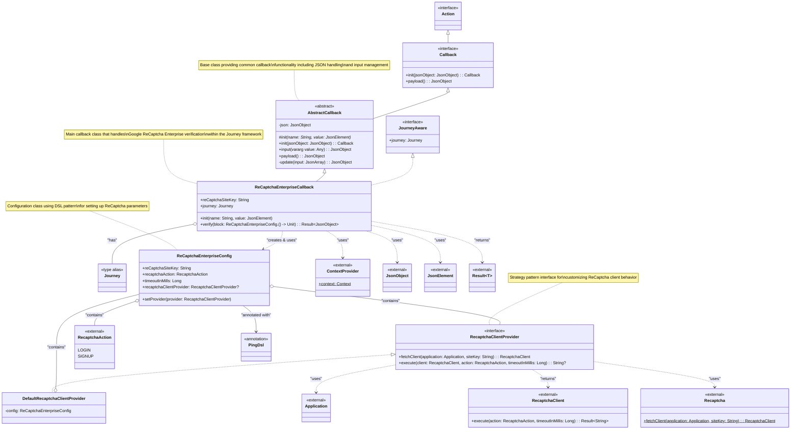

# ReCaptchaEnterpriseCallback Class Diagram

This class diagram shows the structure and relationships of the `ReCaptchaEnterpriseCallback` class based on the Journey Module concept and the plugin architecture.

## Architecture Overview

Based on the CONCEPT.md files and the code structure, the `ReCaptchaEnterpriseCallback` follows these architectural patterns:

### 1. Plugin Architecture (from Journey CONCEPT.md)
- **AbstractCallback**: Provides the foundation for all callbacks in the Journey module
- **JourneyAware**: Interface that allows callbacks to be aware of the Journey workflow
- **Journey**: Type alias for Workflow, representing the orchestration flow

### 2. Strategy Pattern
- **RecaptchaClientProvider**: Interface that allows different implementations for ReCaptcha client management
- **DefaultRecaptchaClientProvider**: Default implementation of the provider

### 3. DSL Configuration Pattern
- **ReCaptchaEnterpriseConfig**: Uses `@PingDsl` annotation to provide a domain-specific language for configuration
- Allows fluent configuration using lambda blocks

### 4. External Integration
- Integrates with Google's ReCaptcha Enterprise SDK
- Uses Android's Application context through ContextProvider
- Leverages Kotlin serialization for JSON handling

### Key Design Features:
1. **Extensibility**: Through the RecaptchaClientProvider interface
2. **Configuration**: DSL-based configuration for ease of use
3. **Integration**: Seamless integration with the Journey workflow
4. **Error Handling**: Uses Kotlin's Result type for robust error handling
5. **Async Support**: Suspend functions for non-blocking operations
