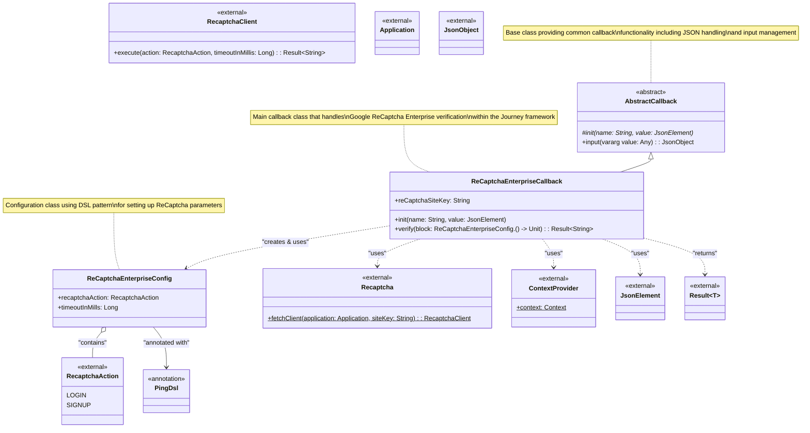

# ReCaptchaEnterpriseCallback Class Diagram

This class diagram shows the structure and relationships of the `ReCaptchaEnterpriseCallback` class based on the Journey Module concept and the plugin architecture.

## Architecture Overview

Based on the code structure, the `ReCaptchaEnterpriseCallback` follows these architectural patterns:

### 1. Plugin Architecture
- **AbstractCallback**: Provides the foundation for all callbacks in the Journey module. `ReCaptchaEnterpriseCallback` extends this class to integrate into the authentication flow.

### 2. DSL Configuration Pattern
- **ReCaptchaEnterpriseConfig**: Uses the `@PingDsl` annotation to provide a domain-specific language for configuration, allowing for fluent and type-safe setup of verification parameters using lambda blocks.

### 3. External Integration
- Integrates directly with Google's ReCaptcha Enterprise SDK (`com.google.android.recaptcha.Recaptcha`).
- Uses Android's Application context via `com.pingidentity.android.ContextProvider`.
- Leverages Kotlin serialization for handling JSON data from the server.

### Key Design Features:
1. **Simplicity**: Direct integration with the ReCaptcha SDK without extra abstraction layers.
2. **Configuration**: DSL-based configuration for ease of use.
3. **Integration**: Seamless integration with the Journey workflow via the `AbstractCallback`.
4. **Error Handling**: Uses Kotlin's `Result` type for robust error handling.
5. **Async Support**: The `verify` method is a `suspend` function, enabling non-blocking asynchronous operations.
