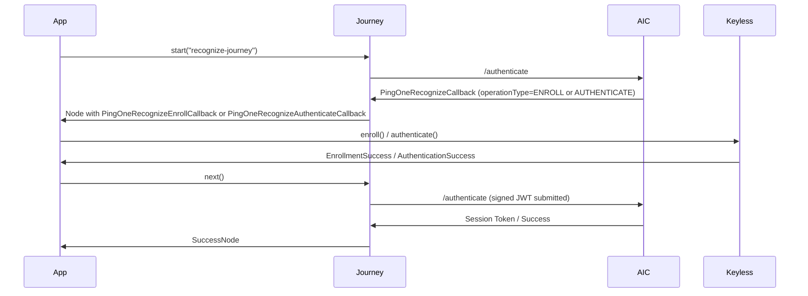

[](https://github.com/ForgeRock/ping-android-sdk)

# Recognize Module: PingOne Recognize Biometric Authentication

## Overview

The `recognize` module integrates [PingOne Recognize](https://docs.pingidentity.com/pingoneaic/latest/) (powered by the
Keyless biometric SDK) into Journey-based authentication flows on Android. It handles both **enrollment** (registering a
user's biometric) and **authentication** (verifying a returning user) through standard Journey callbacks.

The module exposes two callbacks that are returned automatically by the Journey framework:

| Callback                               | `operationType` | Purpose                         |
|----------------------------------------|-----------------|---------------------------------|
| `PingOneRecognizeEnrollCallback`       | `ENROLL`        | Biometric enrollment ceremony   |
| `PingOneRecognizeAuthenticateCallback` | `AUTHENTICATE`  | Biometric authentication ceremony |

All server-supplied configuration fields (API key, host, transaction data, liveness settings, etc.)
are parsed automatically from the Journey response — **you only need to call `enroll()` or
`authenticate()`**.



---

## Installation

Add the `recognize` dependency to your app-level `build.gradle.kts`:

```kotlin
dependencies {
    implementation("com.pingidentity.sdks:recognize:<version>")
    implementation("com.pingidentity.sdks:journey:<version>")
}
```

> Replace `<version>` with the latest version available from Maven Central.

The module uses **Jetpack App Startup** to register its callback automatically. No manual
registration is required.

---

## Prerequisites: AIC Journey Configuration

Before writing any Android code, configure a Journey in AIC that includes a
**PingOne Recognize** node. The node produces a `PingOneRecognizeCallback` with either
`operationType = "ENROLL"` or `operationType = "AUTHENTICATE"` depending on the flow.

The node also provides all SDK parameters (API key, host, liveness configuration, etc.) as output
fields — the SDK maps these to `EnrollConfig` / `AuthConfig` automatically.

---

## Getting Started

### 1. Create a Journey Instance

```kotlin
val journey = Journey {
    serverUrl = "https://openam-your-tenant.forgeblocks.com/am"
    module(Oidc) {
        clientId          = "your-client-id"
        discoveryEndpoint = "https://openam-your-tenant.forgeblocks.com/am/oauth2/alpha/.well-known/openid-configuration"
        scopes            = mutableSetOf("openid", "profile", "email")
        redirectUri       = "com.example.app://oauth2redirect"
    }
}
```

### 2. Start the Journey

```kotlin
var node = journey.start("PingOneRecognizeJourney")
```

### 3. Handle the Recognize Callbacks

```kotlin
when (node) {
    is ContinueNode -> {
        node.callbacks.forEach { callback ->
            when (callback) {
                is PingOneRecognizeEnrollCallback -> {
                    val result = callback.enroll()
                    result.onSuccess { node = node.next() }
                    result.onFailure { /* handle error */ }
                }
                is PingOneRecognizeAuthenticateCallback -> {
                    val result = callback.authenticate()
                    result.onSuccess { node = node.next() }
                    result.onFailure { /* handle error */ }
                }
            }
        }
    }
    is SuccessNode -> { /* User authenticated */ }
    is FailureNode -> { /* Authentication failed */ }
    is ErrorNode   -> { /* Network or configuration error */ }
}
```

---

## Enrollment

`PingOneRecognizeEnrollCallback.enroll()` performs the full biometric enrollment ceremony.

The callback automatically maps every server-supplied field to the corresponding `EnrollConfig`
parameter before calling the Keyless SDK:

| Callback field / `mobileSDKOptions` key        | `EnrollConfig` property               |
|------------------------------------------------|---------------------------------------|
| `transactionData`                              | `jwtSigningInfo.claimTransactionData` |
| `clientState`                                  | `clientState`                         |
| `generateClientState`                          | `generatingClientState`               |
| `mobileSDKOptions.livenessConfiguration`       | `livenessConfiguration`               |
| `mobileSDKOptions.livenessEnvironmentAware`    | `livenessEnvironmentAware`            |
| `mobileSDKOptions.operationInfoId`             | `operationInfo.operationId`           |
| `mobileSDKOptions.operationInfoPayload`        | `operationInfo.payload`               |
| `mobileSDKOptions.operationInfoExternalUserId` | `operationInfo.externalUserId`        |
| `mobileSDKOptions.cameraDelaySeconds`          | `cameraDelaySeconds`                  |
| `mobileSDKOptions.customSecret`                | `customSecret`                        |
| `mobileSDKOptions.shouldRetrieveEnrollmentFrame` | `shouldRetrieveEnrollmentFrame`     |
| `mobileSDKOptions.showSuccessFeedback`         | `showSuccessFeedback`                 |
| `mobileSDKOptions.showFailureFeedback`         | `showFailureFeedback`                 |
| `mobileSDKOptions.showInstructionsScreen`      | `showInstructionsScreen`              |

### Basic Enrollment

```kotlin
is PingOneRecognizeEnrollCallback -> {
    val result = callback.enroll()
    result.onSuccess { success ->
        // success.keylessId  — the newly enrolled biometric identity ID
        // success.signedJwt  — automatically submitted to the Journey
        node = node.next()
    }
    result.onFailure { error ->
        // error is automatically reported to the Journey; handle UX here
        Log.e("Recognize", "Enrollment failed: ${error.message}")
    }
}
```

### Override Enrollment Config (Optional)

All server-supplied values are applied first. Any property set in the optional DSL block
**overrides** the server value:

```kotlin
val result = callback.enroll {
    // Override the liveness level received from the server
    livenessConfiguration = LivenessSettings.LivenessConfiguration.LEVEL_2
    showInstructionsScreen = false
    cameraDelaySeconds = 3
}
```

---

## Authentication

`PingOneRecognizeAuthenticateCallback.authenticate()` performs the full biometric authentication
ceremony.

The callback automatically maps server-supplied fields to `AuthConfig`:

| Callback field / `mobileSDKOptions` key        | `AuthConfig` property                 |
|------------------------------------------------|---------------------------------------|
| `transactionData`                              | `jwtSigningInfo.claimTransactionData` |
| `generateClientState`                          | `generatingClientState`               |
| `mobileSDKOptions.livenessConfiguration`       | `livenessConfiguration`               |
| `mobileSDKOptions.livenessEnvironmentAware`    | `livenessEnvironmentAware`            |
| `mobileSDKOptions.operationInfoId`             | `operationInfo.operationId`           |
| `mobileSDKOptions.operationInfoPayload`        | `operationInfo.payload`               |
| `mobileSDKOptions.operationInfoExternalUserId` | `operationInfo.externalUserId`        |
| `mobileSDKOptions.cameraDelaySeconds`          | `cameraDelaySeconds`                  |
| `mobileSDKOptions.showSuccessFeedback`         | `showSuccessFeedback`                 |
| `mobileSDKOptions.presentation`                | `presentationStyle`                   |

### Basic Authentication

```kotlin
is PingOneRecognizeAuthenticateCallback -> {
    val result = callback.authenticate()
    result.onSuccess {
        // Signed JWT automatically submitted to the Journey
        node = node.next()
    }
    result.onFailure { error ->
        Log.e("Recognize", "Authentication failed: ${error.message}")
    }
}
```

### Override Authentication Config (Optional)

```kotlin
val result = callback.authenticate {
    presentationStyle     = PresentationStyle.FULL_SCREEN
    livenessConfiguration = LivenessSettings.LivenessConfiguration.LEVEL_1
}
```

---

## EnrollConfig Reference

| Property                          | Type                                     | Default     | Description |
|-----------------------------------|------------------------------------------|-------------|-------------|
| `jwtSigningInfo`                  | `JwtSigningInfo`                         | auto-mapped | JWT signing payload (transaction data) |
| `operationInfo`                   | `OperationInfo`                          | auto-mapped | Operation ID, payload, and external user ID |
| `livenessConfiguration`           | `LivenessSettings.LivenessConfiguration` | `LEVEL_1`   | Liveness security level |
| `livenessEnvironmentAware`        | `Boolean`                                | `false`     | Adapts liveness check to the environment |
| `cameraDelaySeconds`              | `Int`                                    | `0`         | Delay (seconds) before camera capture starts |
| `shouldRetrieveEnrollmentFrame`   | `Boolean`                                | `false`     | Return the enrollment frame from the SDK |
| `shouldRetrieveTemporaryState`    | `Boolean`                                | `false`     | Retrieve a temporary state token |
| `temporaryState`                  | `String`                                 | `""`        | Supply an existing temporary state token |
| `customSecret`                    | `String`                                 | `""`        | Custom secret injected into enrollment |
| `iamToken`                        | `String`                                 | `""`        | IAM token for server-side authorisation |
| `showSuccessFeedback`             | `Boolean`                                | `true`      | Display success animation after enrollment |
| `showFailureFeedback`             | `Boolean`                                | `true`      | Display failure animation after enrollment |
| `showInstructionsScreen`          | `Boolean`                                | `true`      | Show instructions screen before enrollment |
| `generatingClientState`           | `ClientStateType`                        | `BACKUP`    | How the client state is generated |
| `clientState`                     | `String`                                 | `""`        | Pre-existing client state to restore |

---

## AuthConfig Reference

| Property                          | Type                                     | Default               | Description |
|-----------------------------------|------------------------------------------|-----------------------|-------------|
| `jwtSigningInfo`                  | `JwtSigningInfo`                         | auto-mapped           | JWT signing payload (transaction data) |
| `shouldRemovePin`                 | `Boolean`                                | `false`               | Remove the stored PIN during authentication |
| `operationInfo`                   | `OperationInfo`                          | auto-mapped           | Operation ID, payload, and external user ID |
| `dynamicLinkingInfo`              | `DynamicLinkingInfo`                     | `DynamicLinkingInfo("")` | Transaction data for dynamic linking |
| `shouldRetrieveTemporaryState`    | `Boolean`                                | `false`               | Retrieve a temporary state token |
| `livenessConfiguration`           | `LivenessSettings.LivenessConfiguration` | `LEVEL_1`             | Liveness security level |
| `livenessEnvironmentAware`        | `Boolean`                                | `false`               | Adapts liveness check to the environment |
| `cameraDelaySeconds`              | `Int`                                    | `0`                   | Delay (seconds) before camera capture starts |
| `showSuccessFeedback`             | `Boolean`                                | `true`                | Display success animation |
| `deviceToRevoke`                  | `String`                                 | `""`                  | Device ID to revoke (leave empty to skip) |
| `shouldRetrieveSecret`            | `Boolean`                                | `false`               | Retrieve the stored secret after auth |
| `shouldDeleteSecret`              | `Boolean`                                | `false`               | Delete the stored secret after auth |
| `presentationStyle`               | `PresentationStyle`                      | `CAMERA_PREVIEW`      | Controls how the camera UI is presented |
| `generatingClientState`           | `ClientStateType`                        | `BACKUP`              | How the client state is generated |
| `shouldRetrieveAuthenticationFrame` | `Boolean`                              | `false`               | Return the authentication frame from the SDK |

---

## Complete Example (ViewModel)

```kotlin
class RecognizeViewModel : ViewModel() {

    private val journey = Journey {
        serverUrl = "https://openam-your-tenant.forgeblocks.com/am"
        module(Oidc) {
            clientId          = "your-client-id"
            discoveryEndpoint = "https://openam-your-tenant.forgeblocks.com/am/oauth2/alpha/.well-known/openid-configuration"
            scopes            = mutableSetOf("openid", "profile")
            redirectUri       = "com.example.app://oauth2redirect"
        }
    }

    val state = MutableStateFlow<RecognizeState>(RecognizeState.Idle)

    fun start() {
        viewModelScope.launch {
            val node = journey.start("PingOneRecognizeJourney")
            handleNode(node)
        }
    }

    private suspend fun handleNode(node: Node) {
        when (node) {
            is ContinueNode -> {
                node.callbacks.forEach { callback ->
                    when (callback) {
                        is PingOneRecognizeEnrollCallback -> {
                            state.value = RecognizeState.Enrolling
                            val result = callback.enroll()
                            result.onSuccess { handleNode(node.next()) }
                            result.onFailure { state.value = RecognizeState.Error(it.message) }
                        }
                        is PingOneRecognizeAuthenticateCallback -> {
                            state.value = RecognizeState.Authenticating
                            val result = callback.authenticate()
                            result.onSuccess { handleNode(node.next()) }
                            result.onFailure { state.value = RecognizeState.Error(it.message) }
                        }
                    }
                }
            }
            is SuccessNode -> state.value = RecognizeState.Success
            is FailureNode -> state.value = RecognizeState.Error("Journey failed")
            is ErrorNode   -> state.value = RecognizeState.Error(node.message)
        }
    }
}

sealed interface RecognizeState {
    data object Idle           : RecognizeState
    data object Enrolling      : RecognizeState
    data object Authenticating : RecognizeState
    data object Success        : RecognizeState
    data class  Error(val message: String?) : RecognizeState
}
```

---

## Advanced: Using the Keyless Object Directly

For scenarios where the Journey framework is not in use, you can call the `Keyless` object directly.

> **Note:** You must call `Keyless.config {}` before every `enroll()` or `authenticate()` call to
> ensure the SDK is configured with the correct API key and host for your tenant.

```kotlin
// 1. Configure
val configResult = Keyless.config {
    apiKey = "your-api-key"
    host   = listOf("https://your-keyless-host.example.com")
}
configResult.onFailure { /* SDK configuration failed */ }

// 2. Enroll
val enrollResult = Keyless.enroll {
    jwtSigningInfo         = JwtSigningInfo(claimTransactionData = "server-tx-data")
    showInstructionsScreen = false
}
enrollResult.onSuccess { success ->
    val keylessId = success.keylessId
    val signedJwt = success.signedJwt
}

// 3. Authenticate
val authResult = Keyless.authenticate {
    jwtSigningInfo    = JwtSigningInfo(claimTransactionData = "server-tx-data")
    presentationStyle = PresentationStyle.FULL_SCREEN
}
authResult.onSuccess { success ->
    val signedJwt = success.signedJwt
}
```

---

## Troubleshooting

| Symptom | Possible Cause | Fix |
|---------|----------------|-----|
| `Keyless.config` returns `Result.failure` | Wrong API key or host URL | Verify the values returned by the Journey node output fields |
| Camera never opens | Missing `Activity` context | Ensure `enroll()` / `authenticate()` is called from a coroutine scope tied to an active `Activity` |
| `"operationType" is required` error | Journey node misconfigured | Check the PingOne Recognize node configuration in AIC |
| Enrollment succeeds but Journey returns an error | Double submission | `enroll()` / `authenticate()` submit inputs automatically — do **not** call `input()` manually again |
| Liveness check too strict / too lenient | Server default not suitable | Override in the DSL block: `enroll { livenessConfiguration = LivenessSettings.LivenessConfiguration.LEVEL_2 }` |
